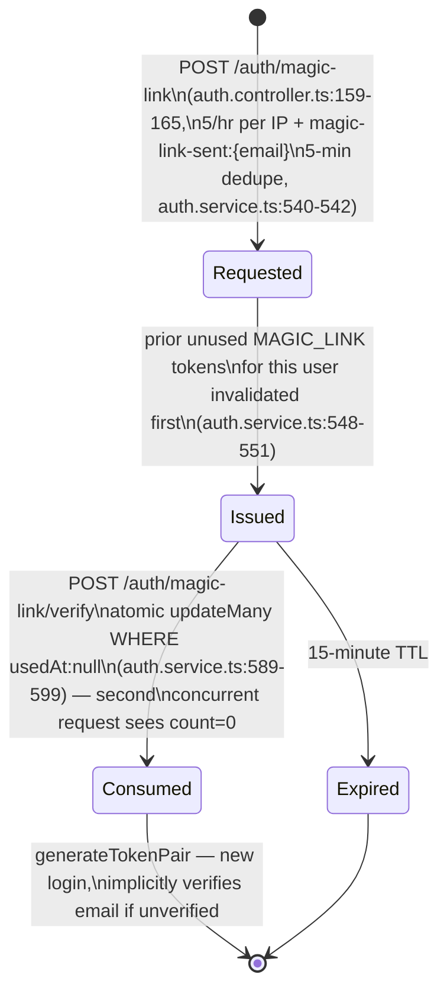
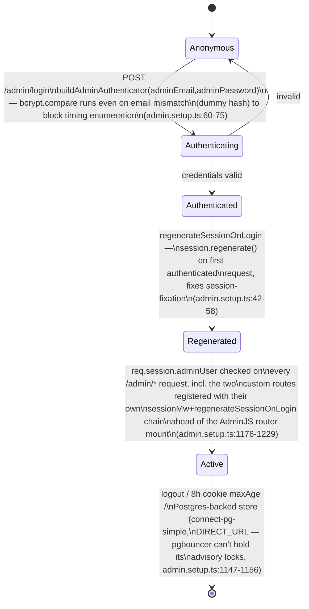
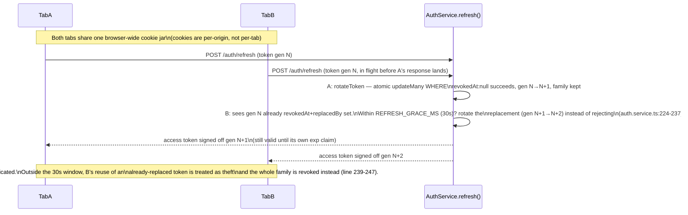

# Auth / Session Lifecycle Model

Same method as [`business-process-model.md`](./business-process-model.md) and
[`coupon-lifecycle-model.md`](./coupon-lifecycle-model.md), applied to the Auth/Session
domain: state diagrams + sequence diagrams derived from reading the real implementation,
followed by an Audit Findings section. Every transition is cited `file:line` against
the code as of branch `fix/audit_round_22`.

**Why this doc exists.** `audit-exclusion-list.md`'s "Auth / Sessions / OAuth" section
(lines 10-26) carries 17 raw bullets, almost none tagged `(fixed)`. The working
assumption going in was that this is the largest genuinely-open cluster left on the
list. That assumption turned out to be **mostly wrong** — re-verifying every bullet
against current code found that 15 of 17 are already fixed, just never tagged, the
same staleness pattern `audit-exclusion-list.md`'s own closing note already warned
about for round 16. See [Audit Findings](#audit-findings) for the line-by-line
re-verification and the two findings that are genuinely new.

**See also:** [`business-process-model.md`](./business-process-model.md) (same method,
Orders/Payments/Shipments/Returns), [`coupon-lifecycle-model.md`](./coupon-lifecycle-model.md)
(same method, Coupons — also where a prior pass's findings turned out to need
correction in both directions, overstated and understated), [`audit-exclusion-list.md`](./audit-exclusion-list.md)
(condensed history — this doc's findings get folded into its Auth section once fixes
land), [`accepted-tradeoffs.md`](./accepted-tradeoffs.md) (the JWT-Redis-outage
fail-open entry is cited directly below).

---

## 1. Access/refresh token lifecycle

Access tokens are stateless JWTs (15 min, `JWT_ACCESS_EXPIRES_IN`); refresh tokens are
opaque UUIDs hashed (SHA-256) before storage, rotated on every use, grouped into a
`family` per login so theft-detection can invalidate an entire session at once.

```mermaid
stateDiagram-v2
    [*] --> Issued: login() / register() / consumeMagicLink() /\nfindOrCreateGoogleUser()\ngenerateTokenPair (auth.service.ts:612-625)\nnew family per login

    Issued --> Active: access token accepted by JwtStrategy\n(jwt.strategy.ts:60-95)
    Active --> Rotated: refresh() — atomic updateMany\nWHERE revokedAt:null guards concurrent\nrotation of the same token\n(auth.service.ts:270-300)
    Rotated --> Active: new access+refresh pair issued

    Active --> RevokedExplicit: logout() / changePassword() /\nresetPassword() / requestEmailChange()\n→ revokeAccessTokensForUser()\nsets auth:revoke-before:{userId} fence\n(auth.service.ts:636-643)
    RevokedExplicit --> [*]: fence checked on every\nsubsequent JwtStrategy.validate()\n(jti compared against iat)

    Active --> TheftDetected: refresh() reuse of an\nalready-rotated token OUTSIDE the\n30s grace window (REFRESH_GRACE_MS)\n→ whole family revoked\n(auth.service.ts:239-247)
    TheftDetected --> [*]

    Active --> GraceRecovered: refresh() reuse INSIDE the 30s grace\nwindow — treated as a dropped response,\nnot theft; rotates the already-issued\nreplacement instead (auth.service.ts:224-237)
    GraceRecovered --> Active

    Active --> ExpiredNatural: 7-day refreshToken.expiresAt /\n15-min access token exp claim
    ExpiredNatural --> [*]: purgeExpiredTokens cron,\ndaily 4am Europe/Warsaw\n(auth.service.ts:52-66)
```

**Revocation is two-layered, by design:**
- **Refresh tokens** are revoked row-by-row in Postgres (`revokedAt`) — authoritative,
  survives Redis loss.
- **Access tokens** can't be revoked individually (stateless JWT) without a blocklist,
  so two Redis-backed fences exist: `auth:revoke-before:{userId}` (all tokens issued
  before a timestamp — used by logout/password-change/email-change) and
  `auth:revoked-jti:{jti}` (single-token, for future "log out this device only" UX —
  `revokeAccessTokenJti`, auth.service.ts:651-653, not yet called from any controller).
  Both are checked in `JwtStrategy.validate()` (jwt.strategy.ts:60-95).
- **JWT secret rotation** doesn't force a logout: `secretOrKeyProvider` tries
  `JWT_ACCESS_SECRET` then falls back to `JWT_ACCESS_SECRET_PREV` during a rotation
  window (jwt.strategy.ts:31-56) — dual-key support exists and is wired.

---

## 2. OAuth (Google) login / account-link flow

```mermaid
sequenceDiagram
    actor C as Customer
    participant FE as Frontend
    participant G as Google
    participant BE as AuthController
    participant AS as AuthService

    C->>FE: "Continue with Google"
    FE->>BE: GET /auth/google
    BE->>G: redirect (passport-google-oauth20, state:true)\n(google.strategy.ts:13-19)
    G->>C: consent screen
    C->>G: approve
    G->>BE: GET /auth/google/callback?code&state\n(state verified by Passport itself)
    BE->>AS: findOrCreateGoogleUser(profile)
    alt no existing user
        AS->>AS: create user, isEmailVerified:true
    else email exists, no googleId, has passwordHash
        AS-->>BE: ConflictException (block silent hijack)\n(auth.service.ts:158-166)
        BE->>FE: redirect /auth/login?error=account_conflict\n(google-auth.guard.ts stashes err,\nauth.controller.ts:197-205)
    else email exists, googleId already linked
        AS->>AS: link / return existing user
    end
    BE->>BE: generateTokenPair; set httpOnly refresh cookie;\nset short-lived oauth_access_token cookie (60s);\nmint one-time Redis nonce (60s TTL)
    BE->>FE: redirect /auth/callback#state={nonce}
    FE->>BE: POST /auth/token/exchange {nonce}\n(nonce read from URL fragment, never sent as a query param)
    BE->>BE: GETDEL oauth_nonce:{nonce} (one-time use)\n+ read oauth_access_token cookie
    BE-->>FE: { accessToken }
```

The access token is never placed in the redirect URL itself — it travels in a
60-second httpOnly cookie, and the fragment only carries a one-time nonce that must be
exchanged via a same-origin POST (`auth.controller.ts:187-245`). This closes the
"token visible in browser history / Referer" class of bug the equivalent guest-order
cancel-link flow had before being fixed (see `audit-exclusion-list.md`'s Payments
section).

---

## 3. Magic-link request → consume flow



Email enumeration is avoided the same way on both `requestMagicLink` and
`requestPasswordReset` — both resolve silently (no 404) whether or not the email
exists (`auth.service.ts:457-459,544-546`).

---

## 4. AdminJS session lifecycle



---

## 5. Sequence: concurrent refresh across two tabs (the realistic multi-tab race)



This mechanism was built for network-drop recovery (comment at `auth.service.ts:25-27`)
but, as a side effect, also resolves the ordinary multi-tab-refresh race for any
realistic timing. See [A1](#a1) for the one Redis-dependent path in this same file that
does **not** degrade as gracefully.

---

## Audit Findings

### A1 — MEDIUM (FIXED): `revokeAccessTokensForUser` has no Redis error handling, unlike every other Redis call in this file

`auth.service.ts:636-643`:

```ts
async revokeAccessTokensForUser(userId: string): Promise<void> {
  await this.redis.set(
    `auth:revoke-before:${userId}`,
    Date.now().toString(),
    'EX',
    this.revokeBeforeTtlSecs,
  );
}
```

Every other Redis call in this file — `login()`'s lockout/failure-tracking (lines
107-144) and `JwtStrategy.validate()` (jwt.strategy.ts:81-90, the documented tradeoff
in `accepted-tradeoffs.md`) — wraps the Redis call in `try/catch`, logs to
`logger.error`/Sentry, and lets the request continue (fail-open by design). This one
method has no such guard, and it is called, unguarded, from four security-sensitive
paths that all run it as the *last* step of an otherwise-already-committed write:

- `logout()` — `auth.service.ts:266`, after the refresh token is already revoked in
  Postgres.
- `changePassword()` — `auth.service.ts:537`, after the new password hash and refresh
  token revocation are already committed in the same `$transaction`.
- `resetPassword()` — `auth.service.ts:514`, same shape.
- `requestEmailChange()` — `auth.service.ts:374`, after `pendingEmail` is already set
  and the verification email already queued.

If Redis is unavailable at that moment, the `await` throws, NestJS's default exception
filter returns a 500, and none of these controllers (`auth.controller.ts:116-126`,
`users.controller.ts:78-79`) catch it. The user-visible result: **the password change
(or logout, or email-change request) actually succeeded, but the HTTP response says it
failed.** A user who retries `changePassword` with their *old* password — reasonable,
since they were told it failed — now gets `UnauthorizedException('Invalid
credentials')` from the `bcrypt.compare` check against the *already-changed* hash,
with no indication why. Separately, the security property these four methods exist to
provide (force-expire any access token issued before this moment) silently does not
take effect for the rest of that access token's natural 15-minute life, during the
outage — a narrower, time-boxed version of the same exposure `accepted-tradeoffs.md`
already accepts for `JwtStrategy.validate()`, just reached via a different code path
that wasn't built to the same fail-open standard.

**Why this isn't already covered by the accepted tradeoff:** the accepted tradeoff is
specifically "JWT validation fails open on Redis outage" — i.e., a degraded *read*.
This is a degraded *write* with no fallback at all, on a call sandwiched after a
committed DB transaction, which is a different failure shape (request-level 500 +
silent security-property loss, not just "old token still works for a while").

**Fixed:** wrapped the `redis.set` in `revokeAccessTokensForUser` in the same
fail-open try/catch + `logger.error` pattern `login()` already uses
(`auth.service.ts:636-651`), so a Redis outage now degrades to "the DB-side
revocation took effect, the access-token fence didn't (logged, time-boxed)" instead
of "the response lies about whether the request succeeded." Regression test: `logout`
→ *"still resolves when Redis is unavailable while writing the revocation fence
(DB-side revocation already committed)"* (`auth.service.spec.ts`).

### A2 — LOW (not a bug, tracked here rather than fixed): Admin credentials are env-var-only, no in-app rotation or expiry

`admin.setup.ts:291-296` — `ADMIN_DEFAULT_EMAIL`/`ADMIN_DEFAULT_PASSWORD` are read
once at boot; there's no DB-backed admin-user table, so rotating credentials means
changing Railway env vars (which does trigger a redeploy) rather than an in-app flow,
and there's no forced periodic rotation or expiry. Not a vulnerability by itself — the
audit trail (`AdminLog`, see A1 in the Resolved section below) at least means actions
are attributable — but worth tracking if admin headcount grows beyond one shared
credential. Borderline candidate for `accepted-tradeoffs.md` rather than a bug to fix,
given there's currently exactly one admin account by design.

---

## Resolved — `audit-exclusion-list.md` lines 10-26, re-verified against current code

Re-checking every raw bullet in the Auth/Sessions/OAuth section against the code
(not against the doc's own wording) before treating any of them as still open:

| # | Exclusion-list claim | Verified status |
|---|---|---|
| 10 | "Login throttle per-IP only, no per-email lockout; `trust proxy` never set" | **Stale.** `trust proxy` is set (`main.ts:35`). A per-email Redis lockout exists independently of the IP throttle: 10 failures/15min locks `auth:login-locked:{email}` (`auth.service.ts:100-144`). |
| 11 | "No password complexity rules on `RegisterDto`" | **Stale.** `RegisterDto`, `ResetPasswordDto`, and `ChangePasswordDto` all enforce the identical regex (≥1 upper, 1 lower, 1 digit, 8-72 chars) — `register.dto.ts:17-19`, `reset-password.dto.ts:9-11`, `change-password.dto.ts:9-11`. |
| 12 | "Forgot-password / magic-link bombing (per-IP only, no per-email dedupe)" | **Stale.** Both have a 5-minute per-email Redis dedupe key on top of the per-IP hourly throttle (`auth.service.ts:454-455,541-542`). |
| 13 | "Magic link replay race (no `usedAt` WHERE guard)" | **Stale.** `consumeMagicLink` uses the same atomic `updateMany({where:{id,usedAt:null}})` pattern as `rotateToken`/`verifyEmail` (`auth.service.ts:589-599`). |
| 14 | "Google OAuth: no `state` CSRF param; silently takes over existing password accounts" | **Stale, both halves.** `state: true` is set on the strategy (`google.strategy.ts:18`) — real Passport-level CSRF protection (the *frontend's* now-dead parallel state mechanism was already removed per round 16). Account hijack is explicitly blocked: `findOrCreateGoogleUser` throws `ConflictException` when an existing password account has no linked `googleId` (`auth.service.ts:158-166`). |
| 15 | "OAuth token exchange 60s CSRF window via `oauth_access_token` cookie" | **Not a bug as implemented.** The cookie is httpOnly+secure+sameSite, and the actual exchange additionally requires a one-time Redis nonce (`GETDEL`) read from the URL *fragment* (never sent to any server as a query param) — see §2 above. The "window" is the cookie's validity period, not an exploitable gap. |
| 16 | "`changePassword`/`resetPassword` don't revoke access token; `logout()` never revokes access tokens" | **Stale.** All three call `revokeAccessTokensForUser` (`auth.service.ts:537,514,266`). See A1 above for the real remaining gap in *that same method's* error handling — a different bug than the one originally flagged. |
| 17 | "`requestEmailChange` doesn't revoke access tokens or all token types (MAGIC_LINK survives)" | **Stale.** `requestEmailChange` invalidates every unused `emailVerificationToken` row for the user with no `type` filter (`auth.service.ts:345-348`), covering MAGIC_LINK rows too, and revokes access tokens (line 374). Refresh tokens are deliberately left alone until `verifyEmail` actually confirms the new address (line 433-437) — the pending change hasn't taken effect yet, so there's nothing to force-logout for. |
| 18 | "`verifyEmail` idempotency shortcut bypasses `usedAt`/`expiresAt` guards" | **Stale.** The idempotency shortcut (`auth.service.ts:397-403`) runs strictly after the `usedAt`/`expiresAt` checks (389-391); ordering is correct and commented as deliberate. |
| 19 | "JWT Redis-outage fail-open (tradeoff) but `login()` has no try/catch" | **Stale (second half).** Every Redis call inside `login()` is individually try/catch-guarded with fail-open + `logger.error` (`auth.service.ts:107-144`), matching the documented `JwtStrategy` pattern. The first half remains the accepted tradeoff in `accepted-tradeoffs.md`. |
| 20 | "Dual-key JWT rotation strategy missing" | **Stale.** `secretOrKeyProvider` tries `JWT_ACCESS_SECRET` then `JWT_ACCESS_SECRET_PREV` (`jwt.strategy.ts:31-56`). |
| 21 | "Cookie `SameSite`/`Secure` computed from stale module-load constant" | **Not a bug as implemented.** `AuthController.crossSite` is derived once from `FRONTEND_URL` at DI-construction time (`auth.controller.ts:51`) — immutable for the process's life, same shape as the accepted `STRIPE_CURRENCY`-checked-once-at-boot tradeoff. Candidate to add to `accepted-tradeoffs.md` rather than carry as an open finding. |
| 22 | "Open redirect via unvalidated `returnTo` param" | **Stale.** `login.component.ts:102-106`, `register.component.ts:80-84`, and `google-callback.component.ts:23` all apply the identical `startsWith('/') && !startsWith('//')` guard. |
| 23 | "Multi-tab logout — no `BroadcastChannel`" | **Stale.** `AuthService` (frontend) creates a `BroadcastChannel('fragrance-auth')`, posts on logout, and clears session on receipt in every other tab (`auth.service.ts:36-44,134,140`). |
| 24 | "Concurrent 401 refresh races across tabs can orphan a token" | **Largely resolved, not regression-tested.** See §5 above — the existing 30-second grace window plus per-tab `shareReplay` dedupe handles the realistic race. Recommend a regression test rather than carrying this as an open defect; no code path was found that actually orphans a tab. |
| 25 | "Guest/auth guard gaps: `authGuard` drops `returnUrl`; no `guestGuard`; `/wishlist`,`/returns` missing `canActivate`" | **Stale, all three.** `guestGuard` exists and is wired to the login/register routes (`app.routes.ts:85,92`); `authGuard` preserves the full deep link including query string as `returnTo` (`auth.guard.spec.ts` "preserves the full deep-link URL..."); `/wishlist` and `/returns` carry `authGuard` per `app.routes.spec.ts`'s explicit invariant test. |
| 26 | "Admin: no `session.regenerate()`; wrong session key; password not bcrypt-validated; session secret falls back to password hash; cookie missing `secure`/`sameSite`; email enumerable via timing; `deleteVariant()` bypassed; `User.show` not logged" | **Stale, every sub-item.** Session regen + correct key already fixed per line 28's own note; `buildAdminAuthenticator` runs a constant-time dummy-hash compare specifically to block timing enumeration (`admin.setup.ts:60-75`); session secret requires an explicit `ADMIN_SESSION_SECRET` env var (random ephemeral only in non-prod, never falls back to the password — `admin.setup.ts:300-315`); the session cookie sets both `secure: NODE_ENV==='production'` and `sameSite:'strict'` (`admin.setup.ts:1166-1167`); `ProductVariant`'s `delete` action is `isAccessible:false` (`admin.setup.ts:423`); `User.show` writes an `AdminLog` row via `logAdminAction(..., 'viewProfile', ...)` on every view (`admin.setup.ts:794-797`). Only the credential-rotation-requires-redeploy nuance remains, now reframed as A2 above (it was never really part of this bullet's wording, but it's the only piece of the underlying concern with no fix). |

**18 bullets checked, 16 stale (15 fully fixed + 1 reclassified as "not a bug"), 2 real
findings (A1 fixed, A2 left as a tracked non-bug), 1 "largely resolved, recommend a
regression test."** This mirrors the exact staleness pattern `audit-exclusion-list.md`'s
closing note already flagged for round 16 — the likely explanation is the same: a
hardening pass happened on this domain at some point and the backlog doc was never
updated to match.
