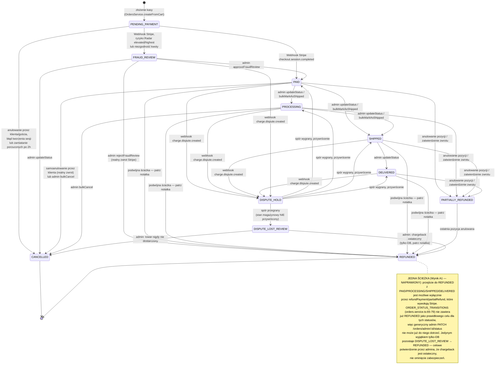
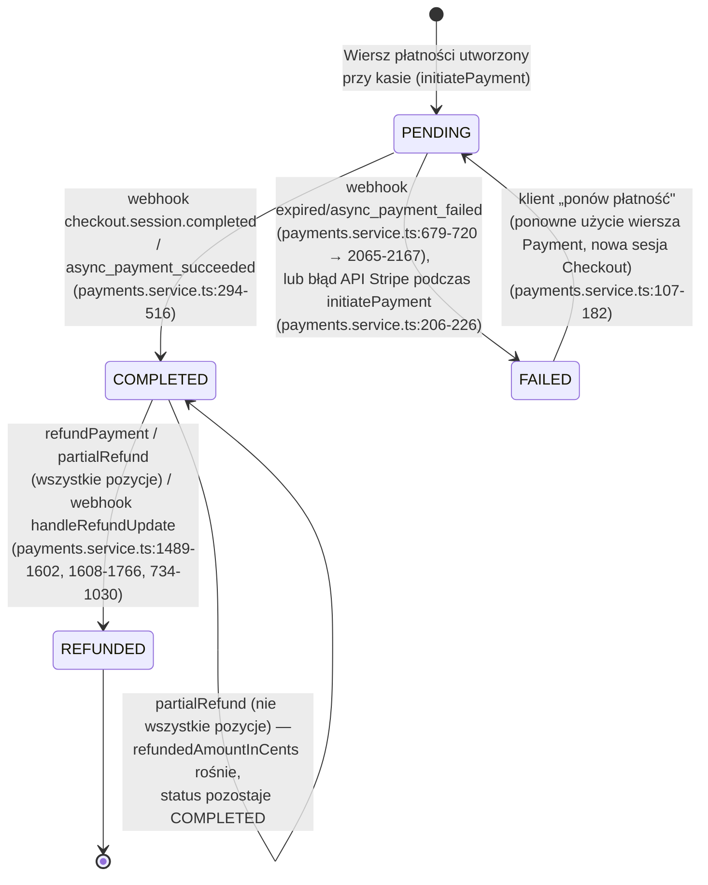
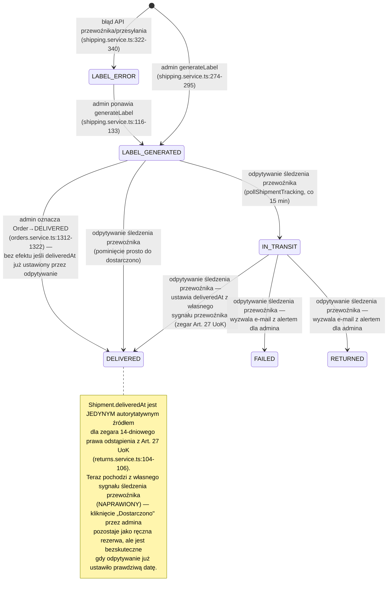
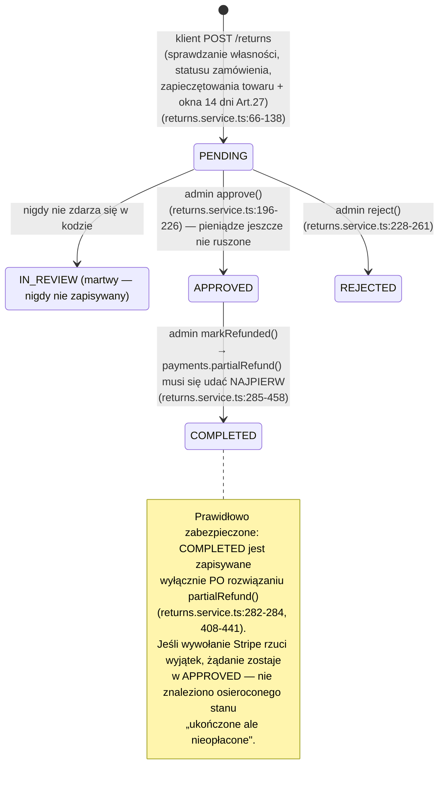
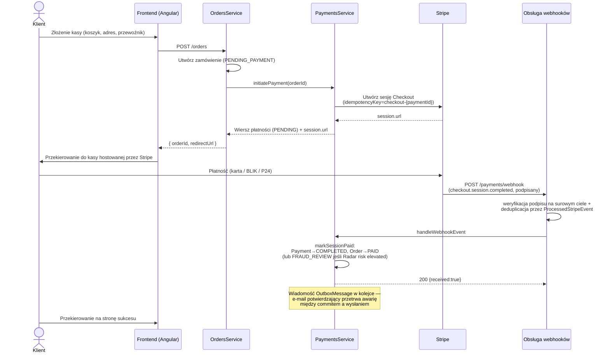
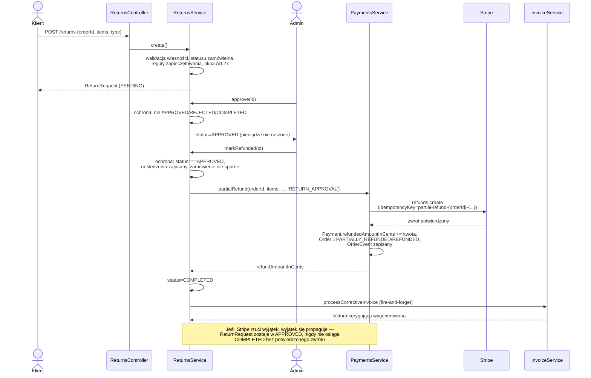
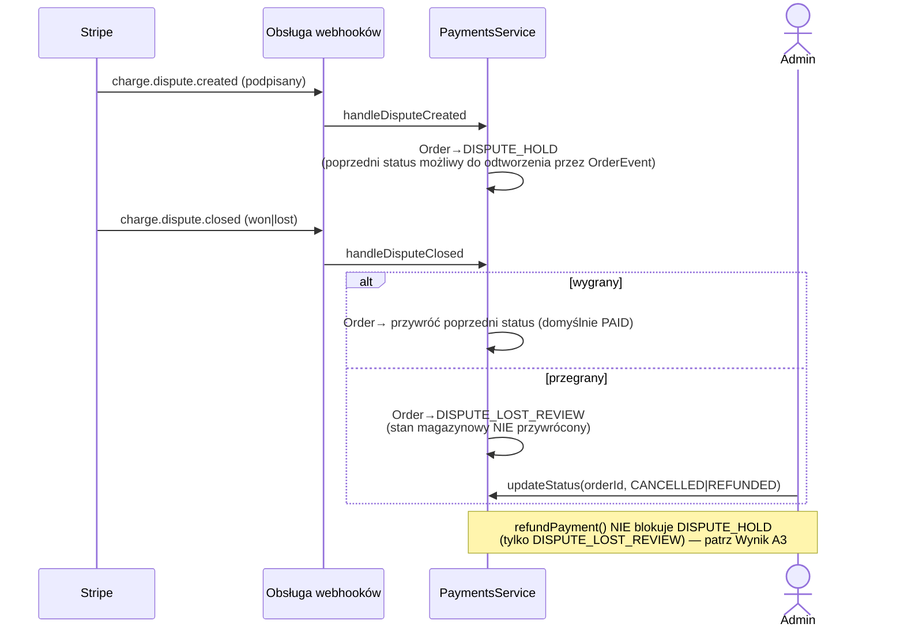
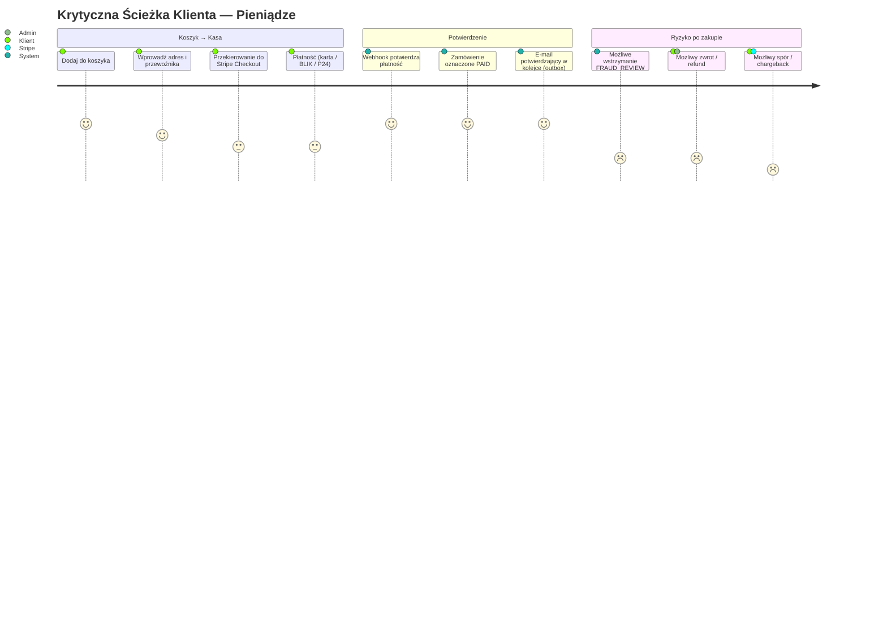
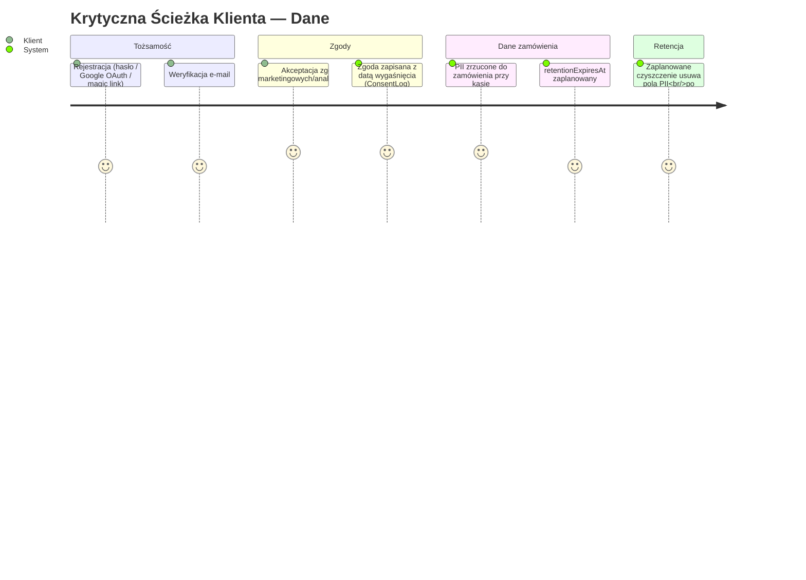

# Model Procesów Biznesowych — Zamówienia, Płatności, Przesyłki, Zwroty

Podstawowy dokument referencyjny opisujący przepływ pieniędzy i danych klientów przez tę bazę kodu, wyprowadzony z lektury rzeczywistej implementacji (nie zamierzonego projektu). Diagramy używają Mermaid — renderują się bezpośrednio na GitHub/GitLab i w większości edytorów.

**Zakres.** Zgodnie z założeniami dokument celowo *nie* mapuje każdej encji w systemie. Obejmuje dwie domeny, gdzie błędy kosztują pieniądze lub tworzą odpowiedzialność prawną:

- **Pieniądze**: kasa → płatność → realizacja → zwrot/spór (`Order`, `Payment`, `Shipment`, `ReturnRequest`, `InvoiceCorrection`)
- **Dane**: tożsamość, zgody i przechowywanie danych osobowych (PII) wokół zamówienia

Każde przejście poniżej jest cytowane jako `plik:linia` w odniesieniu do kodu z gałęzi `fix/audit_round_22`. Tam, gdzie przejście jest *prawnie dopuszczalne, ale faktycznie niebezpieczne* (pytanie „czy można przejść z A do C omijając B?"), jest to zaznaczone inline i ponownie w sekcji [Wyniki Audytu](#wyniki-audytu).

**Zobacz też:** [`clickable-elements-mapping-plan.md`](./clickable-elements-mapping-plan.md) (które elementy UI faktycznie wyzwalają te przejścia), [`audit-exclusion-list.md`](./audit-exclusion-list.md) (skrócona historia wszystkich rozwiązanych wyników — A1–A4 są dodawane do jego sekcji Zamówień/Płatności po naprawieniu), [`accepted-tradeoffs.md`](./accepted-tradeoffs.md) (celowe decyzje projektowe, np. brak automatycznego przywracania stanu po DISPUTE_LOST_REVIEW), [`coupon-lifecycle-model.md`](./coupon-lifecycle-model.md) (ta sama metoda zastosowana do domeny Kuponów, celowo poza zakresem tego dokumentu), [`auth-session-lifecycle-model.md`](./auth-session-lifecycle-model.md) (ta sama metoda zastosowana do Auth/Sesji/OAuth), [`gdpr-export-erasure-model.md`](./gdpr-export-erasure-model.md) (ta sama metoda zastosowana do przepływu eksportu/usuwania §8.2 — większość była już zbudowana).

---

## 1. Maszyna stanów zamówienia

`OrderStatus` (`packages/shared-types/src/enums.ts:6-18`) jest zarządzany przez jawną listę dozwolonych przejść, `ORDER_STATUS_TRANSITIONS` (`backend/src/modules/orders/orders.service.ts:65-79`). Stany terminalne (`CANCELLED`, `REFUNDED`) nie mają krawędzi wychodzących w tej tabeli.

**Wyzwalacze według ścieżki kodu:**

| Przejście | Wyzwalacz | Cytowanie |
|---|---|---|
| `*` → `PENDING_PAYMENT` | Kasa (`createFromCart`) | `orders.service.ts:368-374` |
| `PENDING_PAYMENT` → `PAID`/`FRAUD_REVIEW` | Webhook `checkout.session.completed`/`async_payment_succeeded` przez `markSessionPaid` | `payments.service.ts:294-516` |
| `PENDING_PAYMENT` → `CANCELLED` | Samoanulowanie, anulowanie tokenem gościa, błąd ponowienia płatności lub zamiatanie porzuconych po 2h | `orders.service.ts:454,827,894,955`; `payments.service.ts:1272-1370` |
| `FRAUD_REVIEW` → `PAID` | Admin zatwierdza | `orders.service.ts:1163-1176` → `payments.service.ts:522-589` |
| `FRAUD_REVIEW` → `REFUNDED` | Admin odrzuca (realny zwrot) | `orders.service.ts:1178-1191` → `payments.service.ts:1489-1597` |
| `PAID/PROCESSING` → `SHIPPED`, `SHIPPED` → `DELIVERED` | Generyczne przejście przez admina | `orders.service.ts:1220-1343` (zabezpieczone przez listę dozwolonych powyżej) |
| `PAID/PROCESSING/SHIPPED/DELIVERED` → `REFUNDED` (jedyna ścieżka — wywołanie Stripe) | `refundPayment` | `payments.service.ts:1489-1597` |
| `DISPUTE_LOST_REVIEW` → `REFUNDED` (tylko DB, admin potwierdza chargeback) | Generyczny admin `updateStatus` | `orders.service.ts:1220-1343` |
| `*` → `PARTIALLY_REFUNDED/REFUNDED` | `partialRefund` (anulowanie pozycji lub zatwierdzenie zwrotu) | `payments.service.ts:1608-1766` |
| `*` → `DISPUTE_HOLD` | Webhook `charge.dispute.created` | `payments.service.ts:1768-1870` |
| `DISPUTE_HOLD →` (przywrócenie) / `→ DISPUTE_LOST_REVIEW` | Webhook `charge.dispute.closed` | `payments.service.ts:1872-1991` |

Każdy prawidłowy zapis powyżej wstawia wiersz `OrderEvent` (`fromStatus`, `toStatus`, `actor`, `note`) w tej samej transakcji DB — stanowi to ślad audytowy używany przez diagramy w tym dokumencie oraz przez `handleDisputeClosed` do znalezienia statusu sprzed sporu do przywrócenia.

---

## 2. Maszyna stanów płatności

`PaymentStatus` (`enums.ts:20-25`): `PENDING → COMPLETED → REFUNDED`, z gałęzią `FAILED`, która może wrócić do `PENDING` przy ponowieniu.

Idempotentność: każdy zapis sterowany webhookiem wstawia wiersz `ProcessedStripeEvent` wewnątrz *tej samej transakcji* co mutacja (unikalny na `eventId`, plus syntetyczne klucze sesyjne `paid-${sessionId}` / `failed-${sessionId}` dla wyścigów cron/webhook) — `payments.service.ts:252-254, 372-377` i w całym pliku. Wywołania po stronie Stripe dodatkowo noszą własne klucze idempotentności (`checkout-`, `coupon-`, `refund-`, `partial-refund-` — `stripe.client.ts:142,105,175,192`).

---

## 3. Maszyna stanów przesyłki

`ShipmentStatus` (`enums.ts:27-35`) — **NAPRAWIONY.** `IN_TRANSIT`/`FAILED`/`RETURNED` były martwe (zdefiniowane w schemacie, nigdy nie zapisywane przez żadną ścieżkę kodu), a `Shipment.deliveredAt` — jedyne autorytatywne źródło dla zegara 14-dniowego prawa odstąpienia z Art. 27 UoK (`returns.service.ts:104-106`) — był ustawiany wyłącznie przez kliknięcie „Dostarczono" przez admina, nigdy przez rzeczywisty sygnał przewoźnika. `ShippingService.pollShipmentTracking` (`shipping.service.ts`) działa teraz co 15 minut, pyta klientów każdego przewoźnika o `getTrackingStatus()` dla każdej przesyłki `LABEL_GENERATED`/`IN_TRANSIT` na nieukończonym zamówieniu i zapisuje wynik bezpośrednio — włącznie z `deliveredAt`, chronionym przez `deliveredAt: null`, aby nie mógł zostać nadpisany przez późniejsze kliknięcie admina (lub odwrotnie; wygrywa ten, kto dotrze pierwszy). Wynik `FAILED`/`RETURNED` wyzwala e-mail z alertem dla admina (`sendShipmentExceptionAlert`), ale celowo **nie** mutuje `Order.status` — ten sam wzorzec „człowiek musi zdecydować" co `DISPUTE_LOST_REVIEW`.

Zastrzeżenie: jest to rzeczywiste w przypadku InPost (mapowanie statusów potwierdzone na podstawie dokumentacji ShipX InPost) i DHL (potwierdzone na podstawie API „Shipment Tracking – Unified" DHL, które wymaga osobnego `DHL_TRACKING_API_KEY` — oddzielnej subskrypcji od klucza MyDHL API używanego do tworzenia etykiet; odpytywanie jest pomijane, nie powoduje błędu startu, jeśli nie jest ustawiony). GLS/DPD Polska nie mają publicznego API, więc ich rzeczywiste gałęzie są przybliżeniem wzorowanym na istniejących (równie niezweryfikowanych) gałęziach `createShipment` — należy zweryfikować z prawdziwą dokumentacją konta przed poleganiem na nich produkcyjnie. Wszystkie cztery mają zapasowe deterministyczne symulacje (`SHIPMENT_MOCK_IN_TRANSIT_AFTER_MINUTES`/`SHIPMENT_MOCK_DELIVERED_AFTER_MINUTES`) pod istniejącą flagą `*_MOCK_ENABLED` każdego przewoźnika.

Domyślny stan `LABEL_PENDING` (`schema.prisma:513`) jest praktycznie martwy: żaden `Shipment.create()` nie istnieje poza `upsert` w `generateLabel`, którego gałąź `create` zawsze zapisuje bezpośrednio `LABEL_GENERATED` lub `LABEL_ERROR` — wiersz `Shipment` po prostu nie istnieje dopóki nie zostanie wygenerowana etykieta.

---

## 4. Maszyna stanów zwrotu / reklamacji (nota korygująca)

`ReturnStatus` (`enums.ts:72-78`) — jest to najbliższy analog procesu noty kredytowej: przepływ odstąpienia konsumenckiego (Art. 27 UoK) i reklamacji. `IN_REVIEW` jest zdefiniowany, ale **nigdy nieprzypisywany** przez żaden serwis ani akcję admina — zwroty przechodzą bezpośrednio `PENDING → APPROVED/REJECTED`. Celowo pozostawione tak (nie błąd, brak wpływu na pieniądze/prawo): w tym wdrożeniu jest tylko jedno konto admina, więc nie ma problemu kolizji recenzji, dla którego stan pośredni „zajęty przez admina" miałby rozwiązywać. Należy ponownie rozważyć tylko jeśli dołączy drugi admin i podwójne recenzje staną się realnym problemem.

`markRefunded` dodatkowo wymaga, dla zwrotów typu `WITHDRAWAL`, aby `returnTrackingNumber` był już zapisany (Art. 32 UoK — sprzedawca może wstrzymać zwrot do chwili otrzymania potwierdzenia fizycznego zwrotu, `returns.service.ts:298-306`), i blokuje jeśli powiązane zamówienie ma status `DISPUTE_HOLD`/`FRAUD_REVIEW`/`DISPUTE_LOST_REVIEW` (`returns.service.ts:388-403`).

---

## 5. Sekwencja: kasa → płatność → realizacja (ścieżka pieniądza)

## 6. Sekwencja: zwrot / nota kredytowa (proces zwrotu)

## 7. Sekwencja: spór / chargeback

---

## 8. Ścieżki użytkownika — tylko ścieżki krytyczne

Zgodnie z założeniami, pomijamy onboarding, UX przeglądania/wyszukiwania itp. i skupiamy się tylko na miejscach, gdzie pieniądze lub dane osobowe faktycznie zmieniają właściciela.

### 8.1 Pieniądze

### 8.2 Dane

Ścieżka danych jest celowo płytka — `ConsentLog`, `Order.retentionExpiresAt` i `orders-cleanup.service.ts` są potwierdzone jako istniejące i dotykające PII, ale pełny audyt obsługi żądań eksportu/usuwania nie był w zakresie tego przejścia. Zobacz [`docs/gdpr-breach-runbook.md`](./gdpr-breach-runbook.md) dotyczący strony reagowania na incydenty.

---

## Wyniki Audytu

Odpowiadamy na rzeczywiste pytanie — *„czy istnieje ścieżka w kodzie pozwalająca przejść z A do C omijając B?"* — uszeregowane według rzeczywistej wagi. Wszystkie cztery zostały potwierdzone przez bezpośrednią lekturę kodu (dwa z nich niezależnie przez oddzielne przeglądy).

### A1 — KRYTYCZNY: Admin może oznaczyć zamówienie jako `REFUNDED` bez wywoływania Stripe — NAPRAWIONY

**Naprawiony:** `ORDER_STATUS_TRANSITIONS` nie pozwala już `PAID/PROCESSING/SHIPPED/DELIVERED/FRAUD_REVIEW` dotrzeć do `CANCELLED/REFUNDED/PARTIALLY_REFUNDED` przez generyczny endpoint — te stany z przechwyconym pieniądzem muszą teraz przechodzić przez `refundPayment`/`partialRefund`/`approveFraudReview`/`rejectFraudReview`, które wywołują Stripe i aktualizują `Payment.status` atomowo. `DISPUTE_LOST_REVIEW → CANCELLED/REFUNDED` pozostaje jedynym prawidłowym wyjątkiem tylko-DB. Patrz komentarz `ORDER_STATUS_TRANSITIONS` w `orders.service.ts` i testy regresyjne w `orders.service.spec.ts`.

`PATCH /orders/admin/:id/status` → `OrdersService.updateStatus` (`orders.service.ts:1220-1343`) walidował przejście względem `ORDER_STATUS_TRANSITIONS` (§1) — co **pozwalało** na `PAID/PROCESSING/SHIPPED/DELIVERED → REFUNDED`. Handler przywracał stan magazynowy i zapisywał pozornie prawidłowy `OrderEvent`, ale **nigdy nie wywoływał `stripeClient.createRefund()` i nie dotykał `Payment.status`**.

Efekt netto: `Order.status = REFUNDED` wszędzie (panel admina, historia zamówień klienta, ślad audytowy), podczas gdy `Payment.status` pozostaje `COMPLETED` — sprzedawca zatrzymuje opłatę. Nic tego nie uzgadniało: `reconcilePendingPayments` skanuje tylko `Payment.status = PENDING` (`payments.service.ts:1210-1218`), a żaden middleware Prisma/trigger DB nie weryfikuje `Order.status` względem `Payment.status`.

**Kierunek naprawy:** usunięcie `REFUNDED`/`PARTIALLY_REFUNDED` jako prawidłowych celów dla generycznego endpointu statusu lub delegowanie przez `updateStatus()` do `refundPayment()` gdy celem jest `REFUNDED`.

### A2 — KRYTYCZNY: Domyślny formularz edycji AdminJS nie ma *żadnej* ochrony na `Order.status` i `Shipment.status` — NAPRAWIONY

**Naprawiony:** oba zasoby teraz ustawiają `properties.status` na stałą `EDIT_LOCKED` (`admin.setup.ts:279`) — `isVisible: { list: true, show: true, edit: false, filter: true }` — ukrywając `status` z domyślnego formularza edycji opartego na Prisma, zachowując go widocznym/filtrowalnym. Zmiany statusu są wymuszane przez zabezpieczone akcje i endpointy REST. Patrz testy `EDIT_LOCKED` w `admin.setup.spec.ts`.

Niezależnie od A1: zasoby `Order` (`admin.setup.ts:467-482`) i `Shipment` (`admin.setup.ts:725-739`) w AdminJS wyłączały tylko akcje `new`/`delete`. `status` pozostawało jako zwykłe edytowalne pole rozwijane w domyślnej akcji `edit` — bez nadpisania `properties.status` (w przeciwieństwie do `ReturnRequest`, które whitlistuje `editProperties: ['adminNote']`, wymuszając zmiany statusu przez zabezpieczone akcje niestandardowe — `admin.setup.ts:899`).

Każdy posiadacz sesji AdminJS mógł więc ustawić `Order.status` lub `Shipment.status` na *dowolną* wartość enum przez domyślny formularz edycji oparty na Prisma: bez sprawdzania listy dozwolonych przejść, bez przywracania stanu magazynowego, bez wywołania Stripe, **bez żadnego zapisu `OrderEvent`/`AdminLog`**. Jest to ściśle gorsze niż A1 — nie pozostawia nawet wiarygodnego śladu audytowego. Potwierdzone niezależnie przez dwa oddzielne przeglądy `admin.setup.ts`.

**Kierunek naprawy:** dodanie `properties: { status: { isVisible: { edit: false } } }` (lub równoważnego) do obu zasobów, wymuszając wszystkie zmiany statusu przez istniejące zabezpieczone akcje niestandardowe.

### A3 — WYSOKI: `refundPayment` nie blokuje otwartego sporu, tylko przegrany — NAPRAWIONY

**Naprawiony:** `refundPayment` teraz blokuje `DISPUTE_HOLD` obok `DISPUTE_LOST_REVIEW` (celowo nadal *nie* blokuje `FRAUD_REVIEW`, ponieważ `rejectFraudReview` prawidłowo go wywołuje gdy zamówienie jest nadal `FRAUD_REVIEW`). `partialRefund` teraz ponownie pobiera `order.status` wewnątrz własnej blokady i blokuje `DISPUTE_HOLD`/`FRAUD_REVIEW`/`DISPUTE_LOST_REVIEW` — zamykając okno TOCTOU dla każdego wywołującego przez konstrukcję. Patrz nowe testy ochrony sporu na obu metodach w `payments.service.spec.ts`.

`refundPayment` (`payments.service.ts:1489-1597`) blokowało `Order.status === DISPUTE_LOST_REVIEW`, ale **nie sprawdzało `DISPUTE_HOLD`**. `handleDisputeCreated` przenosi `Order.status → DISPUTE_HOLD` bez dotykania `Payment.status` (pozostaje `COMPLETED`). `POST /payments/:orderId/refund` (tylko admin) mógł więc przejść przez każde zabezpieczenie i wystawić realny zwrot Stripe *gdy Stripe jednocześnie prowadzi spór o tę samą opłatę jako chargeback*.

`partialRefund` (`payments.service.ts:1608-1766`) był gorszy — nie miał **żadnego** sprawdzenia `order.status`, tylko `payment.status === COMPLETED`. `ReturnsService.markRefunded` samodzielnie sprawdzał zablokowane statusy tuż przed jego wywołaniem (`returns.service.ts:388-403`), ale `OrdersService.cancelItemsByUser` sprawdzał status raz na początku i nie był ponownie serializowany względem jednocześnie nadchodzącego webhooka `charge.dispute.created` (który nie bierze żadnej blokady) — wąskie ale realne okno TOCTOU mogące zwrócić pieniądze za zamówienie w trakcie sporu.

### A4 — ŚREDNI: wyścig zatwierdzenia/odrzucenia fraud review może zarówno wysłać jak i zwrócić pieniądze za to samo zamówienie — NAPRAWIONY

**Naprawiony:** `approveFraudReview`/`rejectFraudReview` teraz współdzielą blokadę Redis `fraud-review-lock:${orderId}` (`OrdersService.withFraudReviewLock`), pobraną *przed* odczytem `order.status === FRAUD_REVIEW` i utrzymaną przez delegację do `PaymentsService`. To wywołanie, które przegra wyścig, teraz widzi już zaktualizowany status i prawidłowo odrzuca zamiast ponownie zatwierdzać. Patrz blok `describe` „approveFraudReview / rejectFraudReview — zabezpieczenie współbieżności" w `orders.service.spec.ts`.

`OrdersService.approveFraudReview`/`rejectFraudReview` (`orders.service.ts:1163-1191`) każde odczytywało `order.status` raz przed delegacją do zablokowanego przez Redis wywołania serwisu płatności. Odczyt statusu i pobranie blokady nie były atomowe, więc dwie równoczesne akcje admina mogły obie przejść zewnętrzne sprawdzenie, a następnie ścigać się o blokadę. Jeśli odrzucenie wygrało po tym jak zatwierdzenie już zacommitowało `PAID` (klient powiadomiony, faktura wystawiona), wewnętrzna ochrona odrzucenia (`payment.status === COMPLETED`, `order.status !== DISPUTE_LOST_REVIEW`) nadal przechodziła — zamówienie kończyło zatem zarówno zatwierdzone-i-wysłane *jak i* zwrócone.

### A5 — Strukturalne luki warte śledzenia, nie exploity

- **Status przesyłki był ślepy na przewoźnika — NAPRAWIONY.** `IN_TRANSIT`/`FAILED`/`RETURNED` były martwe (§3) — zgubiona lub odrzucona paczka była niewidoczna dla systemu. `ShippingService.pollShipmentTracking` teraz odpytuje własny status śledzenia każdego przewoźnika co 15 minut i zapisuje prawdziwy wynik, przy czym wynik `FAILED`/`RETURNED` informuje admina e-mailem zamiast cicho leżeć bez działania. Patrz §3 dotyczący zastrzeżenia dotyczącego pewności per-przewoźnik (mapowania InPost/DHL potwierdzone na podstawie prawdziwych dokumentów; GLS/DPD to najlepsze przybliżenie, podobnie jak ich istniejące gałęzie `createShipment`).
- **Zegar 14 dni z Art. 27 opierał się na zaufaniu do admina, nie na potwierdzeniu przewoźnika — NAPRAWIONY** tą samą zmianą. `Shipment.deliveredAt` (notatka §3) jest teraz stemplowany z własnego sygnału dostawy przewoźnika natychmiast gdy odpytywanie go wykryje, chroniony przez `deliveredAt: null` aby nie mógł zostać nadpisany przez późniejsze (teraz zbędne) kliknięcie admina.
- **Gałąź odzyskiwania częściowego zwrotu przez webhook `handleRefundUpdate` nie mogła przywrócić stanu magazynowego — NAPRAWIONY.** `partialRefund` teraz dołącza podział `orderItemId`/`productVariantId`/`quantity`/`discountAppliedInCents` per pozycję do własnych metadanych zwrotu Stripe w momencie tworzenia (`StripeClient.buildRefundItemsMetadata`, `stripe.client.ts`). Jeśli synchroniczny zapis DB po wywołaniu Stripe się nie powiedzie, gałąź odzyskiwania `handleRefundUpdate` (`payments.service.ts:856-971`) dekoduje i waliduje te metadane i samodzielnie rekonstruuje `cancelledQuantity`, stan magazynowy i status `Order`/`Payment`. Metadane są ograniczone do limitu 500 znaków Stripe; zamówienie z wystarczającą liczbą odrębnych pozycji aby przekroczyć ten limit wraca do oryginalnego zachowania z najlepszym wysiłkiem.
- **Miejsca zapisu statusu pomijające ochronę `where: status` — NAPRAWIONY.** `markSessionPaid`, `handlePaymentFailure`, `refundPayment`, `partialRefund` i obie gałęzie `handleRefundUpdate` teraz wszystkie zapisują `Order.status` przez warunkowe `updateMany` oparte na statusie, który każda metoda odczytała dla zamówienia, wzorując się na defensywnym wzorcu `updateStatus`/`sweepOrphanedPendingOrders`. Wynik 0 rzuca `OrderStatusRaceError`.
- **TTL blokady `pruneProcessedStripeEvents` (~23h) był na tyle bliski jej 24h interwałowi cron, że uśpienie Railway hobby-tier mogło zepchnąć kolejne skuteczne czyszczenie o ~48h — NAPRAWIONY.** `reconcilePendingPayments` teraz wywołuje `pruneProcessedStripeEvents()` samodzielnie na końcu każdego tiku, opakowanego w własny try/catch.

---

## Rozszerzony audyt Płatności/Stripe (2026-06-24)

Postępując za tym samym wzorcem przestarzałości znajdującym się już w [`auth-session-lifecycle-model.md`](./auth-session-lifecycle-model.md) (16 z 17 punktów już naprawionych) i [`gdpr-export-erasure-model.md`](./gdpr-export-erasure-model.md) (7 z 7), sekcja „Payments / Stripe" w `audit-exclusion-list.md` — największy klaster punktów poza Frontend/SSR — została zweryfikowana linia po linii względem aktualnych `payments.service.ts`, `stripe.client.ts`, `payments.controller.ts` i `orders.service.ts`. **22 z 24 sprawdzonych punktów jest przestarzałych** (już naprawionych, kilka nigdzie nie udokumentowanych do teraz). Dwa realne, wcześniej nieudokumentowane luki ujawniły się przez czytanie ścieżki dispatch webhooka od końca do końca:

### A6 — WYSOKI (NAPRAWIONY): endpoint webhooka Stripe Dashboard prawdopodobnie nigdy nie subskrybował zdarzeń sporu ani payout

`handleWebhookEvent` dispatcher (`payments.service.ts:249-292`) w pełni obsługuje `charge.dispute.created`, `charge.dispute.closed` i `payout.failed` — trzy realne, przetestowane ścieżki kodu. Ale lista zdarzeń w checkliście produkcyjnej `CLAUDE.md` podaje: `checkout.session.completed`, `checkout.session.expired`, `checkout.session.async_payment_failed`, `charge.refund.updated`. **Żaden z trzech typów zdarzeń sporu/payout nie jest na tej liście.**

Endpoint webhook Stripe dostarcza tylko typy zdarzeń wyraźnie wybranych przy konfiguracji — nie ma rezerwy „wyślij wszystko". Jeśli produkcyjny endpoint był ustawiony przez dosłowne śledzenie udokumentowanej checklisty, `charge.dispute.created`/`closed` i `payout.failed` nigdy nie docierają. Praktyczny wpływ jest poważny i cichy:

- **Cała maszyna stanów `DISPUTE_HOLD`/`DISPUTE_LOST_REVIEW` (§1, §7 powyżej) nigdy się nie aktywuje.** Realny chargeback zostawia zamówienie w `PAID` bezterminowo.
- Żaden e-mail z alertem sporu (`sendDisputeAlert`) ani przechwytywanie Sentry nigdy nie wyzwala się — spory są niewidoczne dla sprzedawcy do czasu gdy własny dashboard/e-mail Stripe ich powiadomi, już po uruchomieniu zegara składania dowodów (`evidence_details.due_by`).
- `payout.failed` — niezależnie oznaczony przez oryginalny punkt wykluczenia-listy — ma identyczną przyczynę główną.

To nie jest błąd kodu; handlery są prawidłowe i przetestowane. To **luka dokumentacyjna z konsekwencją dla poprawności produkcyjnej** — jedyny kanał instruujący człowieka jak skonfigurować Dashboard jest niekompletny.

**Naprawiony:** dodano `charge.dispute.created`, `charge.dispute.closed` i `payout.failed` do listy zdarzeń webhook Stripe w `CLAUDE.md` (wiersz `STRIPE_WEBHOOK_SECRET`), z notatką wyjaśniającą konsekwencję cichego wyłączenia jeśli brakuje tych zdarzeń. To jest tylko naprawa dokumentacji — ponieważ faktyczna subskrypcja Dashboard nie może zostać zweryfikowana przez czytanie repozytorium, **potwierdź bezpośrednio w Stripe Dashboard** (Developers → Webhooks → produkcyjny endpoint → „Listening for"), że wszystkie siedem zdarzeń jest faktycznie wybranych.

### A7 — ŚREDNI (NAPRAWIONY): klient Stripe SDK nie ma skonfigurowanego timeoutu ani polityki ponowień

`stripe.client.ts:71-74` buduje SDK tylko z ustawionym `apiVersion` — `new StripeSDK(apiKey, { apiVersion: '2026-05-27.dahlia' })`. Bez opcji `timeout` ani `maxNetworkRetries`, każde wywołanie korzysta z domyślnych `stripe-node` (timeout 80 sekund, zero automatycznych ponowień). `markSessionPaid` — wywoływane synchronicznie z obsługi webhooka — wywołuje `retrievePaymentIntentWithCharge` (sprawdzenie poziomu ryzyka Radar, `payments.service.ts:354`) zanim może odpowiedzieć `{received:true}`. Powolna odpowiedź API Stripe bliska temu 80-sekundowemu limitowi utrzymuje webhook otwarty długo po własnym oczekiwanym oknie odpowiedzi Stripe.

**Naprawiony:** przekazano `timeout: 15000` i `maxNetworkRetries: 2` do konstruktora `StripeSDK` (`stripe.client.ts:71-74`) — wygodnie poniżej okna cierpliwości webhooków Stripe, z ponowieniami bezpiecznymi ponieważ każde wywołanie mutujące stan już nosi jawny `idempotencyKey`. Test regresyjny weryfikuje obie opcje w `stripe.client.spec.ts`.

### Rozwiązane — rozszerzony przegląd Payments

| Twierdzenie z listy wykluczeń | Zweryfikowany status |
|---|---|
| „Rabat kuponu nie odejmowany w pozycjach Stripe (nadpłata)" | **Przestarzały.** `createCheckoutSession` tworzy realny kupon Stripe z `amount_off` i stosuje go przez `discounts` (`stripe.client.ts:95-105`), z kluczem idempotentności `coupon-{paymentId}`. |
| „Cron uzgadniania omija ochronę idempotentności vs wyścig webhook" | **Przestarzały.** Zarówno webhook jak i cron wywołują ten sam `markSessionPaid`, który wstawia klucz dedup `paid-{sessionId}` w zakresie sesji wewnątrz swojego `$transaction` niezależnie od wywołującego (`payments.service.ts:372-377`) — wygrywa ten który pierwszy zacommituje, drugi dostaje `P2002` i zwraca. |
| „Webhook Stripe poza kolejnością (`expired` przed `completed`) przełącza opłacone zamówienie na anulowane" | **Niereprodukowane zgodnie z opisem.** `markSessionFailed` jawnie zwraca wcześnie jeśli `payment.status === COMPLETED` (`payments.service.ts:694-697`), a własny cykl życia sesji Checkout Stripe sprawia, że `expired`-po-`completed` dla *tej samej* sesji jest nieosiągalny. |
| „Brak klucza idempotentności na `sessions.create` / `coupons.create`" | **Przestarzały.** Oba wywołania noszą `idempotencyKey: checkout-{paymentId}` / `coupon-{paymentId}` (`stripe.client.ts:142,105`). |
| „Osierocone obiekty kuponów Stripe nigdy nie usuwane (przy ponowieniu, przy wygaśnięciu)" | **Przestarzały.** Usuwane po udanej płatności, po niepowodzeniu i przed ponownym tworzeniem sesji przy ponowieniu. |
| „P2002 crash tworzenia drugiego wiersza Payment w `retryPayment`" | **Przestarzały.** `initiatePayment` używa upsert przez `findUnique` a następnie warunkowe `update`/`create` (`payments.service.ts:112-182`) — brak zwykłego `create` na ścieżce ponowienia. |
| „Kwota zamówienia poniżej 50gr omija minimum Stripe... 50gr zamiast 200gr" | **Przestarzały.** Dedykowany util `getStripeMinimumChargeInCents()` z prawdziwą mapą per-waluta (200gr PLN jako rezerwa) jest wymuszany wewnątrz transakcji `createFromCart` (`orders.service.ts:358-366`). |
| „Rekord płatności tworzony po wywołaniu API Stripe (ryzyko kolejności)" | **Przestarzały — jest już odwrotnie.** `initiatePayment` tworzy/aktualizuje wiersz `Payment` (`payments.service.ts:163-182`) *przed* wywołaniem `stripeClient.createCheckoutSession` (`:192`). |
| „PDF faktury base64 przechowywane w payloadzie BullMQ/Redis" | **Przestarzały.** `dispatchPostPaymentNotifications` przekazuje `invoiceStoragePath` (ścieżka Supabase, nie payload) do kolejki e-mail (`payments.service.ts:646-661`). |
| „`charge.dispute.created`/`closed` nieobsługiwane" + podroszczenia omijania/podwójnego zwrotu | **Przestarzały.** Oba obsługiwane (`handleDisputeCreated`/`Closed`, `:1768-1991`); podroszczenia zamknięte przez A1/A3 powyżej. **Ale patrz A6 — handlery działają, subskrypcja Dashboard z CLAUDE.md prawdopodobnie nie zawiera tych zdarzeń w ogóle.** |
| „`cancelItemsByUser` zwraca brutto przed rabatem; błędna proporcja FREE_SHIPPING; brak limitu" | **Przestarzały, w pełni zastąpiony.** `partialRefund` limituje przez `Math.min(rawRefundAmountInCents, available)` (`:1664`); `prorateDiscountForRefundItems` pomija kupony `FREE_SHIPPING` i zachowuje faktycznie zastosowany (nie idealny) rabat per jednostkę (`:1450-1480`). |
| „Atak czasowy na porównanie `PAYMENTS_RECONCILE_SECRET`" | **Przestarzały.** `timingSafeEqual` z buforami równej długości (`payments.controller.ts:124-128`). |
| „`pg_advisory_xact_lock` nieskuteczna przez pgbouncer (sekwencja DDL)" | **Rozwiązane przez zmianę projektu.** Komentarz w `onModuleInit` (`orders.service.ts:113-117`) wyjaśnia, że blokada celowo *nie jest używana* — `CREATE SEQUENCE IF NOT EXISTS` jest naturalnie idempotentna/bezpieczna przy równoległym wykonaniu bez blokady. |
| „`FOR UPDATE` wewnątrz interaktywnych transakcji jest bezskuteczny przez pgbouncer (ochrona przed nadsprzedażą zepsuta)" | **Niereprodukowane jako ogólne twierdzenie.** Ochrona magazynowa kasy (`createFromCart`) używa atomowego `updateMany` warunkowego na `stock >= quantity` (`orders.service.ts:298-308`), nie `FOR UPDATE` — z natury odporna. |
| „Niepowodzenie payout Stripe niemonitorowane (`payout.failed` niezsubskrybowany)" | **Potwierdzone — połączone z A6, który stwierdził tę samą lukę obejmującą oba zdarzenia sporu.** |
| „Token anulowania gościa wycieka przez Referer; TTL za krótki dla P24/BLIK (1h)" | **Przestarzały, obie połowy.** Nieprzejrzysty klucz wyszukiwania Redis `order-token:{orderId}` zastąpił już wszelki znaczący sekret w URL, a jego TTL wynosi 7 dni (`payments.service.ts:184-188`), jawnie dobrany dla wielodniowego okna rozliczenia P24. |
| „Stawka wysyłki pobierana poza transakcją zamówienia → naliczana przestarzała cena" | **Przestarzały.** Jawnie pobierany wewnątrz transakcji `createFromCart` teraz (`orders.service.ts:332-336`). |
| „Kontrola prędkości na poziomie miasta nieskuteczna/blokuje legit klientów z Warszawy" + „Radar odpala po płatności, brak pre-checkout" | **Przestarzały, oba.** Zastąpiony kontrolą prędkości opartą na tożsamości (`userId`/`snapshotEmail`) przed kasą — 5 zamówień/30min — z jawnym komentarzem odrzucającym kontrole na poziomie miasta jako bezużyteczne w skali Warszawy (`payments.service.ts:72-85`). |
| „Duplikacja tworzenia zamówienia: brak idempotentności/blokady na `createFromCart`" | **Przestarzały.** Zarówno wczesny powrót `idempotencyKey` (`orders.service.ts:171-182`) jak i blokada Redis `checkout-lock:{userId|sessionId}` (`:188-193`). |
| „`markRefunded` wystawia pełny zwrot niezależnie od pozycji częściowego zwrotu" | **Przestarzały.** Ogranicza każdą pozycję do `orderItem.quantity - orderItem.cancelledQuantity` i wywołuje `partialRefund` tylko z dopasowanymi, ograniczonymi pozycjami (`returns.service.ts:347-368,408-410`). |
| „Lokalny `REDIS_CLIENT` w `ProductsModule` przysłania globalny klient" | **Przestarzały — provider już nie istnieje.** Tylko jeden provider `REDIS_CLIENT` istnieje w repozytorium, w współdzielonym `redis.module.ts`. |
| „`retryPayment`... brak try/catch/rollback w ogóle" | **Przestarzały.** Pełny try/catch z rollbackiem stanu magazynowego/kuponu przy odrzuceniu Stripe (`orders.service.ts:954-987`). |
| „`markSessionPaid` nigdy nie weryfikuje krzyżowo przechwyconej kwoty Stripe" | **Przestarzały.** Jawne sprawdzenie `amountMismatch` względem `session.amount_total`, kierujące do `FRAUD_REVIEW` z przechwytywaniem Sentry na poziomie `fatal` przy niezgodności (`payments.service.ts:313-342`). |
| „`handlePaymentFailure` przywracał pełną oryginalną ilość do stanu magazynowego" | **Przestarzały.** Już `item.quantity - (item.cancelledQuantity ?? 0)` (`payments.service.ts:2133`). |

**Sprawdzono 24 punkty, 22 przestarzałe, 2 nowe (A6, A7) — oba naprawione w tym przebiegu.**

---

## Załącznik: gdzie szukać

| Domena | Serwis | Tabela przejść / główna ochrona | Kontroler / wyzwalacz |
|---|---|---|---|
| Zamówienie | `backend/src/modules/orders/orders.service.ts` | `ORDER_STATUS_TRANSITIONS`, linie 65-79 | `orders.controller.ts` |
| Płatność | `backend/src/modules/payments/payments.service.ts` | dispatcher `handleWebhookEvent`, linie 249-292 | `payments.controller.ts` |
| Przesyłka | `backend/src/modules/shipping/shipping.service.ts` | `generateLabel`, linie 83-354 | `shipping.controller.ts` |
| Zwrot | `backend/src/modules/returns/returns.service.ts` | `approve`/`reject`/`markRefunded`, linie 196-458 | `returns.controller.ts` |
| Faktura korygująca | `backend/src/modules/invoice/invoice.service.ts` | `processCorrectiveInvoice`, linie 219-358 | wywoływane wewnętrznie, nieeksponowane |
| Nadpisania admina | `backend/src/modules/admin/admin.setup.ts` | definicje zasobów/akcji, linie 340-1144 | Panel AdminJS (`/admin`) |
