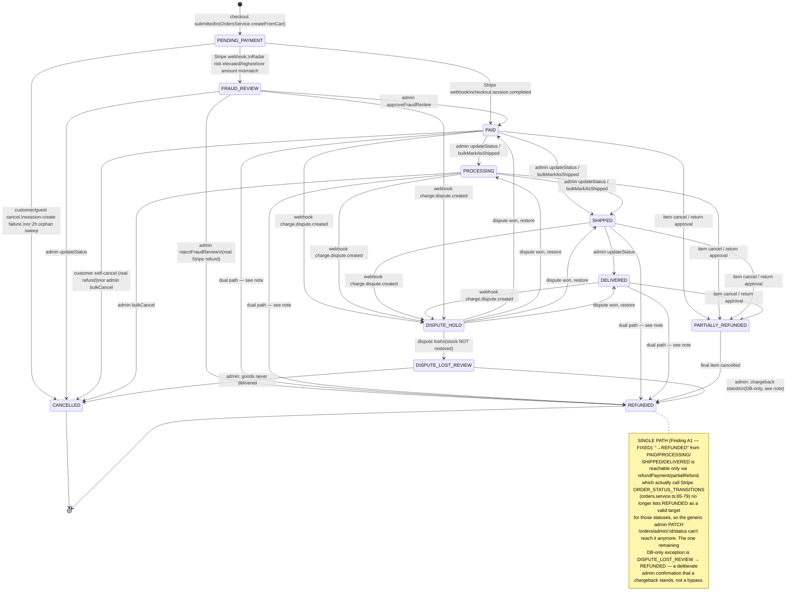
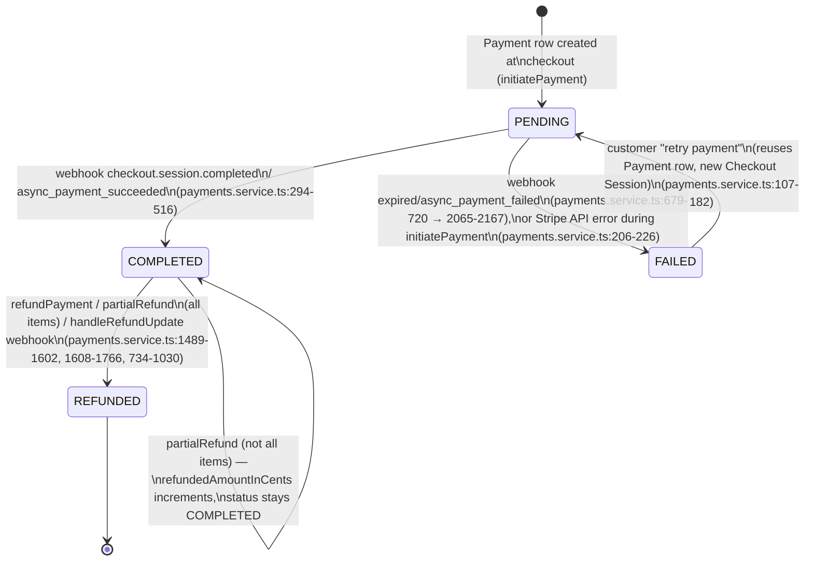
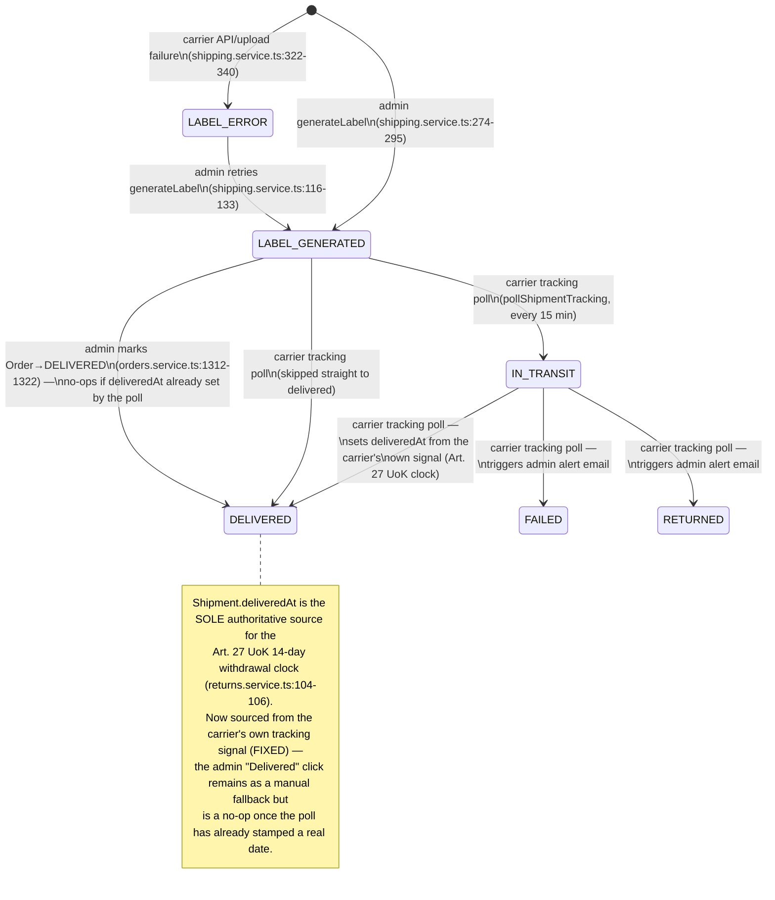
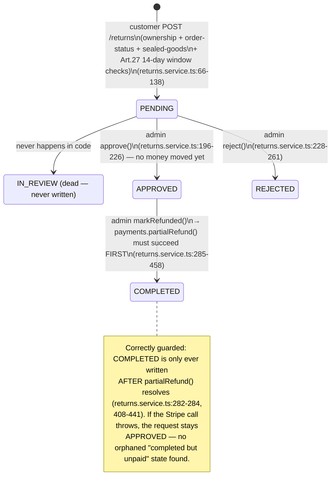
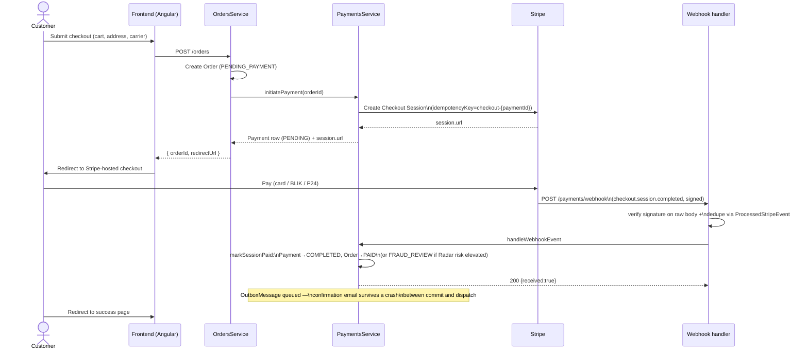
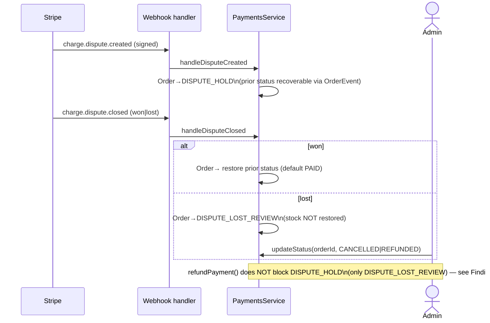
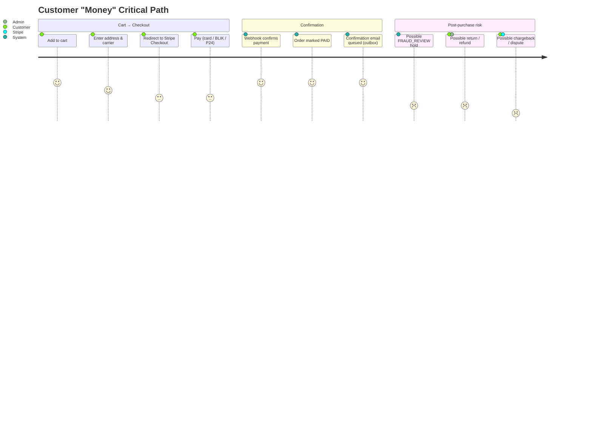
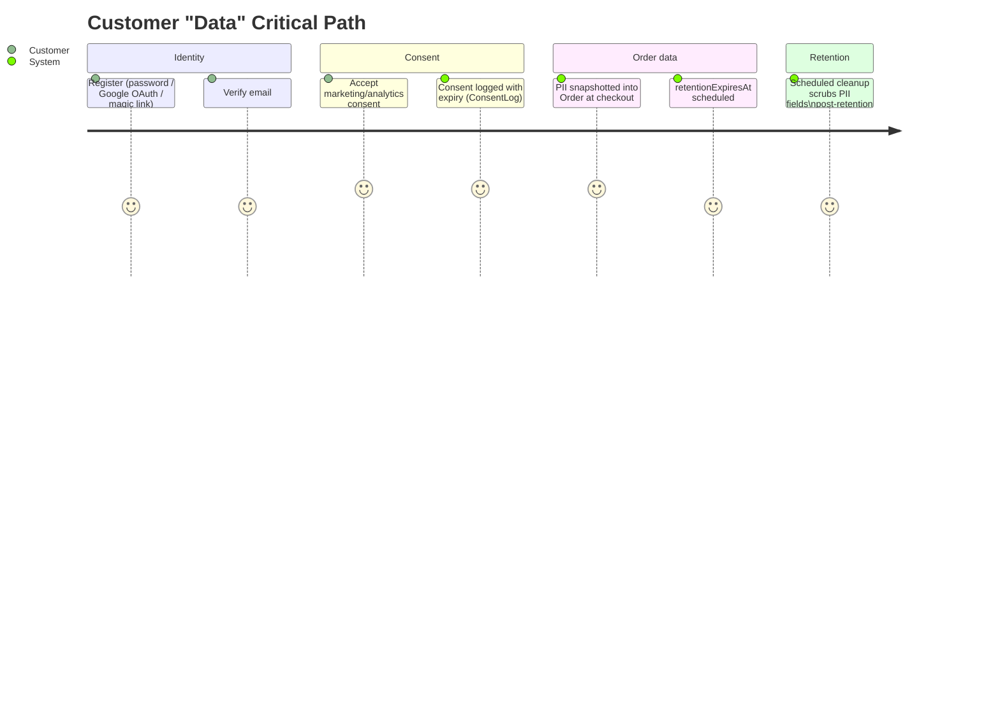

# Business Process Model — Orders, Payments, Shipments, Returns

Foundational reference for how money and customer data actually move through this
codebase, derived by reading the real implementation (not the intended design).
Diagrams use Mermaid so they render directly on GitHub/GitLab and in most editors.

**Scope.** Per the brief that produced this doc, this intentionally does *not* try to
map every entity in the system. It covers the two domains where mistakes cost money or
create legal exposure:

- **Money**: checkout → payment → fulfillment → refund/dispute (`Order`, `Payment`,
  `Shipment`, `ReturnRequest`, `InvoiceCorrection`)
- **Data**: identity, consent, and PII retention around an order

Every transition below is cited as `file:line` against the code as of branch
`fix/audit_round_22`. Where a transition is *legal but not actually safe* (the "can
you get from A to C bypassing B" question), it's called out inline and again in
[Audit Findings](#audit-findings).

**See also:** [`clickable-elements-mapping-plan.md`](./clickable-elements-mapping-plan.md)
(which UI elements actually trigger these transitions), [`audit-exclusion-list.md`](./audit-exclusion-list.md)
(condensed history of every other resolved finding — A1–A4 below are folded into its
Orders/Payments sections once fixed), [`accepted-tradeoffs.md`](./accepted-tradeoffs.md)
(deliberate design choices referenced inline above, e.g. the DISPUTE_LOST_REVIEW
no-auto-restore decision), [`coupon-lifecycle-model.md`](./coupon-lifecycle-model.md)
(same method applied to the Coupon domain, deliberately scoped out of this doc),
[`auth-session-lifecycle-model.md`](./auth-session-lifecycle-model.md) (same method
applied to Auth/Sessions/OAuth, also scoped out of this doc),
[`gdpr-export-erasure-model.md`](./gdpr-export-erasure-model.md) (same method applied
to the export/erasure flow §8.2 below explicitly scoped out — turns out most of it was
already built).

---

## 1. Order status state machine

`OrderStatus` (`packages/shared-types/src/enums.ts:6-18`) is governed by an explicit
allowlist, `ORDER_STATUS_TRANSITIONS` (`backend/src/modules/orders/orders.service.ts:65-79`).
Terminal states (`CANCELLED`, `REFUNDED`) have no outgoing edges in that table.



**Triggers, by code path:**

| Transition | Trigger | Citation |
|---|---|---|
| `*` → `PENDING_PAYMENT` | Checkout (`createFromCart`) | `orders.service.ts:368-374` |
| `PENDING_PAYMENT` → `PAID`/`FRAUD_REVIEW` | Webhook `checkout.session.completed`/`async_payment_succeeded` via `markSessionPaid` | `payments.service.ts:294-516` |
| `PENDING_PAYMENT` → `CANCELLED` | Self-cancel, guest token cancel, retry-payment failure, or 2h orphan sweep | `orders.service.ts:454,827,894,955`; `payments.service.ts:1272-1370` |
| `FRAUD_REVIEW` → `PAID` | Admin approve | `orders.service.ts:1163-1176` → `payments.service.ts:522-589` |
| `FRAUD_REVIEW` → `REFUNDED` | Admin reject (real refund) | `orders.service.ts:1178-1191` → `payments.service.ts:1489-1597` |
| `PAID/PROCESSING` → `SHIPPED`, `SHIPPED` → `DELIVERED` | Admin generic transition | `orders.service.ts:1220-1343` (guarded by the allowlist above) |
| `PAID/PROCESSING/SHIPPED/DELIVERED` → `REFUNDED` (only path — Stripe call) | `refundPayment` | `payments.service.ts:1489-1597` |
| `DISPUTE_LOST_REVIEW` → `REFUNDED` (DB-only, admin confirms chargeback stands) | Generic admin `updateStatus` | `orders.service.ts:1220-1343` |
| `* → PARTIALLY_REFUNDED/REFUNDED` | `partialRefund` (item cancel or return approval) | `payments.service.ts:1608-1766` |
| `* → DISPUTE_HOLD` | Webhook `charge.dispute.created` | `payments.service.ts:1768-1870` |
| `DISPUTE_HOLD → (restore)` / `→ DISPUTE_LOST_REVIEW` | Webhook `charge.dispute.closed` | `payments.service.ts:1872-1991` |

Every legitimate write above inserts an `OrderEvent` row (`fromStatus`, `toStatus`,
`actor`, `note`) in the same DB transaction — this is the audit trail used by
diagrams elsewhere in this doc and by `handleDisputeClosed` to find the
pre-dispute status to restore to.

---

## 2. Payment status state machine

`PaymentStatus` (`enums.ts:20-25`): `PENDING → COMPLETED → REFUNDED`, with a `FAILED`
branch that can loop back to `PENDING` on retry.



Idempotency: every webhook-driven write inserts a `ProcessedStripeEvent` row inside
the *same transaction* as the mutation (unique on `eventId`, plus session-scoped
synthetic keys `paid-${sessionId}` / `failed-${sessionId}` for cron/webhook races) —
`payments.service.ts:252-254, 372-377` and throughout. Stripe-side calls additionally
carry their own idempotency keys (`checkout-`, `coupon-`, `refund-`, `partial-refund-` —
`stripe.client.ts:142,105,175,192`).

---

## 3. Shipment status state machine

`ShipmentStatus` (`enums.ts:27-35`) — **FIXED.** `IN_TRANSIT`/`FAILED`/`RETURNED` used
to be dead code (defined in the schema, never written by any code path), and
`Shipment.deliveredAt` — the sole authoritative source for the Art. 27 UoK 14-day
withdrawal clock (`returns.service.ts:104-106`) — was only ever set by an admin
manually clicking "Delivered", never by an actual carrier signal. `ShippingService.
pollShipmentTracking` (`shipping.service.ts`) now runs every 15 minutes, asks each
carrier client's `getTrackingStatus()` for the real status of every `LABEL_GENERATED`/
`IN_TRANSIT` shipment on a non-terminal order, and writes the result directly —
including `deliveredAt`, guarded on `deliveredAt: null` so it can't be clobbered by a
later admin click (or vice versa; whichever writer gets there first wins). A
`FAILED`/`RETURNED` result triggers an admin alert email
(`sendShipmentExceptionAlert`) but deliberately does **not** mutate `Order.status` —
same "human must decide" pattern as `DISPUTE_LOST_REVIEW`.

Caveat: this is real in InPost's case (status mapping confirmed against InPost's
ShipX docs) and DHL's case (confirmed against DHL's "Shipment Tracking - Unified"
API, which needs its own `DHL_TRACKING_API_KEY` — a separate subscription from the
MyDHL API key used for label creation; polling is skipped, not boot-fatal, if it's
unset). GLS/DPD Poland have no public API reference, so their real branches are a
best-effort field-shape guess mirroring this file's existing (equally unverified)
`createShipment` branches — confirm against real account docs before relying on them
in production. All four fall back to a deterministic mock progression
(`SHIPMENT_MOCK_IN_TRANSIT_AFTER_MINUTES`/`SHIPMENT_MOCK_DELIVERED_AFTER_MINUTES`)
under each carrier's existing `*_MOCK_ENABLED` flag.



The `LABEL_PENDING` default (`schema.prisma:513`) is also effectively dead: no
`Shipment.create()` exists outside the `upsert` in `generateLabel`, whose `create`
branch always writes `LABEL_GENERATED` or `LABEL_ERROR` directly — a `Shipment` row
simply doesn't exist until a label is generated.

---

## 4. Return / complaint ("credit note") state machine

`ReturnStatus` (`enums.ts:72-78`) — this is the closest analog to a credit-note
process: Polish consumer-protection withdrawal (Art. 27 UoK) and complaint flows.
`IN_REVIEW` is defined but **never assigned** by any service or admin action — returns
go directly `PENDING → APPROVED/REJECTED`. Deliberately left as-is (not a bug, no
money/legal impact): there's a single admin account in this deployment, so there's no
review-collision problem for an intermediate "claimed by an admin" state to solve.
Revisit only if a second admin joins and duplicate-review friction becomes real.



`markRefunded` additionally requires, for `WITHDRAWAL`-type returns, that
`returnTrackingNumber` is already recorded (Art. 32 UoK — merchant may withhold the
refund until proof of physical return, `returns.service.ts:298-306`), and blocks if the
linked order is `DISPUTE_HOLD`/`FRAUD_REVIEW`/`DISPUTE_LOST_REVIEW`
(`returns.service.ts:388-403`).

---

## 5. Sequence: checkout → payment → fulfillment (the money path)



## 6. Sequence: refund / credit note (return) flow

```mermaid
sequenceDiagram
    actor C as Customer
    participant RC as ReturnsController
    participant RS as ReturnsService
    actor A as Admin
    participant PS as PaymentsService
    participant Stripe
    participant IS as InvoiceService

    C->>RC: POST /returns (orderId, items, type)
    RC->>RS: create()
    RS->>RS: validate ownership, order status,\nsealed-goods rule, Art.27 window
    RS-->>C: ReturnRequest (PENDING)

    A->>RS: approve(id)
    RS->>RS: guard: not already APPROVED/REJECTED/COMPLETED
    RS-->>A: status=APPROVED (no money moved)

    A->>RS: markRefunded(id)
    RS->>RS: guard: status===APPROVED,\ntracking# recorded, order not disputed
    RS->>PS: partialRefund(orderId, items, ..., 'RETURN_APPROVAL')
    PS->>Stripe: refunds.create\n(idempotencyKey=partial-refund-{orderId}-{...})
    Stripe-->>PS: refund confirmed
    PS->>PS: Payment.refundedAmountInCents += amount;\nOrder→PARTIALLY_REFUNDED/REFUNDED;\nOrderEvent logged
    PS-->>RS: refundAmountInCents
    RS->>RS: status=COMPLETED
    RS->>IS: processCorrectiveInvoice (fire-and-forget)
    IS-->>RS: faktura korygująca generated
    Note over RS,PS: If Stripe throws, exception propagates —\nReturnRequest stays APPROVED, never reaches\nCOMPLETED without a confirmed refund
```

## 7. Sequence: dispute / chargeback



---

## 8. User journeys — critical paths only

Per the brief, this skips onboarding polish, browse/search UX, etc. and sticks to
where money or personal data actually changes hands.

### 8.1 Money



### 8.2 Data



The data journey is intentionally shallow — `ConsentLog`, `Order.retentionExpiresAt`,
and `orders-cleanup.service.ts` are confirmed to exist and touch PII, but a full audit
of export/erasure request handling wasn't in scope for this pass. See
[`docs/gdpr-breach-runbook.md`](./gdpr-breach-runbook.md) for the incident-response
side of data handling.

---

## Audit Findings

Answering the brief's actual question — *"is there a path in the code that gets from
A to C while bypassing B?"* — ranked by real-world severity. All four were confirmed
by direct code reading (two of them independently by separate research passes).

### A1 — CRITICAL: Admin can mark an order `REFUNDED` without Stripe ever being called — FIXED

**Fixed:** `ORDER_STATUS_TRANSITIONS` no longer allows `PAID/PROCESSING/SHIPPED/
DELIVERED/FRAUD_REVIEW` to reach `CANCELLED/REFUNDED/PARTIALLY_REFUNDED` through the
generic endpoint — those money-captured states must now go through `refundPayment`/
`partialRefund`/`approveFraudReview`/`rejectFraudReview`, which call Stripe and update
`Payment.status` atomically. `DISPUTE_LOST_REVIEW → CANCELLED/REFUNDED` remains the one
legitimate DB-only exception. See `orders.service.ts`'s `ORDER_STATUS_TRANSITIONS`
comment and regression tests in `orders.service.spec.ts` ("blocks every
money-captured-state transition...").

`PATCH /orders/admin/:id/status` → `OrdersService.updateStatus`
(`orders.service.ts:1220-1343`) validates the transition against
`ORDER_STATUS_TRANSITIONS` (§1) — which **allows** `PAID/PROCESSING/SHIPPED/DELIVERED → REFUNDED`. The handler restores stock and writes a legitimate-looking `OrderEvent`,
but **never calls `stripeClient.createRefund()` and never touches `Payment.status`**.

Net effect: `Order.status = REFUNDED` everywhere (admin UI, customer order history,
audit trail) while `Payment.status` stays `COMPLETED` — the merchant keeps the
charge. Nothing reconciles this: `reconcilePendingPayments` only scans
`Payment.status = PENDING` (`payments.service.ts:1210-1218`), and no Prisma
middleware/DB trigger cross-checks `Order.status` against `Payment.status`.

The *real* refund path (`PaymentsService.refundPayment`, `payments.service.ts:1489-1597`)
is fully guarded and does call Stripe — the bug is that a second, unrelated endpoint
reaches the same terminal state without it. Same root cause makes `DELIVERED`
reachable without proof of delivery, which directly distorts the Art. 27 14-day
withdrawal clock (§3 note).

**Fix direction:** remove `REFUNDED`/`PARTIALLY_REFUNDED` as valid targets for the
generic status endpoint, or have `updateStatus()` delegate to `refundPayment()`
whenever the target is `REFUNDED`.

### A2 — CRITICAL: AdminJS's default edit form has *zero* guard on `Order.status` and `Shipment.status` — FIXED

**Fixed:** both resources now set `properties.status` to the shared
`EDIT_LOCKED` constant (`admin.setup.ts:279`) — `isVisible: { list: true, show:
true, edit: false, filter: true }` — hiding `status` from the default Prisma-backed
edit form while keeping it visible/filterable. Status changes are forced through the
guarded actions and the REST endpoints above. See `EDIT_LOCKED` tests in
`admin.setup.spec.ts`.

Independent of A1: AdminJS's `Order` resource (`admin.setup.ts:467-482`) and
`Shipment` resource (`admin.setup.ts:725-739`) disable only the `new`/`delete`
actions. `status` is left as a plain editable dropdown on the default `edit` action —
no `properties.status` override exists (contrast with `ReturnRequest`, which
whitelists `editProperties: ['adminNote']`, forcing status changes through guarded
custom actions — `admin.setup.ts:899`).

Any AdminJS session holder can therefore set `Order.status` or `Shipment.status` to
*any* enum value via the generic Prisma-backed edit form: no transition-allowlist
check, no stock restoration, no Stripe call, **no `OrderEvent`/`AdminLog` write at
all**. This is strictly worse than A1 — it doesn't even leave a plausible audit
trail. Confirmed independently by two separate research passes over `admin.setup.ts`.

**Fix direction:** add `properties: { status: { isVisible: { edit: false } } }` (or
equivalent) to both resources, forcing all status changes through the existing
guarded custom actions (`refundFull`, `generateLabel`, `bulkMarkAsShipped`, etc.).

### A3 — HIGH: `refundPayment` doesn't block an open dispute, only a lost one — FIXED

**Fixed:** `refundPayment` now blocks `DISPUTE_HOLD` alongside `DISPUTE_LOST_REVIEW`
(deliberately still *not* blocking `FRAUD_REVIEW`, since `rejectFraudReview`
legitimately calls it while the order is still `FRAUD_REVIEW`). `partialRefund` now
re-fetches `order.status` fresh inside its own lock and blocks `DISPUTE_HOLD`/
`FRAUD_REVIEW`/`DISPUTE_LOST_REVIEW` — closing the TOCTOU window for every caller
(`cancelItemsByUser`, `ReturnsService.markRefunded`, ...) by construction, since none
of them re-check status after acquiring the lock. See `payments.service.spec.ts`'s
new dispute-guard tests on both methods.

`refundPayment` (`payments.service.ts:1489-1597`) blocks `Order.status === DISPUTE_LOST_REVIEW` but has **no check for `DISPUTE_HOLD`**. `handleDisputeCreated` moves
`Order.status → DISPUTE_HOLD` without touching `Payment.status` (stays `COMPLETED`).
`POST /payments/:orderId/refund` (admin-only) will therefore pass every guard and
issue a real Stripe refund *while Stripe is simultaneously litigating the same charge
as a chargeback* — the AdminJS button hides itself for non-allowed statuses
(`admin.setup.ts:626-633`), but that's UI-only; the REST endpoint has no such check.

`partialRefund` (`payments.service.ts:1608-1766`) is worse — it has **no `order.status`
check at all**, only `payment.status === COMPLETED`. `ReturnsService.markRefunded`
re-checks dispute-blocked statuses itself just before calling it
(`returns.service.ts:388-403`), but `OrdersService.cancelItemsByUser` checks status
once up front and is not re-serialized against a concurrently-arriving
`charge.dispute.created` webook (which takes no lock) — a narrow but real TOCTOU
window that can refund money on an order mid-dispute.

### A4 — MEDIUM: fraud-review approve/reject race can both ship and refund the same order — FIXED

**Fixed:** `approveFraudReview`/`rejectFraudReview` now share a `fraud-review-lock:
${orderId}` Redis lock (`OrdersService.withFraudReviewLock`), acquired *before* the
`order.status === FRAUD_REVIEW` read and held through the delegation into
`PaymentsService`. Whichever call loses the race now sees the already-updated status
and correctly rejects instead of also committing a conflicting transition. See the
"approveFraudReview / rejectFraudReview — concurrency guard" describe block in
`orders.service.spec.ts`.

`OrdersService.approveFraudReview`/`rejectFraudReview` (`orders.service.ts:1163-1191`)
each read `order.status` once before delegating into a Redis-locked payment-service
call. The status read and the lock acquisition are not atomic, so two concurrent
admin actions ("approve" and "reject") can both pass the outer check, then race for
the lock. If reject wins after approve already committed `PAID` (customer notified,
invoice issued), reject's inner guard (`payment.status === COMPLETED`,
`order.status !== DISPUTE_LOST_REVIEW`) still passes — the order ends up both
approved-and-shipped *and* refunded.

### A5 — Structural gaps worth tracking, not exploits

- **Shipment status was carrier-blind — FIXED.** `IN_TRANSIT`/`FAILED`/`RETURNED`
  used to be dead code (§3) — a lost or refused parcel was invisible to the system.
  `ShippingService.pollShipmentTracking` now polls each carrier's own tracking status
  every 15 minutes and writes the real result, with a `FAILED`/`RETURNED` outcome
  alerting an admin by email rather than silently sitting unactioned. See §3 for the
  per-carrier confidence caveat (InPost/DHL mappings are confirmed against real docs;
  GLS/DPD are a best-effort guess, same as their existing `createShipment` branches).
- **The Art. 27 14-day clock ran on admin trust, not carrier confirmation — FIXED**
  by the same change. `Shipment.deliveredAt` (§3 note) is now stamped from the
  carrier's own delivery signal as soon as the poll observes it, guarded on
  `deliveredAt: null` so it can't be overwritten by a later (now redundant) admin
  click — closing the gap where an admin clicking "Delivered" early or late could
  directly shift the customer's legal withdrawal deadline.
- **`handleRefundUpdate`'s partial-refund webhook-recovery branch couldn't restore
  stock — FIXED.** `partialRefund` now attaches the per-item
  `orderItemId`/`productVariantId`/`quantity`/`discountAppliedInCents` breakdown to the
  Stripe refund's own metadata at creation time (`StripeClient.buildRefundItemsMetadata`,
  `stripe.client.ts`). If the synchronous DB write after the Stripe call fails,
  `handleRefundUpdate`'s recovery branch (`payments.service.ts:856-971`) decodes and
  validates that metadata (`parseRefundItemsMetadata`, `payments.service.ts:1038-1084`
  — returns `null` on malformed JSON, a foreign order item, or any non-positive/non-integer
  quantity) and reconstructs `cancelledQuantity`, stock, and `Order`/`Payment` status
  itself, logging at `warning` rather than `[CRITICAL]`/`fatal`. Metadata is capped at
  Stripe's 500-char value limit; an order with enough distinct line items to exceed it
  (or a refund issued before this fix shipped) falls back to the original best-effort
  behavior — order flagged `PARTIALLY_REFUNDED`, `[CRITICAL]` + Sentry `fatal`,
  `cancelledQuantity` requires manual admin correction. See
  `payments.service.spec.ts`'s "reconstructs from refund metadata when the sync path
  failed" describe block and `stripe.client.spec.ts`'s `createPartialRefund` suite.
- **Status-write sites that skip a `where: status` guard — FIXED.** `markSessionPaid`,
  `handlePaymentFailure`, `refundPayment`, `partialRefund`, and both branches of
  `handleRefundUpdate` now all write `Order.status` via a conditional `updateMany`
  keyed on the status each method read the order as, mirroring `updateStatus`'s/
  `sweepOrphanedPendingOrders`'s defense-in-depth pattern. Where the target status
  isn't known until mid-transaction (`partialRefund`, `handleRefundUpdate`'s metadata-
  recovery branch), a no-op same-status "claim" write is used first instead, the same
  technique `sweepOrphanedPendingOrders` already uses. A 0-count result throws
  `OrderStatusRaceError`: webhook-driven methods (`markSessionPaid`,
  `handlePaymentFailure`, `handleRefundUpdate`) log `[CRITICAL]` + Sentry fatal and
  return 200 rather than retry-storm Stripe; `refundPayment`/`partialRefund` (Stripe
  already called by this point) let it flow into their existing post-Stripe-success
  catch block, which already logs and relies on the webhook to reconcile. Closes a
  real (if narrow) gap: previously, none of these five methods took the same
  `status-lock:${id}` or conditional-write precaution `OrdersService.updateStatus`
  uses, so an admin status change landing on the same order at the same moment as a
  webhook could be silently overwritten with no detection.
- **`pruneProcessedStripeEvents`' lock TTL (~23h) was close enough to its 24h cron
  interval that a Railway hobby-tier sleep spanning a tick could push the next
  successful prune out ~48h — FIXED.** `reconcilePendingPayments` (`payments.service.ts:1202-1261`)
  now calls `pruneProcessedStripeEvents()` itself at the end of every tick, wrapped in
  its own try/catch so a prune failure can't fail reconciliation. Since
  `reconcilePendingPayments` runs every 10 minutes in-process *and* already has the
  external `POST /payments/reconcile` keep-alive trigger (`payments.controller.ts:116-135`,
  CLAUDE.md's documented Railway Cron Job), the prune now gets ~144 chances/day to run
  instead of 1 — and `pruneProcessedStripeEvents`' own NX lock (`cron:prune-stripe-events:lock`,
  `payments.service.ts:1372-1373`) makes every call that isn't the first to land after
  the ~23h TTL expires a no-op, so this adds no duplicate-work risk. Still a low-stakes
  gap either way — its only consequence was `ProcessedStripeEvent` rows surviving a few
  extra days before deletion (disk growth, not a correctness/money issue — Stripe stops
  retrying webhooks after 3 days regardless) — but it no longer depends on the container
  being awake at exactly one specific minute of the day.

---

## Extended Payments/Stripe audit (2026-06-24)

Following the same staleness pattern already found in
[`auth-session-lifecycle-model.md`](./auth-session-lifecycle-model.md) (16 of 17 raw
bullets already fixed) and [`gdpr-export-erasure-model.md`](./gdpr-export-erasure-model.md)
(7 of 7), `audit-exclusion-list.md`'s "Payments / Stripe" section — the largest raw
bullet cluster in that file outside Frontend/SSR — was re-verified line-by-line against
current `payments.service.ts`, `stripe.client.ts`, `payments.controller.ts`, and
`orders.service.ts`. **22 of 24 checked bullets are stale** (already fixed, several
documented nowhere until now — see [Resolved](#resolved-extended-payments-sweep) below).
Two real, previously-undocumented gaps surfaced from reading the webhook dispatch path
end-to-end rather than re-checking old bullets:

### A6 — HIGH (FIXED): the Stripe Dashboard webhook endpoint is very likely never subscribed to dispute or payout events at all

`handleWebhookEvent`'s dispatcher (`payments.service.ts:249-292`) fully handles
`charge.dispute.created`, `charge.dispute.closed`, and `payout.failed` — three real,
tested code paths (`handleDisputeCreated`, `handleDisputeClosed`, `handlePayoutFailed`).
But `CLAUDE.md`'s own production setup checklist, under `STRIPE_WEBHOOK_SECRET`, tells
whoever configures the Stripe Dashboard webhook endpoint to subscribe to exactly four
events: `checkout.session.completed`, `checkout.session.expired`,
`checkout.session.async_payment_failed`, `charge.refund.updated`. **None of the three
dispute/payout event types are in that list.**

A Stripe webhook endpoint only delivers the event types explicitly selected when it's
configured — there is no "send everything" fallback. If the production endpoint was set
up by literally following the documented checklist (the most likely scenario, since it's
the only setup instruction that exists), `charge.dispute.created`/`closed` and
`payout.failed` never arrive at all. The practical impact is severe and silent:

- **The entire `DISPUTE_HOLD`/`DISPUTE_LOST_REVIEW` state machine (§1, §7 above) never
  activates.** A real chargeback leaves the order sitting in `PAID` indefinitely —
  `refundPayment`'s `disputeBlockedRefundStatuses` guard (A3, fixed) can never trigger
  because the order never reaches `DISPUTE_HOLD` in the first place. An admin could
  refund an order that's *simultaneously* the subject of an active, un-tracked
  chargeback, exactly the double-loss scenario A3 was built to prevent — closed in code,
  reopened by a missing Dashboard checkbox.
- No dispute alert email (`sendDisputeAlert`) or Sentry capture
  (`payments.service.ts:1826-1869`) ever fires — disputes are invisible to the merchant
  until Stripe's own dashboard/email notifies them, well after the evidence-submission
  clock (`evidence_details.due_by`) has started running.
- `payout.failed` — already independently flagged by the original (correct) exclusion-list
  bullet — has the identical root cause, just for payout risk instead of disputes.

This is not a code bug; the handlers are correct and tested. It's a **documentation gap
with a production-correctness consequence** — the one channel that tells a human how to
wire up the Dashboard is incomplete.

**Fixed:** added `charge.dispute.created`, `charge.dispute.closed`, and `payout.failed`
to `CLAUDE.md`'s Stripe webhook event list (`STRIPE_WEBHOOK_SECRET` row), with a note
explaining the silent-disable consequence if they're missing. This is a documentation
fix only — since the actual Dashboard subscription can't be verified by reading the
repo, **confirm directly in the Stripe Dashboard** (Developers → Webhooks → the
production endpoint → "Listening for") that all seven events are actually selected,
not just the four that were previously documented.

### A7 — MEDIUM (FIXED): Stripe SDK client has no configured request timeout or retry policy

`stripe.client.ts:71-74` constructs the SDK with only `apiVersion` set —
`new StripeSDK(apiKey, { apiVersion: '2026-05-27.dahlia' })`. No `timeout` or
`maxNetworkRetries` option is passed, so every call rides `stripe-node`'s defaults
(80-second timeout, zero automatic retries). `markSessionPaid` — invoked synchronously
from the webhook handler, on Stripe's own delivery thread — calls
`retrievePaymentIntentWithCharge` (the Radar risk-level check, `payments.service.ts:354`)
before it can respond `{received:true}`. A slow Stripe API response anywhere close to
that 80-second ceiling holds the webhook open well past Stripe's own expected response
window (Stripe's dashboard recommends acknowledging within a few seconds and treats slow
responses as a delivery problem worth retrying). A subsequent Stripe retry of the same
event is idempotency-safe (`processedStripeEvent` unique constraint, §2), so this isn't a
double-processing risk — it's wasted retry volume and slower fraud-review latency under
any Stripe-side or network degradation, with no code path currently bounding it.

**Fixed:** passed `timeout: 15000` and `maxNetworkRetries: 2` to the `StripeSDK`
constructor (`stripe.client.ts:71-74`) — comfortably under Stripe's own webhook
patience window, with retries safe since every state-mutating call already carries an
explicit `idempotencyKey`. Regression test asserts both options are passed
(`stripe.client.spec.ts`, "configures a bounded timeout and automatic network
retries").

### Resolved — extended Payments sweep

| Exclusion-list claim | Verified status |
|---|---|
| "Coupon discount not subtracted in Stripe line items (overcharge)" | **Stale.** `createCheckoutSession` creates a real Stripe `amount_off` coupon and applies it via `discounts` (`stripe.client.ts:95-105`), idempotency-keyed `coupon-{paymentId}`. |
| "Reconciliation cron bypasses idempotency guard vs webhook race" | **Stale.** Both the webhook and the cron call the same `markSessionPaid`, which inserts a session-scoped `paid-{sessionId}` dedup key inside its `$transaction` regardless of caller (`payments.service.ts:372-377`) — whichever commits first wins, the other gets `P2002` and returns. |
| "Stripe webhook out-of-order (`expired` before `completed`) flips paid order to cancelled" | **Not reproducible as described.** `markSessionFailed` explicitly returns early if `payment.status === COMPLETED` (`payments.service.ts:694-697`), and Stripe's own Checkout Session lifecycle makes `expired`-after-`completed` for the *same* session unreachable (a session is binary-terminal). The realistic case (a late `async_payment_failed` arriving after `completed`) is exactly what that guard blocks. |
| "No idempotency key on `sessions.create` / `coupons.create`" | **Stale.** Both calls carry `idempotencyKey: checkout-{paymentId}` / `coupon-{paymentId}` (`stripe.client.ts:142,105`). |
| "Orphaned Stripe coupon objects never deleted (on retry, on expiry)" | **Stale.** Deleted on successful payment (`extractSessionCouponId`+`deleteCoupon`, `payments.service.ts:450-451`), on failure (`markSessionFailed`, `:718-719`), and before a retry creates a new session (`initiatePayment`, `:156-158`). |
| "`retryPayment` P2002 crash creating second Payment row" | **Stale.** `initiatePayment` upserts via `findUnique` then conditional `update`/`create` (`payments.service.ts:112-182`) — no plain `create` on a retry path. |
| "Sub-50gr order total bypasses Stripe minimum...50gr instead of 200gr" | **Stale.** A dedicated `getStripeMinimumChargeInCents()` util with a real per-currency map (200gr PLN fallback) is enforced inside `createFromCart`'s transaction (`orders.service.ts:358-366`), with boundary tests at 199/200 cents (`orders.service.spec.ts:1209-1265`). |
| "Payment record created after Stripe API call (ordering risk)" | **Stale — already the opposite.** `initiatePayment` creates/updates the `Payment` row (`payments.service.ts:163-182`) *before* calling `stripeClient.createCheckoutSession` (`:192`). |
| "Invoice PDF base64 stored in BullMQ/Redis payload" | **Stale.** `dispatchPostPaymentNotifications` passes `invoiceStoragePath` (a Supabase path, not a payload) to the email queue (`payments.service.ts:646-661`). |
| "`charge.dispute.created`/`closed` not handled" + bypass/double-refund sub-claims | **Stale.** Both handled (`handleDisputeCreated`/`Closed`, `:1768-1991`); the admin-bypass and double-refund sub-claims were closed by A1/A3 above. **But see [A6](#a6--high-the-stripe-dashboard-webhook-endpoint-is-very-likely-never-subscribed-to-dispute-or-payout-events-at-all) — the handlers work, the Dashboard subscription documented in CLAUDE.md likely doesn't include these events at all.** |
| "`cancelItemsByUser` refunds pre-discount gross; FREE_SHIPPING proration wrong; no cap" | **Stale, fully superseded.** `partialRefund` caps via `Math.min(rawRefundAmountInCents, available)` (`:1664`); `prorateDiscountForRefundItems` skips `FREE_SHIPPING` coupons and persists actual-applied (not idealized) discount per unit (`:1450-1480`). |
| "Timing attack on `PAYMENTS_RECONCILE_SECRET` comparison" | **Stale.** `timingSafeEqual` with equal-length buffers (`payments.controller.ts:124-128`). |
| "`pg_advisory_xact_lock` ineffective through pgbouncer (sequence DDL)" | **Resolved by design change, not a fix-in-place.** `onModuleInit`'s comment (`orders.service.ts:113-117`) explains the lock was deliberately *not used* — `CREATE SEQUENCE IF NOT EXISTS` is naturally idempotent/safe under concurrent execution without needing a lock at all. |
| "`FOR UPDATE` inside interactive transactions is a no-op under pgbouncer (oversell protection broken)" | **Not reproducible as a general claim.** The checkout stock guard (`createFromCart`) uses an atomic `updateMany` conditional on `stock >= quantity` (`orders.service.ts:298-308`), not `FOR UPDATE` — immune to this concern by construction. The one real `FOR UPDATE` use (`handlePaymentFailure`, `payments.service.ts:2081-2083`) runs inside a single Prisma interactive transaction, which pins one physical connection for the transaction's full duration even under pgbouncer transaction-mode pooling — the failure mode described (statements split across connections) applies to multi-statement *non-interactive* `$transaction([...])` arrays or session-scoped advisory locks, neither of which this call is. |
| "Stripe payout failure not monitored (`payout.failed` not subscribed)" | **Confirmed real — folded into [A6](#a6--high-the-stripe-dashboard-webhook-endpoint-is-very-likely-never-subscribed-to-dispute-or-payout-events-at-all), which found the same gap also covers both dispute events.** |
| "Guest cancel-token leaks via Referer; TTL too short for P24/BLIK (1h)" | **Stale, both halves.** The opaque Redis `order-token:{orderId}` lookup key already replaced any meaningful secret in the URL, and its TTL is 7 days (`payments.service.ts:184-188`), explicitly sized for P24's multi-day settlement window. |
| "Shipping rate fetched outside order transaction → stale price charged" | **Stale.** Explicitly fetched inside `createFromCart`'s transaction now (`orders.service.ts:332-336`). |
| "City-level velocity guard ineffective/blocks legit Warsaw customers" + "Radar fires post-payment, no pre-checkout velocity check" | **Stale, both.** Replaced with an identity-based (`userId`/`snapshotEmail`) pre-checkout velocity guard — 5 orders/30min — with an explicit comment rejecting city-level checks as useless at Warsaw's scale (`payments.service.ts:72-85`). |
| "Duplicate order creation: no idempotency/lock on `createFromCart`" | **Stale.** Both an `idempotencyKey` early-return (`orders.service.ts:171-182`) and a `checkout-lock:{userId|sessionId}` Redis lock (`:188-193`). |
| "`markRefunded` issues full refund regardless of partial return items" | **Stale.** Clamps each item to `orderItem.quantity - orderItem.cancelledQuantity` and calls `partialRefund` with only the matched, clamped items (`returns.service.ts:347-368,408-410`). |
| "`ProductsModule` local `REDIS_CLIENT` shadows global client" | **Stale — provider no longer exists.** Only one `REDIS_CLIENT` provider exists repo-wide, in the shared `redis.module.ts`. |
| "`retryPayment`...no try/catch/rollback at all" | **Stale.** Full try/catch with stock/coupon rollback on Stripe rejection (`orders.service.ts:954-987`). |
| "`markSessionPaid` never cross-checks Stripe's captured amount" | **Stale.** Explicit `amountMismatch` check against `session.amount_total`, routing to `FRAUD_REVIEW` with a `fatal`-level Sentry capture on mismatch (`payments.service.ts:313-342`). |
| "`handlePaymentFailure` stock-restore credited full original quantity" | **Stale.** Already `item.quantity - (item.cancelledQuantity ?? 0)` (`payments.service.ts:2133`). |

**24 bullets checked, 22 stale, 2 new (A6, A7) — both fixed in this pass.**

---

## Appendix: where to look

| Domain | Service | Transition table / core guard | Controller / trigger |
|---|---|---|---|
| Order | `backend/src/modules/orders/orders.service.ts` | `ORDER_STATUS_TRANSITIONS`, lines 65-79 | `orders.controller.ts` |
| Payment | `backend/src/modules/payments/payments.service.ts` | `handleWebhookEvent` dispatcher, lines 249-292 | `payments.controller.ts` |
| Shipment | `backend/src/modules/shipping/shipping.service.ts` | `generateLabel`, lines 83-354 | `shipping.controller.ts` |
| Return | `backend/src/modules/returns/returns.service.ts` | `approve`/`reject`/`markRefunded`, lines 196-458 | `returns.controller.ts` |
| Invoice correction | `backend/src/modules/invoice/invoice.service.ts` | `processCorrectiveInvoice`, lines 219-358 | called internally, not exposed |
| Admin overrides | `backend/src/modules/admin/admin.setup.ts` | resource/action definitions, lines 340-1144 | AdminJS panel (`/admin`) |
