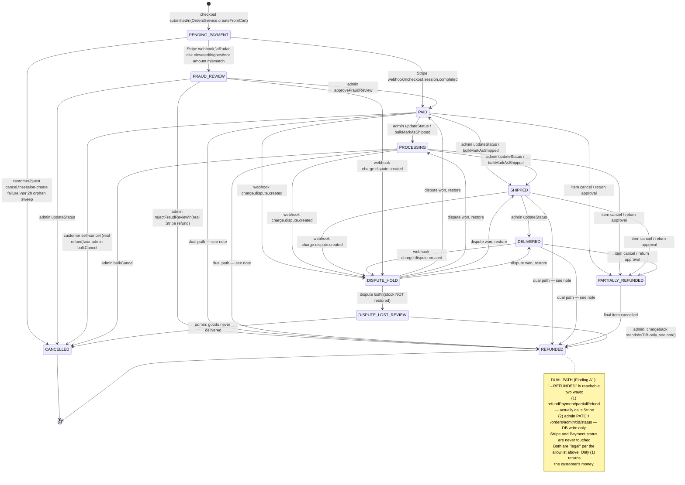
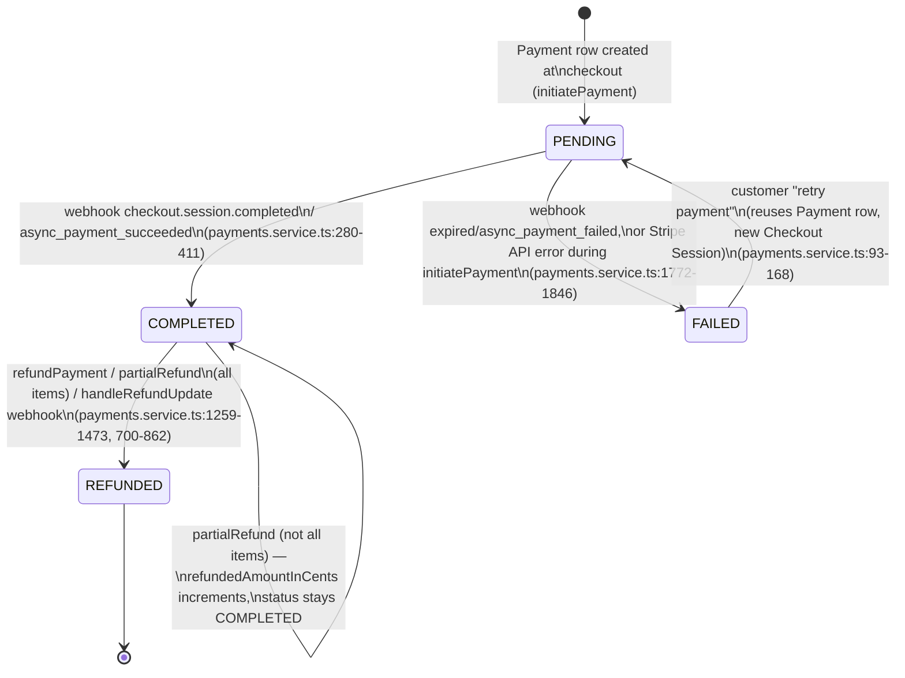
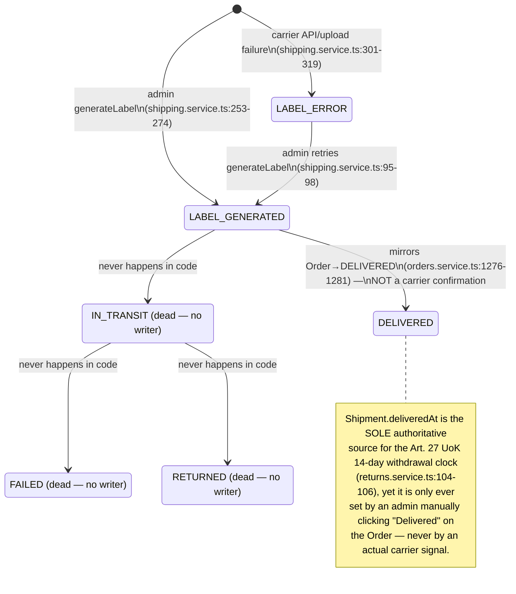
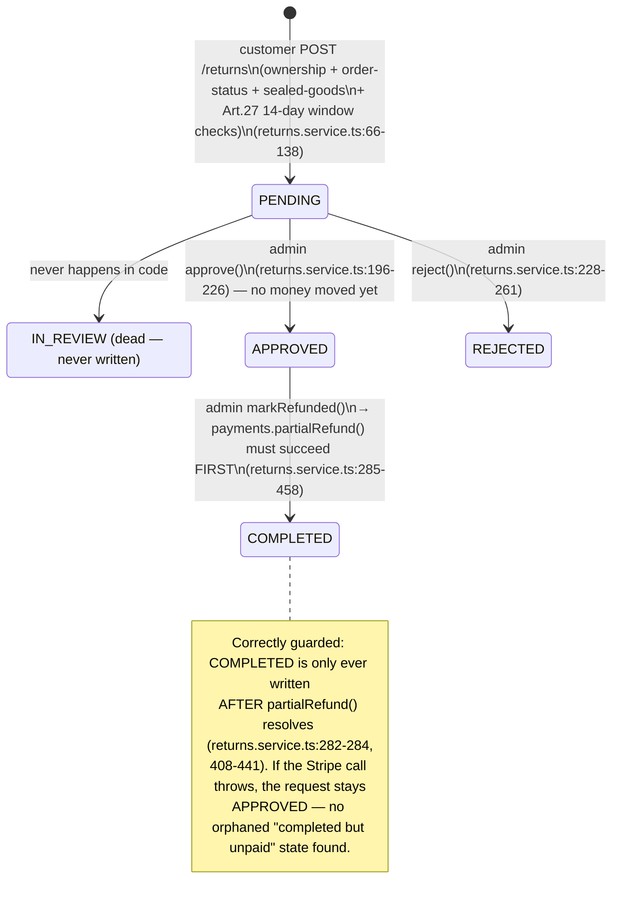
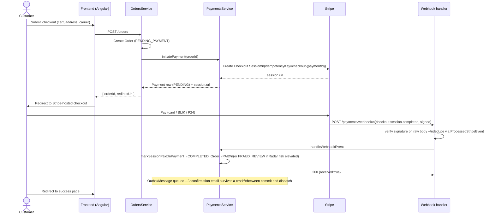
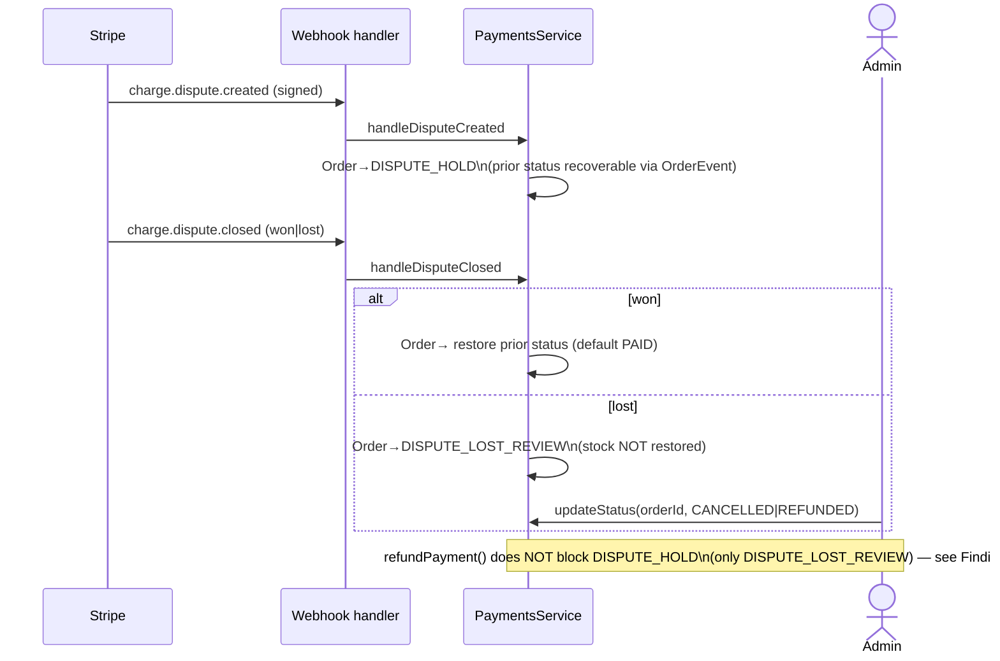
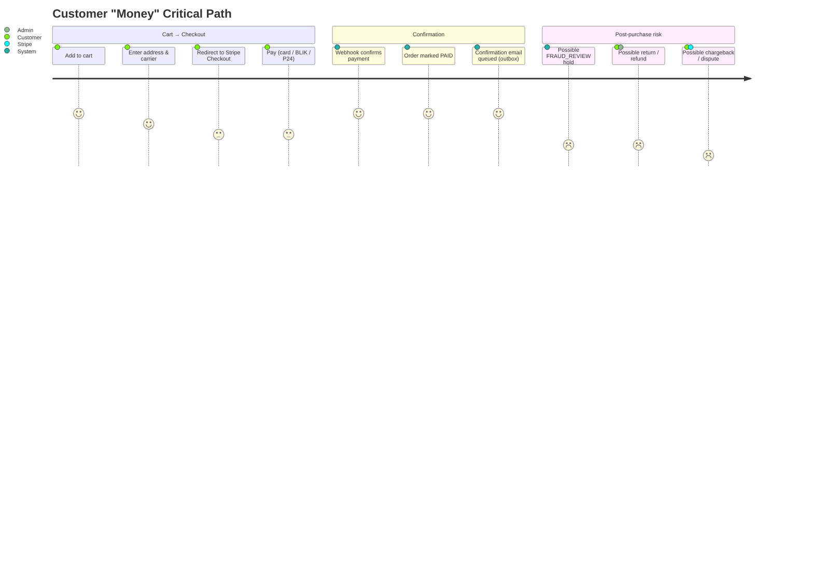
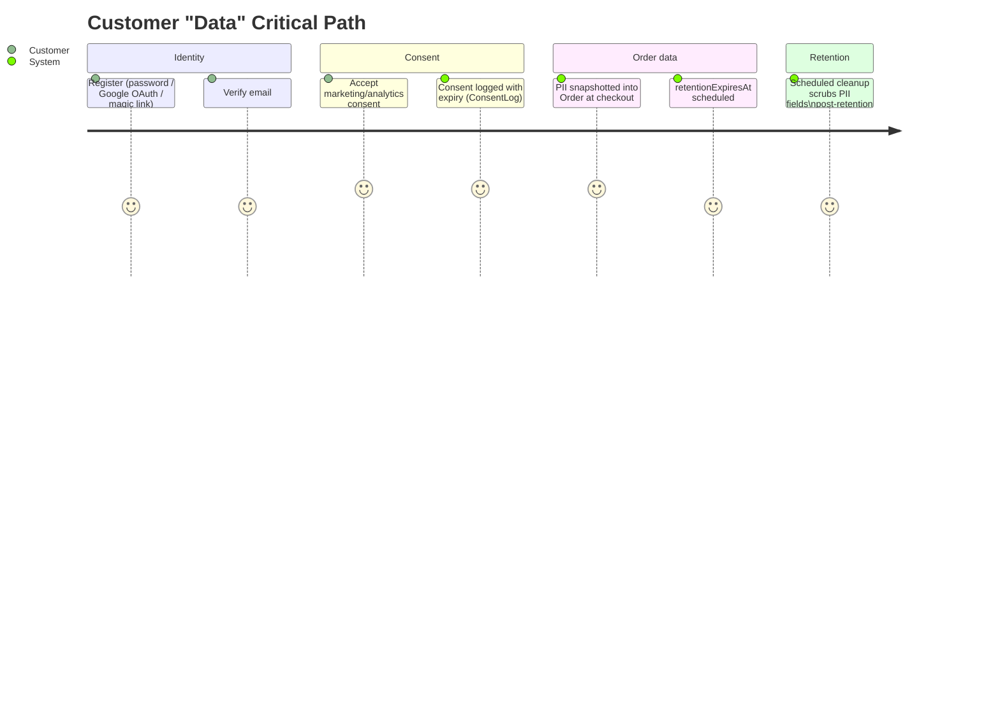

# Business Process Model — Orders, Payments, Shipments, Returns

Foundational reference for how money and customer data actually move through this
codebase, derived by reading the real implementation (not the intended design).
Diagrams use Mermaid so they render directly on GitHub/GitLab and in most editors.

**Scope.** Per the brief that produced this doc, this intentionally does *not* try to
map every entity in the system. It covers the two domains where mistakes cost money or
create legal exposure:

- **Money**: checkout → payment → fulfillment → refund/dispute (`Order`, `Payment`,
  `Shipment`, `ReturnRequest`, `InvoiceCorrection`)
- **Data**: identity, consent, and PII retention around an order

Every transition below is cited as `file:line` against the code as of branch
`fix/audit_round_22`. Where a transition is *legal but not actually safe* (the "can
you get from A to C bypassing B" question), it's called out inline and again in
[Audit Findings](#audit-findings).

**See also:** [`clickable-elements-mapping-plan.md`](./clickable-elements-mapping-plan.md)
(which UI elements actually trigger these transitions), [`audit-exclusion-list.md`](./audit-exclusion-list.md)
(condensed history of every other resolved finding — A1–A4 below are folded into its
Orders/Payments sections once fixed), [`accepted-tradeoffs.md`](./accepted-tradeoffs.md)
(deliberate design choices referenced inline above, e.g. the DISPUTE_LOST_REVIEW
no-auto-restore decision), [`coupon-lifecycle-model.md`](./coupon-lifecycle-model.md)
(same method applied to the Coupon domain, deliberately scoped out of this doc),
[`auth-session-lifecycle-model.md`](./auth-session-lifecycle-model.md) (same method
applied to Auth/Sessions/OAuth, also scoped out of this doc),
[`gdpr-export-erasure-model.md`](./gdpr-export-erasure-model.md) (same method applied
to the export/erasure flow §8.2 below explicitly scoped out — turns out most of it was
already built).

---

## 1. Order status state machine

`OrderStatus` (`packages/shared-types/src/enums.ts:6-18`) is governed by an explicit
allowlist, `ORDER_STATUS_TRANSITIONS` (`backend/src/modules/orders/orders.service.ts:53-67`).
Terminal states (`CANCELLED`, `REFUNDED`) have no outgoing edges in that table.



**Triggers, by code path:**

| Transition | Trigger | Citation |
|---|---|---|
| `*` → `PENDING_PAYMENT` | Checkout (`createFromCart`) | `orders.service.ts:357-362` |
| `PENDING_PAYMENT` → `PAID`/`FRAUD_REVIEW` | Webhook `checkout.session.completed`/`async_payment_succeeded` via `markSessionPaid` | `payments.service.ts:280-411` |
| `PENDING_PAYMENT` → `CANCELLED` | Self-cancel, guest token cancel, retry-payment failure, or 2h orphan sweep | `orders.service.ts:454,827,894,955`; `payments.service.ts:1038-1135` |
| `FRAUD_REVIEW` → `PAID` | Admin approve | `orders.service.ts:1153-1164` → `payments.service.ts:505-530` |
| `FRAUD_REVIEW` → `REFUNDED` | Admin reject (real refund) | `orders.service.ts:1166-1177` → `payments.service.ts:1259-1349` |
| `PAID/PROCESSING` → `SHIPPED`, `SHIPPED` → `DELIVERED` | Admin generic transition | `orders.service.ts:1179-1302` (guarded by the allowlist above) |
| `PAID/PROCESSING/SHIPPED/DELIVERED` → `REFUNDED` (real) | `refundPayment` | `payments.service.ts:1259-1349` |
| `PAID/PROCESSING/SHIPPED/DELIVERED` → `REFUNDED` (DB-only) | Generic admin `updateStatus` | `orders.service.ts:1179-1302` |
| `* → PARTIALLY_REFUNDED/REFUNDED` | `partialRefund` (item cancel or return approval) | `payments.service.ts:1355-1473` |
| `* → DISPUTE_HOLD` | Webhook `charge.dispute.created` | `payments.service.ts:1475-1577` |
| `DISPUTE_HOLD → (restore)` / `→ DISPUTE_LOST_REVIEW` | Webhook `charge.dispute.closed` | `payments.service.ts:1579-1698` |

Every legitimate write above inserts an `OrderEvent` row (`fromStatus`, `toStatus`,
`actor`, `note`) in the same DB transaction — this is the audit trail used by
diagrams elsewhere in this doc and by `handleDisputeClosed` to find the
pre-dispute status to restore to.

---

## 2. Payment status state machine

`PaymentStatus` (`enums.ts:20-25`): `PENDING → COMPLETED → REFUNDED`, with a `FAILED`
branch that can loop back to `PENDING` on retry.



Idempotency: every webhook-driven write inserts a `ProcessedStripeEvent` row inside
the *same transaction* as the mutation (unique on `eventId`, plus session-scoped
synthetic keys `paid-${sessionId}` / `failed-${sessionId}` for cron/webhook races) —
`payments.service.ts:238-240` and throughout. Stripe-side calls additionally carry
their own idempotency keys (`checkout-`, `coupon-`, `refund-`, `partial-refund-` —
`stripe.client.ts:85,122,155,166`).

---

## 3. Shipment status state machine

`ShipmentStatus` (`enums.ts:27-35`) has **3 of 7 values that are dead code** — defined
in the schema, never written by any code path. There is no carrier webhook, no
tracking poller, and no admin endpoint for in-transit/delivery-failure events.



The `LABEL_PENDING` default (`schema.prisma:513`) is also effectively dead: no
`Shipment.create()` exists outside the `upsert` in `generateLabel`, whose `create`
branch always writes `LABEL_GENERATED` or `LABEL_ERROR` directly — a `Shipment` row
simply doesn't exist until a label is generated.

---

## 4. Return / complaint ("credit note") state machine

`ReturnStatus` (`enums.ts:72-78`) — this is the closest analog to a credit-note
process: Polish consumer-protection withdrawal (Art. 27 UoK) and complaint flows.
`IN_REVIEW` is defined but **never assigned** by any service or admin action — returns
go directly `PENDING → APPROVED/REJECTED`.



`markRefunded` additionally requires, for `WITHDRAWAL`-type returns, that
`returnTrackingNumber` is already recorded (Art. 32 UoK — merchant may withhold the
refund until proof of physical return, `returns.service.ts:298-306`), and blocks if the
linked order is `DISPUTE_HOLD`/`FRAUD_REVIEW`/`DISPUTE_LOST_REVIEW`
(`returns.service.ts:388-403`).

---

## 5. Sequence: checkout → payment → fulfillment (the money path)



## 6. Sequence: refund / credit note (return) flow

```mermaid
sequenceDiagram
    actor C as Customer
    participant RC as ReturnsController
    participant RS as ReturnsService
    actor A as Admin
    participant PS as PaymentsService
    participant Stripe
    participant IS as InvoiceService

    C->>RC: POST /returns (orderId, items, type)
    RC->>RS: create()
    RS->>RS: validate ownership, order status,\nsealed-goods rule, Art.27 window
    RS-->>C: ReturnRequest (PENDING)

    A->>RS: approve(id)
    RS->>RS: guard: not already APPROVED/REJECTED/COMPLETED
    RS-->>A: status=APPROVED (no money moved)

    A->>RS: markRefunded(id)
    RS->>RS: guard: status===APPROVED,\ntracking# recorded, order not disputed
    RS->>PS: partialRefund(orderId, items, ..., 'RETURN_APPROVAL')
    PS->>Stripe: refunds.create\n(idempotencyKey=partial-refund-{orderId}-{...})
    Stripe-->>PS: refund confirmed
    PS->>PS: Payment.refundedAmountInCents += amount;\nOrder→PARTIALLY_REFUNDED/REFUNDED;\nOrderEvent logged
    PS-->>RS: refundAmountInCents
    RS->>RS: status=COMPLETED
    RS->>IS: processCorrectiveInvoice (fire-and-forget)
    IS-->>RS: faktura korygująca generated
    Note over RS,PS: If Stripe throws, exception propagates —\nReturnRequest stays APPROVED, never reaches\nCOMPLETED without a confirmed refund
```

## 7. Sequence: dispute / chargeback



---

## 8. User journeys — critical paths only

Per the brief, this skips onboarding polish, browse/search UX, etc. and sticks to
where money or personal data actually changes hands.

### 8.1 Money



### 8.2 Data



The data journey is intentionally shallow — `ConsentLog`, `Order.retentionExpiresAt`,
and `orders-cleanup.service.ts` are confirmed to exist and touch PII, but a full audit
of export/erasure request handling wasn't in scope for this pass. See
[`docs/gdpr-breach-runbook.md`](./gdpr-breach-runbook.md) for the incident-response
side of data handling.

---

## Audit Findings

Answering the brief's actual question — *"is there a path in the code that gets from
A to C while bypassing B?"* — ranked by real-world severity. All four were confirmed
by direct code reading (two of them independently by separate research passes).

### A1 — CRITICAL: Admin can mark an order `REFUNDED` without Stripe ever being called — FIXED

**Fixed:** `ORDER_STATUS_TRANSITIONS` no longer allows `PAID/PROCESSING/SHIPPED/
DELIVERED/FRAUD_REVIEW` to reach `CANCELLED/REFUNDED/PARTIALLY_REFUNDED` through the
generic endpoint — those money-captured states must now go through `refundPayment`/
`partialRefund`/`approveFraudReview`/`rejectFraudReview`, which call Stripe and update
`Payment.status` atomically. `DISPUTE_LOST_REVIEW → CANCELLED/REFUNDED` remains the one
legitimate DB-only exception. See `orders.service.ts`'s `ORDER_STATUS_TRANSITIONS`
comment and regression tests in `orders.service.spec.ts` ("blocks every
money-captured-state transition...").

`PATCH /orders/admin/:id/status` → `OrdersService.updateStatus`
(`orders.service.ts:1179-1302`) validates the transition against
`ORDER_STATUS_TRANSITIONS` (§1) — which **allows** `PAID/PROCESSING/SHIPPED/DELIVERED → REFUNDED`. The handler restores stock and writes a legitimate-looking `OrderEvent`,
but **never calls `stripeClient.createRefund()` and never touches `Payment.status`**.

Net effect: `Order.status = REFUNDED` everywhere (admin UI, customer order history,
audit trail) while `Payment.status` stays `COMPLETED` — the merchant keeps the
charge. Nothing reconciles this: `reconcilePendingPayments` only scans
`Payment.status = PENDING` (`payments.service.ts:980-1027`), and no Prisma
middleware/DB trigger cross-checks `Order.status` against `Payment.status`.

The *real* refund path (`PaymentsService.refundPayment`, `payments.service.ts:1259-1349`)
is fully guarded and does call Stripe — the bug is that a second, unrelated endpoint
reaches the same terminal state without it. Same root cause makes `DELIVERED`
reachable without proof of delivery, which directly distorts the Art. 27 14-day
withdrawal clock (§3 note).

**Fix direction:** remove `REFUNDED`/`PARTIALLY_REFUNDED` as valid targets for the
generic status endpoint, or have `updateStatus()` delegate to `refundPayment()`
whenever the target is `REFUNDED`.

### A2 — CRITICAL: AdminJS's default edit form has *zero* guard on `Order.status` and `Shipment.status` — FIXED

**Fixed:** both resources now set `properties.status` to the shared
`STATUS_EDIT_LOCKED` constant (`admin.setup.ts`) — `isVisible: { list: true, show:
true, edit: false, filter: true }` — hiding `status` from the default Prisma-backed
edit form while keeping it visible/filterable. Status changes are forced through the
guarded actions and the REST endpoints above. See `STATUS_EDIT_LOCKED` tests in
`admin.setup.spec.ts`.

Independent of A1: AdminJS's `Order` resource (`admin.setup.ts:460-470`) and
`Shipment` resource (`admin.setup.ts:714-722`) disable only the `new`/`delete`
actions. `status` is left as a plain editable dropdown on the default `edit` action —
no `properties.status` override exists (contrast with `ReturnRequest`, which
whitelists `editProperties: ['adminNote']`, forcing status changes through guarded
custom actions — `admin.setup.ts:876`).

Any AdminJS session holder can therefore set `Order.status` or `Shipment.status` to
*any* enum value via the generic Prisma-backed edit form: no transition-allowlist
check, no stock restoration, no Stripe call, **no `OrderEvent`/`AdminLog` write at
all**. This is strictly worse than A1 — it doesn't even leave a plausible audit
trail. Confirmed independently by two separate research passes over `admin.setup.ts`.

**Fix direction:** add `properties: { status: { isVisible: { edit: false } } }` (or
equivalent) to both resources, forcing all status changes through the existing
guarded custom actions (`refundFull`, `generateLabel`, `bulkMarkAsShipped`, etc.).

### A3 — HIGH: `refundPayment` doesn't block an open dispute, only a lost one — FIXED

**Fixed:** `refundPayment` now blocks `DISPUTE_HOLD` alongside `DISPUTE_LOST_REVIEW`
(deliberately still *not* blocking `FRAUD_REVIEW`, since `rejectFraudReview`
legitimately calls it while the order is still `FRAUD_REVIEW`). `partialRefund` now
re-fetches `order.status` fresh inside its own lock and blocks `DISPUTE_HOLD`/
`FRAUD_REVIEW`/`DISPUTE_LOST_REVIEW` — closing the TOCTOU window for every caller
(`cancelItemsByUser`, `ReturnsService.markRefunded`, ...) by construction, since none
of them re-check status after acquiring the lock. See `payments.service.spec.ts`'s
new dispute-guard tests on both methods.

`refundPayment` (`payments.service.ts:1259-1349`) blocks `Order.status === DISPUTE_LOST_REVIEW` but has **no check for `DISPUTE_HOLD`**. `handleDisputeCreated` moves
`Order.status → DISPUTE_HOLD` without touching `Payment.status` (stays `COMPLETED`).
`POST /payments/:orderId/refund` (admin-only) will therefore pass every guard and
issue a real Stripe refund *while Stripe is simultaneously litigating the same charge
as a chargeback* — the AdminJS button hides itself for non-allowed statuses
(`admin.setup.ts:618-621`), but that's UI-only; the REST endpoint has no such check.

`partialRefund` (`payments.service.ts:1355-1473`) is worse — it has **no `order.status`
check at all**, only `payment.status === COMPLETED`. `ReturnsService.markRefunded`
re-checks dispute-blocked statuses itself just before calling it
(`returns.service.ts:388-403`), but `OrdersService.cancelItemsByUser` checks status
once up front and is not re-serialized against a concurrently-arriving
`charge.dispute.created` webook (which takes no lock) — a narrow but real TOCTOU
window that can refund money on an order mid-dispute.

### A4 — MEDIUM: fraud-review approve/reject race can both ship and refund the same order — FIXED

**Fixed:** `approveFraudReview`/`rejectFraudReview` now share a `fraud-review-lock:
${orderId}` Redis lock (`OrdersService.withFraudReviewLock`), acquired *before* the
`order.status === FRAUD_REVIEW` read and held through the delegation into
`PaymentsService`. Whichever call loses the race now sees the already-updated status
and correctly rejects instead of also committing a conflicting transition. See the
"approveFraudReview / rejectFraudReview — concurrency guard" describe block in
`orders.service.spec.ts`.

`OrdersService.approveFraudReview`/`rejectFraudReview` (`orders.service.ts:1153-1177`)
each read `order.status` once before delegating into a Redis-locked payment-service
call. The status read and the lock acquisition are not atomic, so two concurrent
admin actions ("approve" and "reject") can both pass the outer check, then race for
the lock. If reject wins after approve already committed `PAID` (customer notified,
invoice issued), reject's inner guard (`payment.status === COMPLETED`,
`order.status !== DISPUTE_LOST_REVIEW`) still passes — the order ends up both
approved-and-shipped *and* refunded.

### A5 — Structural gaps worth tracking, not exploits

- **Shipment status is carrier-blind.** `IN_TRANSIT`/`FAILED`/`RETURNED` are dead
  code (§3) — a lost or refused parcel is invisible to the system; nothing here is a
  security bug, but it means any future automation built "on top of" `Shipment.status`
  will be working from incomplete signal.
- **The Art. 27 14-day clock runs on admin trust, not carrier confirmation** — see the
  note in §3. An admin who clicks "Delivered" early or late directly shifts the
  customer's legal withdrawal deadline.
- **`handleRefundUpdate`'s partial-refund webhook-recovery branch cannot restore
  stock** (`payments.service.ts:798-861`) — an acknowledged degraded mode (comment at
  806-809) that requires manual admin correction if the synchronous `partialRefund`
  DB write fails after Stripe already succeeded.
- **Status-write sites that skip a `where: status` guard** (`markSessionPaid`,
  `handlePaymentFailure`, `refundPayment`, `partialRefund`, `handleRefundUpdate`) rely
  only on `Payment.status` checks plus event dedup, unlike `updateStatus` and
  `sweepOrphanedPendingOrders`, which use a conditional `updateMany` keyed on the
  expected prior status as defense-in-depth. Currently masked by the other guards
  each method has, but structurally inconsistent and worth aligning.

---

## Appendix: where to look

| Domain | Service | Transition table / core guard | Controller / trigger |
|---|---|---|---|
| Order | `backend/src/modules/orders/orders.service.ts` | `ORDER_STATUS_TRANSITIONS`, lines 53-67 | `orders.controller.ts` |
| Payment | `backend/src/modules/payments/payments.service.ts` | `handleWebhookEvent` dispatcher, lines 241-277 | `payments.controller.ts` |
| Shipment | `backend/src/modules/shipping/shipping.service.ts` | `generateLabel`, lines 253-319 | `shipping.controller.ts` |
| Return | `backend/src/modules/returns/returns.service.ts` | `approve`/`reject`/`markRefunded`, lines 196-458 | `returns.controller.ts` |
| Invoice correction | `backend/src/modules/invoice/invoice.service.ts` | `processCorrectiveInvoice`, lines 219-358 | called internally, not exposed |
| Admin overrides | `backend/src/modules/admin/admin.setup.ts` | resource/action definitions, lines 458-953 | AdminJS panel (`/admin`) |
