# Mapowanie Klikalnych Elementów — Struktura Domenowa i Proces

**Zobacz też:** [`business-process-model.md`](./business-process-model.md) (domeny Pieniędzy/Danych tutaj mapują się na maszyny stanów Zamówień/Płatności/Przesyłek/Zwrotów — np. klikalne poniżej z domeny Kasy i Zamówień to te, które wyzwalają przejścia udokumentowane tam); [`audit-exclusion-list.md`](./audit-exclusion-list.md) (dwa wyniki na dole tego dokumentu — martwe CTA Partnerskie, błędnie zlinkowany AnnouncementBanner — są dodawane do sekcji Frontend/SEO po naprawieniu); [`coupon-lifecycle-model.md`](./coupon-lifecycle-model.md) (klikalne „Masz kod promocyjny?"/`applyCoupon()`/`removeCoupon()` w domenie Kasy i Zamówień poniżej to punkt wejścia UI tego dokumentu).

## Struktura Domen Biznesowych

| # | Domena | Backend root | Frontend root |
|---|---|---|---|
| 1 | Tożsamość i Dostęp | `backend/src/modules/auth/` | `frontend/src/app/features/auth/` |
| 2 | Konto / Profil Użytkownika | `backend/src/modules/users/` | `frontend/src/app/features/account/` |
| 3 | Katalog Produktów | `backend/src/modules/products/`, `backend/src/modules/categories/` | `frontend/src/app/features/catalog/` |
| 4 | Koszyk | `backend/src/modules/cart/` | `frontend/src/app/features/cart/` |
| 5 | Kasa i Zamówienia | `backend/src/modules/orders/` | `frontend/src/app/features/checkout/`, `frontend/src/app/features/orders/` (śledzenie zamówień gości) |
| 6 | Płatności | `backend/src/modules/payments/` | wbudowane w kasę (brak dedykowanego roota frontend) |
| 7 | Wysyłka i Realizacja | `backend/src/modules/shipping/`, `backend/src/modules/location/` (wyszukiwanie kodu pocztowego/adresu) | wbudowane w kasę (wybór adresu/przewoźnika) |
| 8 | Promocje / Rabaty | `backend/src/modules/coupons/` | wbudowane w koszyk/kasę (pole kodu kuponu) |
| 9 | Recenzje | `backend/src/modules/reviews/` | wbudowane w katalog (szczegóły produktu) |
| 10 | Zwroty i Prawo Odstąpienia | `backend/src/modules/returns/` | `frontend/src/app/features/returns/` |
| 11 | Fakturowanie | `backend/src/modules/invoice/` | wbudowane w konto/zamówienia (link pobierania) |
| 12 | Powiadomienia | `backend/src/modules/email/` | brak powierzchni UI (tylko transakcyjne) |
| 13 | Lista Życzeń | `backend/src/modules/wishlist/` | `frontend/src/app/features/wishlist/` |
| 14 | Admin / Back-office | `backend/src/modules/admin/` | brak dedykowanej trasy SPA (AdminJS jest server-rendered) |
| 15 | Media / Przechowywanie | `backend/src/modules/storage/` | brak powierzchni UI (serwis używany przez produkty/admin) |
| 16 | B2B / Partnerstwo | brak znalezionego modułu — należy potwierdzić przed mapowaniem (patrz notatka Krok 1) | `frontend/src/app/features/partnership/` |
| 17 | Prawne / Compliance | brak (przekrojowe, pojawia się w zwrotach/zamówieniach) | `frontend/src/app/features/legal/` |
| 18 | Strona Główna / Marketing | brak | `frontend/src/app/features/home/` |

**Wykluczone jako infrastruktura, nie domeny biznesowe:** `correlation/` (middleware ID żądania), `monitoring/` (sprawdzanie zdrowia Supabase), `redis/` (klient cache), `prisma/` (ORM), `common/` (guardy/interceptory), `shared/` (prymitywy UI), `not-found/` (fallback 404).

**Otwarte pytanie:** `partnership/` ma komponent frontend, ale podczas wstępnego skanowania nie znaleziono dopasowanego modułu backend. Należy potwierdzić podczas Kroku 1, czy formularz postauje do generycznego/kontaktowego endpointu przed traktowaniem jako samodzielna domena.

## Proces 5-Kroków

**Krok 1 — Inwentaryzacja tras per domena, nie per plik.**
Dla każdej z 15 domen skierowanych na klientów/admina, pobierz definicje tras Angular (`*.routes.ts`) aby uzyskać pełną listę stron należących do tej domeny. Zakres na poziomie strony przed dotknięciem wewnętrznych komponentów — np. domena Kasy = `/checkout`, `/checkout/success`, `/checkout/failure`, `/checkout/auth-choice`.

**Krok 2 — Wyszukaj w każdym szablonie strony selektory interaktywne.**
W ramach stron domeny, wyszukaj `*.component.html` dla `(click)`, `routerLink`, `[href]`, `<button`, `<a `, `type="submit"` i `(keydown.enter)` (niestandardowe nienative klikalne). Wygeneruj jedną płaską listę per domena: element → handler akcji w pliku `.ts` → co robi (nawiguje / mutuje stan / wywołuje API).

**Krok 3 — Odnieś się do komponentów współdzielonych raz, oddzielnie.**
Komponenty w `shared/` (np. `ProductCard`, `QuantityStepper`, `Modal`) są klikanę z wielu domen. Mapuj je jako własną pseudodomenę zamiast redundantnie dokumentować ten sam przycisk w każdej domenie, która go używa — zanotuj „używany przez: Catalog, Cart, Wishlist" raz.

**Krok 4 — Oznacz każdy klikalny element jego zależnością backendową.**
Dla elementów wyzwalających wywołanie API, zanotuj który moduł backendowy jest uderzany (np. „Dodaj do koszyka" → moduł `cart`, „Zastosuj kupon" → moduł `coupons`). Umożliwia późniejszą analizę wpływu — „jeśli dotknę modułu `coupons`, które elementy UI się psują".

**Krok 5 — Skonsoliduj w jedną macierz, posortowaną według domeny, i oznacz sieroty.**
Połącz listy per domenę w jedną tabelę (Domena | Strona | Element | Handler | Zależność backendowa). Oznacz: (a) klikalne bez wywołania backendowego (czysta nawigacja/stan UI), i (b) domeny backendowe bez odpowiadającego klikalnego frontendu znalezionego w Kroku 2 (np. `invoice`, `email`, `storage` — potwierdza backend-only, nie luka).

**Notatka o strukturze szablonów:** większość komponentów Angular w tej bazie kodu używa inline `template:` wewnątrz `*.component.ts`. Dwa wyjątki używają oddzielnych plików `*.component.html`: `partnership.component.html` i `shared/product-card/product-card.component.html`. Grepp Kroku 2 celuje w każdy plik, który faktycznie zawiera markup per komponent.

---

## Krok 2 — Klikalne Elementy według Domeny

### Strona Główna (`/`)

| Element | Handler | Akcja | Zależność backendowa |
|---|---|---|---|
| Baner hero | `(click)="expandHero()"` | Rozszerza sekcję hero | — (stan UI) |
| Linki „Przeglądaj" / „Odkryj kolekcję" / „Zobacz dyfuzory" / „Zobacz żele" (×6) | `routerLink` → `/category/:slug` lub `/products` z query params | Nawigacja do filtrowanego widoku katalogu | Catalog |
| Przycisk „Throw frontend error (Sentry)" | `(click)="throwFrontendError()"` | Tylko dev/debug — wyrzuca testowy wyjątek weryfikujący okablowanie Sentry | — *(chroniony przez `showDebug`, hardcodowany `false` bez innego przypisania — nigdy nie renderuje się dla prawdziwych użytkowników, potwierdzono jako nieaktualny problem)* |

### Lista Produktów (`/products`, `/category/:slug`)

| Element | Handler | Akcja | Zależność backendowa |
|---|---|---|---|
| Przycisk przełączania filtrów | `(click)="openDrawer()"` | Otwiera szufladę filtrów | — (stan UI) |
| Przyciski opcji sortowania | `(click)="setSortBy(option.value)"` | Zmienia kolejność sortowania, odświeża listę | Products |
| „Wyczyść" (czyść wyszukiwanie) | `(click)="clearSearch()"` | Czyści zapytanie wyszukiwania, odświeża | Products |
| Chip filtra „Usuń" / „Usuń" (na stanie) | `(click)="removeFilter(...)"` / `removeInStock()"` | Usuwa jeden aktywny filtr, odświeża | Products |
| „Wyczyść wszystko" | `(click)="clearAllFilters()"` | Czyści wszystkie filtry, odświeża | Products |
| Tło szuflady / „Zamknij" | `(click)="closeDrawer()"` | Zamyka szufladę filtrów | — (stan UI) |
| „Zastosuj filtry" | `(click)="applyFilters()"` | Stosuje wybrane filtry, odświeża | Products |
| Karta produktu | `<app-product-card>` (komponent współdzielony) | → patrz Krok 3 | Products / Cart / Wishlist |

### Szczegóły Produktu (`/products/:slug`)

| Element | Handler | Akcja | Zależność backendowa |
|---|---|---|---|
| Przycisk wstecz | `(click)="back()"` | Nawigacja wstecz | — |
| Główny obraz | `(click)="openLightbox(i)"` | Otwiera lightbox z obrazem | — (stan UI) |
| Obrazy miniaturek | `(click)="activeImage.set(img.url)"` | Przełącza aktywny obraz | — (stan UI) |
| Przyciski wyboru wariantu | `(click)="selectVariant(v)"` | Przełącza wybrany wariant (cena/stan) | Products |
| Podsumowanie ocen | `(click)="scrollToReviews()"` | Przewija do sekcji recenzji | — |
| „Dodaj do koszyka" | `(click)="addToCart()"` | Dodaje wybrany wariant do koszyka | Cart |
| Przełącznik listy życzeń (ikona serca) | `(click)="toggleWishlist()"` | Dodaje/usuwa z listy życzeń | Wishlist |
| „Rozwiń/Zwiń opis" | `(click)="descExpanded = !descExpanded"` | Przełącza panel opisu | — (stan UI) |
| Przełącznik „Składniki (INCI)" | `(click)="inciExpanded = !inciExpanded"` | Przełącza panel składników | — (stan UI) |
| Przełącznik formularza recenzji | `(click)="reviewFormOpen.set(...)"` | Pokazuje/ukrywa formularz recenzji | — (stan UI) |
| Wyślij formularz recenzji | `(ngSubmit)="submitReview()"` | Przesyła nową recenzję | Reviews |
| Sortowanie recenzji „Najnowsze" / „Najbardziej pomocne" | `(click)="setSort(...)"` | Zmienia kolejność sortowania recenzji | Reviews |
| „Pomocne" (kciuk w górę) na karcie recenzji | `(click)="markHelpful(review)"` | Oznacza recenzję jako pomocną | Reviews |
| „Załaduj więcej opinii" | `(click)="loadMoreReviews()"` | Paginuje recenzje | Reviews |
| Prev/next karuzeli | `(click)="prevSlide()"` / `nextSlide()"` | Cykl karuzeli powiązanych produktów | — (stan UI) |
| Tło lightboxa / zamknij („x") | `(click)="closeLightbox()"` | Zamyka lightbox | — (stan UI) |
| Prev/next lightboxa | `(click)="lightboxPrev()"` / `lightboxNext()"` | Nawigacja obrazów w lightboxie | — (stan UI) |
| Miniaturka lightboxa | `(click)="lightboxGoTo(i)"` | Przeskakuje do obrazu w lightboxie | — (stan UI) |

### Koszyk (`/cart`)

| Element | Handler | Akcja | Zależność backendowa |
|---|---|---|---|
| „Przeglądaj produkty" (stan pustego koszyka) | `routerLink="/products"` | Nawigacja do katalogu | — |
| Link nazwy produktu (per pozycja) | `[routerLink]="['/products', item.slug]"` | Nawigacja do szczegółów produktu | — |
| Stepper ilości (`tui-counter`) | `(ngModelChange)="updateQty(...)"` | Aktualizuje ilość pozycji | Cart |
| Usuń pozycję (przycisk „✕") | `(click)="remove(item.productVariantId)"` | Usuwa pozycję z koszyka | Cart |
| „Przejdź do kasy" | `routerLink="/checkout"` | Nawigacja do kasy | — |

Brak pola kuponu na tej stronie — potwierdza, że kupony żyją wyłącznie w Kasie, nie w Koszyku (zgodne z przewidywaniem Kroku 1).

### Kasa i Zamówienia

`/checkout` to kreator 3-krokowy (`index` 0–2: adres → wysyłka → przegląd) współdzielący jeden komponent. Żadne przyciski metody płatności nie pojawiają się w aplikacji — Stripe Checkout jest hostowany poza stroną (potwierdza udokumentowany w CLAUDE.md przepływ), więc Płatności nie mają dedykowanych klikalnych elementów poza wyzwalaczem przekierowania.

| Element | Handler | Akcja | Zależność backendowa |
|---|---|---|---|
| Pigułka zapisanego adresu | `(click)="selectSavedAddress(addr)"` | Wybiera zapisany adres | Users |
| „+ Nowy adres" | `(click)="useNewAddress()"` | Przełącza na ręczne wprowadzanie adresu | — (stan UI) |
| Wyślij formularz adresu | `(ngSubmit)="onNext()"` | Waliduje adres, przesuwa kreator | — |
| Chip autouzupełniania miasta | `(click)="selectCity(city)"` | Wybiera sugerowane miasto | Shipping (moduł `location` — wyszukiwanie kodu pocztowego/ulicy) |
| Checkbox „Zapisz adres" | `(change)="saveAddress.set(...)"` | Przełącza zapisywanie jako domyślny | — (stan UI, stosowane przy wyślij) |
| Radio przewoźnika (InPost/DHL/GLS/DPD) | `(change)="selectCarrier(c)"` | Wybiera przewoźnika | Shipping |
| „Wybierz paczkomat" / „Zmień" | `(click)="openLockerPicker()"` | Otwiera modal wyboru paczkomatu InPost | Shipping |
| „Wybierz punkt DPD" / „Zmień" | `(click)="openDpdPicker()"` | Otwiera modal wyboru punktu DPD (iframe modal) | Shipping |
| Tło/„✕" modalu DPD | `(click)="closeDpdModal()"` | Zamyka modal wyboru | — (stan UI) |
| „Masz kod promocyjny?" | `(click)="couponExpanded.set(true)"` | Rozszerza pole kodu kuponu | — (stan UI) |
| Pole kodu kuponu (klawisz Enter) | `(keydown.enter)="applyCoupon()"` | Stosuje kupon | Coupons |
| Przycisk kuponu „Zastosuj" | `(click)="applyCoupon()"` | Stosuje kupon | Coupons |
| Kupon „Usuń" | `(click)="removeCoupon()"` | Usuwa zastosowany kupon | Coupons |
| Checkbox regulaminu | `(change)="termsAccepted.set(...)"` | Wymagana zgoda na złożenie zamówienia | — |
| Linki „regulamin sklepu" / „politykę prywatności" | `routerLink` → `/legal/terms`, `/legal/privacy` | Otwiera strony prawne w nowej karcie | Legal |
| „Wróć" / „Koszyk" (nawigacja wstecz) | `(click)="goBack()"` | Poprzedni krok kreatora / powrót do koszyka | — |
| „Dalej" / „Przejdź do płatności" (ostatni krok) | `(click)="onNext()"` | Kroki 0–1: przesuwa kreator. Krok 2: tworzy zamówienie i przekierowuje do Stripe Checkout | **Orders + Payments** |

#### Kasa — Wybór Autoryzacji (`/checkout/auth-choice`)

| Element | Handler | Akcja | Zależność backendowa |
|---|---|---|---|
| „Zaloguj się" | `routerLink="/auth/login"` `[queryParams]="{returnTo: '/checkout'}"` | Nawigacja do logowania, powrót do kasy po | Identity |
| „Zarejestruj się" | `routerLink="/auth/register"` `[queryParams]="{returnTo: '/checkout'}"` | Nawigacja do rejestracji, powrót do kasy po | Identity |
| „Kontynuuj bez logowania" | `(click)="continueAsGuest()"` | Kontynuuje jako gość | — |

#### Kasa — Sukces (`/checkout/success`)

| Element | Handler | Akcja | Zależność backendowa |
|---|---|---|---|
| „Moje zamówienia" | `routerLink="/account/orders"` | Nawigacja do historii zamówień | — |
| „Strona główna" | `routerLink="/"` | Nawigacja na stronę główną | — |
| „Sprawdź status zamówienia" (wskazówka dla gościa) | `routerLink="/orders/track"` | Nawigacja do śledzenia zamówień gości | — |
| Przycisk subskrypcji newslettera | `(click)="subscribeNewsletter()"` | Zapisuje e-mail klienta na newsletter | Notifications/Email |
| „Strona główna" (stan oczekiwania na weryfikację) | `routerLink="/"` | Nawigacja na stronę główną | — |

#### Kasa — Niepowodzenie (`/checkout/failure`)

| Element | Handler | Akcja | Zależność backendowa |
|---|---|---|---|
| Przycisk ponowienia płatności | `(click)="retryPayment()"` | Ponownie tworzy sesję Stripe Checkout dla tego samego zamówienia | Payments |
| Przycisk anulowania zamówienia | `(click)="cancelOrder()"` | Anuluje oczekujące zamówienie | Orders |
| „Wróć do koszyka" | `routerLink="/cart"` | Nawigacja z powrotem do koszyka | — |

#### Śledzenie Zamówień Gości (`/orders/track`)

| Element | Handler | Akcja | Zależność backendowa |
|---|---|---|---|
| Wyślij formularz śledzenia | `(ngSubmit)="track()"` | Wyszukuje zamówienie po e-mailu + numerze zamówienia | Orders |

### Tożsamość i Dostęp

#### Logowanie (`/auth/login`)

| Element | Handler | Akcja | Zależność backendowa |
|---|---|---|---|
| „Nie pamiętasz hasła?" | `routerLink="/auth/forgot-password"` | Nawigacja do zapomniałem hasła | — |
| Wyślij formularz | `(ngSubmit)="submit()"` | Logowanie e-mail/hasło | Identity |
| „Zaloguj przez Google" | `(click)="loginWithGoogle()"` | Przekierowuje do Google OAuth | Identity |
| „Zaloguj się linkiem e-mail" | `routerLink="/auth/magic-link"` | Nawigacja do żądania magic-link | — |
| „Zarejestruj się" | `routerLink="/auth/register"` | Nawigacja do rejestracji | — |

#### Rejestracja (`/auth/register`)

| Element | Handler | Akcja | Zależność backendowa |
|---|---|---|---|
| Wyślij formularz | `(ngSubmit)="submit()"` | Tworzy konto | Identity |
| „Zaloguj się" | `routerLink="/auth/login"` | Nawigacja do logowania | — |

#### Zapomniałem Hasła (`/auth/forgot-password`)

| Element | Handler | Akcja | Zależność backendowa |
|---|---|---|---|
| Wyślij formularz | `(ngSubmit)="submit()"` | Wysyła e-mail resetujący hasło | Identity / Notifications |
| „Wróć do logowania" (×2) | `routerLink="/auth/login"` | Nawigacja do logowania | — |

#### Reset Hasła (`/auth/reset-password`)

| Element | Handler | Akcja | Zależność backendowa |
|---|---|---|---|
| Wyślij formularz | `(ngSubmit)="submit()"` | Ustawia nowe hasło przez token resetu | Identity |
| „Wyślij nowy link" | `routerLink="/auth/forgot-password"` | Nawigacja wstecz (stan wygasłego/nieważnego tokenu) | — |
| „Zaloguj się" | `routerLink="/auth/login"` | Nawigacja do logowania | — |

#### Żądanie Magic Link (`/auth/magic-link`)

| Element | Handler | Akcja | Zależność backendowa |
|---|---|---|---|
| Wyślij formularz | `(ngSubmit)="submit()"` | Wysyła e-mail logowania bez hasła | Identity / Notifications |
| „Wróć do logowania" (×2) | `routerLink="/auth/login"` | Nawigacja do logowania | — |

#### Weryfikacja Magic Login (`/auth/magic-login`)

Brak klikalnych — strona automatycznego przetwarzania. Konsumuje token magic-link po stronie klienta (SSR wykluczone, patrz komentarz w kodzie dotyczący wyścigu jednorazowego tokenu) i programowo przekierowuje.

#### Callback Google OAuth (`/auth/callback`)

Brak klikalnych — strona automatycznego przetwarzania. Wymienia kod OAuth i programowo przekierowuje (sukces → `returnTo` lub `/`; niepowodzenie → `/auth/login`).

#### Weryfikacja E-mail (`/auth/verify-email`)

| Element | Handler | Akcja | Zależność backendowa |
|---|---|---|---|
| „Przejdź do konta" | `routerLink="/account"` | Nawigacja do konta (stan zweryfikowany) | — |
| „Wyślij nowy link z poziomu konta" | `routerLink="/account"` | Nawigacja do konta aby ponownie wysłać (stan wygasłego tokenu) | — |

### Konto / Profil Użytkownika

#### Panel (`/account`)

| Element | Handler | Akcja | Zależność backendowa |
|---|---|---|---|
| „Wyloguj" | `(click)="logout()"` | Wylogowuje, czyści tokeny | Identity |
| „Wyślij ponownie" (baner niezweryfikowanego e-mail) | `(click)="resend()"` | Ponownie wysyła e-mail weryfikacyjny | Identity / Notifications |
| „Zainstaluj" (baner instalacji PWA) | `(click)="install()"` | Wyzwala natywny monit instalacji PWA | — *(nowa powierzchnia nieobecna w oryginalnej tabeli domenowej — `PwaInstallService`, natywna przeglądarka, bez wywołania backendowego)* |
| Karta „Moje zamówienia" | `routerLink="orders"` | Nawigacja do listy zamówień | — |
| Karta „Mój profil" | `routerLink="profile"` | Nawigacja do profilu | — |
| Karta „Moje adresy" | `routerLink="addresses"` | Nawigacja do adresów | — |

#### Profil (`/account/profile`)

| Element | Handler | Akcja | Zależność backendowa |
|---|---|---|---|
| Przycisk wstecz | `(click)="back()"` | Nawigacja wstecz | — |
| „Edytuj" (dane konta) | `(click)="startEdit()"` | Otwiera formularz edycji profilu | — (stan UI) |
| Wyślij formularz profilu | `(ngSubmit)="save()"` | Zapisuje pola nazwy/profilu | Users |
| „Anuluj" (edycja profilu) | `(click)="cancelEdit()"` | Odrzuca edycję | — (stan UI) |
| „Zmień e-mail" | `(click)="startEmailChange()"` | Otwiera formularz zmiany e-mail | — (stan UI) |
| Wyślij formularz zmiany e-mail | `(ngSubmit)="submitEmailChange()"` | Żąda zmiany e-mail (link potwierdzający) | Identity / Notifications |
| „Anuluj" (zmiana e-mail) | `(click)="cancelEmailChange()"` | Odrzuca zmianę e-mail | — (stan UI) |
| „Zmień hasło" | `(click)="startPasswordChange()"` | Otwiera formularz zmiany hasła | — (stan UI) |
| Wyślij formularz zmiany hasła | `(ngSubmit)="submitPasswordChange()"` | Zmienia hasło | Identity |
| „Anuluj" (zmiana hasła) | `(click)="cancelPasswordChange()"` | Odrzuca zmianę hasła | — (stan UI) |
| „Usuń konto" (strefa niebezpieczna) | `(click)="startDeleteConfirm()"` | Otwiera potwierdzenie usunięcia konta | — (stan UI) |
| Potwierdź usunięcie „Anuluj" | `(click)="cancelDeleteConfirm()"` | Anuluje usunięcie | — (stan UI) |
| Potwierdź usunięcie „Usuń konto" (ostateczny) | `(click)="deleteAccount()"` | Trwale usuwa konto | Users (usunięcie RODO) |

#### Adresy (`/account/addresses`)

| Element | Handler | Akcja | Zależność backendowa |
|---|---|---|---|
| Przycisk wstecz | `(click)="back()"` | Nawigacja wstecz | — |
| „+ Dodaj adres" | `(click)="openAddForm()"` | Otwiera formularz dodawania adresu | — (stan UI) |
| Wyślij formularz dodawania adresu | `(ngSubmit)="submitAdd()"` | Tworzy nowy adres | Users |
| Chip autouzupełniania miasta (formularz dodawania) | `(click)="selectAddCity(city)"` | Wybiera sugerowane miasto | Shipping (`location`) |
| „Anuluj" (formularz dodawania) | `(click)="cancelAdd()"` | Odrzuca nowy adres | — (stan UI) |
| Wyślij formularz edycji adresu | `(ngSubmit)="submitEdit(addr.id)"` | Aktualizuje adres | Users |
| Chip autouzupełniania miasta (formularz edycji) | `(click)="selectEditCity(city)"` | Wybiera sugerowane miasto | Shipping (`location`) |
| „Anuluj" (formularz edycji) | `(click)="cancelEdit()"` | Odrzuca edycję | — (stan UI) |
| Potwierdź usunięcie „Tak, usuń" | `(click)="confirmDelete(addr.id)"` | Usuwa adres | Users |
| Potwierdź usunięcie „Anuluj" | `(click)="cancelDeleteConfirm()"` | Anuluje usunięcie | — (stan UI) |
| „Ustaw jako domyślny" | `(click)="setDefault(addr.id)"` | Ustawia domyślny adres | Users |
| „Edytuj" | `(click)="startEdit(addr)"` | Otwiera formularz edycji adresu | — (stan UI) |
| „Usuń" | `(click)="startDeleteConfirm(addr.id)"` | Otwiera potwierdzenie usunięcia | — (stan UI) |

#### Lista Zamówień (`/account/orders`)

| Element | Handler | Akcja | Zależność backendowa |
|---|---|---|---|
| Przycisk wstecz | `(click)="back()"` | Nawigacja wstecz | — |
| „Szczegóły" (per wiersz zamówienia) | `[routerLink]="['/account/orders', order.id]"` | Nawigacja do szczegółów zamówienia | — |

#### Szczegóły Zamówienia (`/account/orders/:id`)

| Element | Handler | Akcja | Zależność backendowa |
|---|---|---|---|
| Przycisk wstecz | `(click)="back()"` | Nawigacja wstecz | — |
| „Pobierz faktur" (pobierz fakturę) | `(click)="downloadInvoice()"` | Pobiera fakturę PDF | Invoice |
| Pobierz fakturę korygującą | `(click)="downloadCorrectiveInvoice()"` | Pobiera korygującą fakturę PDF | Invoice |
| „Anuluj zamówienie" | `(click)="confirming.set(true)"` | Otwiera potwierdzenie anulowania | — (stan UI) |
| Potwierdź anulowanie „Tak, anuluj" | `(click)="doCancel()"` | Anuluje zamówienie | Orders |
| Potwierdź anulowanie „Wróć" | `(click)="confirming.set(false)"` | Zamyka potwierdzenie | — (stan UI) |
| „Anuluj wybrane produkty" | `(click)="startPartialCancel()"` | Otwiera wybierak pozycji do częściowego anulowania/zwrotu | — (stan UI) |
| „Zatwierdź zwrot" | `(click)="doPartialCancel()"` | Przesyła częściowe anulowanie/refund | Orders / Returns |
| Częściowe anulowanie „Anuluj" | `(click)="partialCancelling.set(false)"` | Zamyka przepływ częściowego anulowania | — (stan UI) |

### Lista Życzeń (`/wishlist`)

| Element | Handler | Akcja | Zależność backendowa |
|---|---|---|---|
| „Dodaj wszystko do koszyka" | `(click)="addAllToCart()"` | Dodaje każdy życzony produkt do koszyka | Cart / Wishlist |
| „Przeglądaj produkty" (stan pusty) | `routerLink="/products"` | Nawigacja do katalogu | — |
| Przełącznik powiadomień o dostępności (ikona dzwonka) | `(click)="wishlist.setNotify(product.id, !product.notifyOnRestock)"` | Przełącza powiadamianie e-mailem o przywróceniu stanu | Wishlist |

### Zwroty i Prawo Odstąpienia (`/returns`)

Służy dwóm celom przez parametr query `type`: standardowe żądania zwrotu i ustawowy 14-dniowy przepływ odstąpienia zlinkowany z `/legal/withdrawal`.

| Element | Handler | Akcja | Zależność backendowa |
|---|---|---|---|
| „Wróć do sklepu" (stan sukcesu) | `routerLink="/"` | Nawigacja na stronę główną | — |
| Wyślij formularz zwrotu | `(ngSubmit)="submit()"` | Przesyła żądanie zwrotu/odstąpienia | Returns |
| „Usuń produkt" (per pozycja) | `(click)="removeItem($index)"` | Usuwa pozycję z żądania | — (stan UI) |
| „+ Dodaj produkt" | `(click)="addItem()"` | Dodaje kolejną pozycję do żądania | — (stan UI) |
| Link „polityką prywatności" | `routerLink="/legal/privacy"` | Otwiera politykę prywatności w nowej karcie | Legal |
| Link „polityką zwrotów" | `routerLink="/legal/withdrawal"` | Otwiera politykę odstąpienia w nowej karcie | Legal |
| Przycisk wyślij (ostateczny) | `type="submit"` (ten sam formularz) | Wyłączony gdy `deadlineStatus() === 'expired'` | Returns |

### Prawne / Compliance

| Strona | Element | Handler | Akcja |
|---|---|---|---|
| Regulamin (`/legal/terms`) | Link „Prawo odstąpienia" | `routerLink="/legal/withdrawal"` | Odsyłacz do polityki odstąpienia |
| Regulamin (`/legal/terms`) | Link „Polityki prywatności" | `routerLink="/legal/privacy"` | Odsyłacz do polityki prywatności |
| Prywatność (`/legal/privacy`) | — | — | Czysto statyczny tekst, zero klikalnych |
| Odstąpienie (`/legal/withdrawal`) | „Złóż odstąpienie online" | `routerLink="/returns"` `[queryParams]="{type:'withdrawal'}"` | Głęboki link do domeny Zwrotów z prewybranym typem odstąpienia |

### B2B / Partnerstwo (`/partnership`)

Używa oddzielnego `.component.html` (jedyny wyjątek — wszystkie inne komponenty używają szablonów inline). Brak modułu backendowego dla tej domeny; jedyną żywą akcją na stronie jest link `mailto:`.

| Element | Handler | Akcja | Zależność backendowa |
|---|---|---|---|
| Przyciski „Zarejestruj się bezpośrednio" (×6: hero, footer CTA, 4× sidebar — poprawiona liczba z pierwotnie zgłoszonych ×5, sidebar ma 4 kafelki nie 3) | `(click)="registerCta()"` | Nawiguje do `/` — **tymczasowy placeholder, naprawiony**, wcześniej martwy (brak handlera w ogóle) | — *(patrz ROADMAP.md Faza 7 dla nadal otwartej decyzji: prawdziwy URL Chogan vs. całkowite usunięcie strony)* |
| „info@parfum-traum.de" | `href="mailto:..."` | Otwiera klienta poczty użytkownika | — |

Ta strona wygląda jako strona docelowa MLM/affiliate dla marki zewnętrznej („Chogan") a nie własnego programu B2B sklepu. Przyciski CTA teraz konsekwentnie nawigują do `/` (pasując do ogólnoserwisowego banera poniżej) jako celowy placeholder — prawdziwa decyzja (zewnętrzny URL Chogan vs. usunięcie strony) jest śledzona w `ROADMAP.md` Faza 7, nie rozwiązana tutaj.

---

## Krok 3 — Komponenty Współdzielone (między-domenowe)

Renderują się wewnątrz `app.component.ts` (powłoka aplikacji — `Header`, `Footer`, `CookieConsent`, `AnnouncementBanner` montują się na każdej trasie) lub są ponownie używane w wielu domenach funkcji (`ProductCard`, `Breadcrumb`, `Toast`).

### Nagłówek (globalna powłoka — każda strona)

| Element | Handler | Akcja | Zależność backendowa | Używany przez |
|---|---|---|---|---|
| Logo | `routerLink="/"` | Nawigacja na stronę główną, zamyka menu mobilne | — | globalny |
| Wyzwalacz rozwijania kategorii | `(click)="router.navigate(['/products'])"` | Nawigacja do katalogu, otwiera rozwijanie | — | globalny |
| Pozycje rozwijania kategorii (Perfumy/Dyfuzory/Żele/Wszystkie) | `routerLink` → `/category/:slug` lub `/products` | Nawigacja do filtrowanego katalogu | — | globalny |
| Formularz wyszukiwania w nagłówku | `type="submit"` | Przesyła zapytanie wyszukiwania | Products | globalny |
| Ikona listy życzeń | `routerLink="/wishlist"` | Nawigacja do listy życzeń (odznaka z liczbą) | Wishlist | globalny |
| Ikona koszyka | `routerLink="/cart"` | Nawigacja do koszyka (odznaka z liczbą pozycji) | Cart | globalny |
| Ikona konta | `[routerLink]="auth.isAuthenticated() ? '/account' : '/auth/login'"` | Nawigacja do konta lub logowania | Identity | globalny |
| Menu hamburger | `(click)="toggleMobileMenu()"` | Otwiera/zamyka nawigację mobilną | — (stan UI) | globalny, mobilny |
| Tło nawigacji mobilnej | `(click)="closeMobileMenu()"` | Zamyka nawigację mobilną | — (stan UI) | globalny, mobilny |
| Linki nawigacji mobilnej (×4) + formularz wyszukiwania | te same cele co desktop | duplikat nawigacji desktop dla widoku mobilnego | Products | globalny, mobilny |

### Stopka (globalna powłoka — każda strona)

| Element | Handler | Akcja |
|---|---|---|
| „Wszystkie produkty" / „Perfumy" / „Dyfuzory" / „Żele pod prysznic" | `routerLink` | → Domena katalogu |
| „Moje konto" | `routerLink="/account"` | → Domena konta |
| „Regulamin" / „Polityka prywatności" / „Prawo odstąpienia" | `routerLink` → `/legal/*` | → Domena prawna |
| „Platforma ODR" | `href` (zewnętrzny, nowa karta) | → Platforma rozwiązywania sporów UE, brak zależności backendowej |

### Baner Ogłoszeń (globalna powłoka — każda strona)

| Element | Handler | Akcja |
|---|---|---|
| „ZOSTAŃ PARTNEREM CHOGAN JUŻ TERAZ · Kliknij i dołącz" | `routerLink="/"` | **Prawdopodobny błąd:** kopia mówi „kliknij i dołącz [do programu partnerskiego]" ale cel linku to `/` (strona główna), nie `/partnership`. Baner serwisowy na każdej stronie — element wysokiego ruchu, warto naprawić lub potwierdzić zamierzone. |

### Baner Zgody na Pliki Cookie (globalna powłoka — każda strona, do odrzucenia)

| Element | Handler | Akcja |
|---|---|---|
| Link „Polityka prywatności" | `routerLink="/legal/privacy"` | → Domena prawna |
| „Akceptuj wszystkie" | `(click)="acceptAll()"` | Akceptuje wszystkie kategorie plików cookie | — |
| „Tylko niezbędne" | `(click)="rejectNonEssential()"` | Akceptuje tylko niezbędne | — |

Tylko binarny accept/reject — brak szczegółowego UI preferencji per kategoria pliku cookie.

### Karta Produktu (używana przez: listę produktów w Katalogu i każdą przyszłą powierzchnię listującą produkty — Strona Główna jej nie używa; kafelki kategorii Strony Głównej przekierowują do filtrowanych widoków katalogu)

| Element | Handler | Akcja | Zależność backendowa |
|---|---|---|---|
| Ciało karty | `[routerLink]="['/products', product.slug]"` | Nawigacja do szczegółów produktu | — |
| Przełącznik listy życzeń (ikona serca) | `(click)="onToggleWishlist($event)"` | Dodaj/usuń z listy życzeń (zatrzymuje propagację aby link karty nie odpalał się też) | Wishlist |
| „Dodaj do koszyka" | `(click)="onAddToCart($event)"` | Dodaje najtańszy dostępny wariant do koszyka, odpala zdarzenie analityczne | Cart |

### Nawigacja Okruszkowa (używana przez: Szczegóły Produktu, Partnerstwo i prawdopodobnie inne)

| Element | Handler | Akcja |
|---|---|---|
| Link okruszka | `[routerLink]="crumb.link"` | Nawigacja do strony nadrzędnej |

### Toast (globalny, wyzwalany przez `ToastService` z dowolnej domeny)

| Element | Handler | Akcja |
|---|---|---|
| Powiadomienie toast | `(click)="toastService.dismiss(toast.id)"` | Odrzuca toast | — |

---

## Krok 5 — Skonsolidowana Macierz Główna

158 klikalnych elementów w 10 domenach frontend + globalna powłoka aplikacji. `—` w Zależności Backendowej = czysta nawigacja/stan UI, bez wywołania API.

| Domena | Strona | Element | Handler | Zależność Backendowa |
|---|---|---|---|---|
| Strona główna | `/` | Baner hero | `expandHero()` | — |
| Strona główna | `/` | Linki katalogu (×6) | `routerLink` | Catalog |
| Strona główna | `/` | Przycisk debug Sentry | `throwFrontendError()` | — *(martwy kod, `showDebug` hardcodowany false)* |
| Katalog produktów | `/products`, `/category/:slug` | Przełącznik filtrów | `openDrawer()` | — |
| Katalog produktów | `/products`, `/category/:slug` | Przyciski sortowania | `setSortBy()` | Products |
| Katalog produktów | `/products`, `/category/:slug` | Wyczyść wyszukiwanie | `clearSearch()` | Products |
| Katalog produktów | `/products`, `/category/:slug` | Usuń chip(y) filtra | `removeFilter()` / `removeInStock()` | Products |
| Katalog produktów | `/products`, `/category/:slug` | Wyczyść wszystkie filtry | `clearAllFilters()` | Products |
| Katalog produktów | `/products`, `/category/:slug` | Zamknij szufladę/tło | `closeDrawer()` | — |
| Katalog produktów | `/products`, `/category/:slug` | Zastosuj filtry | `applyFilters()` | Products |
| Katalog produktów | `/products/:slug` | Wstecz | `back()` | — |
| Katalog produktów | `/products/:slug` | Otwórz lightbox | `openLightbox()` | — |
| Katalog produktów | `/products/:slug` | Przełącz miniaturkę | `activeImage.set()` | — |
| Katalog produktów | `/products/:slug` | Wybierz wariant | `selectVariant()` | Products |
| Katalog produktów | `/products/:slug` | Przewiń do recenzji | `scrollToReviews()` | — |
| Katalog produktów | `/products/:slug` | Dodaj do koszyka | `addToCart()` | Cart |
| Katalog produktów | `/products/:slug` | Przełącznik listy życzeń | `toggleWishlist()` | Wishlist |
| Katalog produktów | `/products/:slug` | Rozwiń/zwiń opis | przełącznik inline | — |
| Katalog produktów | `/products/:slug` | Rozwiń/zwiń INCI | przełącznik inline | — |
| Katalog produktów | `/products/:slug` | Przełącznik formularza recenzji | `reviewFormOpen.set()` | — |
| Katalog produktów | `/products/:slug` | Wyślij recenzję | `submitReview()` | Reviews |
| Katalog produktów | `/products/:slug` | Sortuj recenzje | `setSort()` | Reviews |
| Katalog produktów | `/products/:slug` | Oznacz recenzję jako pomocną | `markHelpful()` | Reviews |
| Katalog produktów | `/products/:slug` | Załaduj więcej recenzji | `loadMoreReviews()` | Reviews |
| Katalog produktów | `/products/:slug` | Prev/next karuzeli | `prevSlide()` / `nextSlide()` | — |
| Katalog produktów | `/products/:slug` | Zamknij/tło lightboxa | `closeLightbox()` | — |
| Katalog produktów | `/products/:slug` | Prev/next lightboxa | `lightboxPrev()` / `lightboxNext()` | — |
| Katalog produktów | `/products/:slug` | Miniaturka lightboxa | `lightboxGoTo()` | — |
| Koszyk | `/cart` | „Przeglądaj produkty" (pusty) | `routerLink` | — |
| Koszyk | `/cart` | Link nazwy produktu | `routerLink` | — |
| Koszyk | `/cart` | Stepper ilości | `updateQty()` | Cart |
| Koszyk | `/cart` | Usuń pozycję | `remove()` | Cart |
| Koszyk | `/cart` | Przejdź do kasy | `routerLink` | — |
| Kasa i Zamówienia | `/checkout` | Pigułka zapisanego adresu | `selectSavedAddress()` | Users |
| Kasa i Zamówienia | `/checkout` | Przełącznik nowego adresu | `useNewAddress()` | — |
| Kasa i Zamówienia | `/checkout` | Wyślij formularz adresu | `onNext()` | — |
| Kasa i Zamówienia | `/checkout` | Autouzupełnianie miasta | `selectCity()` | Shipping (`location`) |
| Kasa i Zamówienia | `/checkout` | Checkbox zapisz adres | `saveAddress.set()` | — |
| Kasa i Zamówienia | `/checkout` | Wybór przewoźnika | `selectCarrier()` | Shipping |
| Kasa i Zamówienia | `/checkout` | Otwórz wybór paczkomatu | `openLockerPicker()` | Shipping |
| Kasa i Zamówienia | `/checkout` | Otwórz wybór DPD | `openDpdPicker()` | Shipping |
| Kasa i Zamówienia | `/checkout` | Zamknij modal DPD | `closeDpdModal()` | — |
| Kasa i Zamówienia | `/checkout` | Rozwiń pole kuponu | `couponExpanded.set()` | — |
| Kasa i Zamówienia | `/checkout` | Zastosuj kupon (Enter / przycisk) | `applyCoupon()` | Coupons |
| Kasa i Zamówienia | `/checkout` | Usuń kupon | `removeCoupon()` | Coupons |
| Kasa i Zamówienia | `/checkout` | Checkbox regulaminu | `termsAccepted.set()` | — |
| Kasa i Zamówienia | `/checkout` | Linki prawne (regulamin/prywatność) | `routerLink` | Legal |
| Kasa i Zamówienia | `/checkout` | Wstecz / „Koszyk" nawigacja | `goBack()` | — |
| Kasa i Zamówienia | `/checkout` | „Przejdź do płatności" (ostatni krok) | `onNext()` | **Orders + Payments** |
| Kasa i Zamówienia | `/checkout/auth-choice` | Link logowania | `routerLink` | Identity (nawigacja) |
| Kasa i Zamówienia | `/checkout/auth-choice` | Link rejestracji | `routerLink` | Identity (nawigacja) |
| Kasa i Zamówienia | `/checkout/auth-choice` | Kontynuuj jako gość | `continueAsGuest()` | — |
| Kasa i Zamówienia | `/checkout/success` | „Moje zamówienia" | `routerLink` | — |
| Kasa i Zamówienia | `/checkout/success` | „Strona główna" (×2 stany) | `routerLink` | — |
| Kasa i Zamówienia | `/checkout/success` | Link śledzenia zamówienia | `routerLink` | — |
| Kasa i Zamówienia | `/checkout/success` | Subskrypcja newslettera | `subscribeNewsletter()` | Notifications |
| Kasa i Zamówienia | `/checkout/failure` | Ponów płatność | `retryPayment()` | Payments |
| Kasa i Zamówienia | `/checkout/failure` | Anuluj zamówienie | `cancelOrder()` | Orders |
| Kasa i Zamówienia | `/checkout/failure` | „Wróć do koszyka" | `routerLink` | — |
| Kasa i Zamówienia | `/orders/track` | Wyślij formularz śledzenia | `track()` | Orders |
| Tożsamość i Dostęp | `/auth/login` | „Nie pamiętasz hasła?" | `routerLink` | — |
| Tożsamość i Dostęp | `/auth/login` | Wyślij formularz logowania | `submit()` | Identity |
| Tożsamość i Dostęp | `/auth/login` | Google OAuth | `loginWithGoogle()` | Identity |
| Tożsamość i Dostęp | `/auth/login` | Magic-link / nawigacja do rejestracji | `routerLink` | — |
| Tożsamość i Dostęp | `/auth/register` | Wyślij formularz rejestracji | `submit()` | Identity |
| Tożsamość i Dostęp | `/auth/register` | Nawigacja do logowania | `routerLink` | — |
| Tożsamość i Dostęp | `/auth/forgot-password` | Wyślij formularz | `submit()` | Identity / Notifications |
| Tożsamość i Dostęp | `/auth/forgot-password` | Wróć do logowania (×2) | `routerLink` | — |
| Tożsamość i Dostęp | `/auth/reset-password` | Wyślij formularz | `submit()` | Identity |
| Tożsamość i Dostęp | `/auth/reset-password` | Ponownie wyślij / nawigacja logowania | `routerLink` | — |
| Tożsamość i Dostęp | `/auth/magic-link` | Wyślij formularz | `submit()` | Identity / Notifications |
| Tożsamość i Dostęp | `/auth/magic-link` | Wróć do logowania (×2) | `routerLink` | — |
| Tożsamość i Dostęp | `/auth/magic-login` | *(brak — autoprzetwarzanie)* | — | — |
| Tożsamość i Dostęp | `/auth/callback` | *(brak — autoprzetwarzanie)* | — | — |
| Tożsamość i Dostęp | `/auth/verify-email` | Idź do konta (×2 stany) | `routerLink` | — |
| Konto / Użytkownicy | `/account` | Wyloguj | `logout()` | Identity |
| Konto / Użytkownicy | `/account` | Ponownie wyślij weryfikację | `resend()` | Identity / Notifications |
| Konto / Użytkownicy | `/account` | Instaluj PWA | `install()` | — *(natywna przeglądarka)* |
| Konto / Użytkownicy | `/account` | Karty Zamówienia/Profil/Adresy | `routerLink` | — |
| Konto / Użytkownicy | `/account/profile` | Wstecz | `back()` | — |
| Konto / Użytkownicy | `/account/profile` | Przełącznik edycji / anuluj | `startEdit()` / `cancelEdit()` | — |
| Konto / Użytkownicy | `/account/profile` | Zapisz profil | `save()` | Users |
| Konto / Użytkownicy | `/account/profile` | Przełącznik/anuluj zmianę e-mail | `startEmailChange()` / `cancelEmailChange()` | — |
| Konto / Użytkownicy | `/account/profile` | Wyślij zmianę e-mail | `submitEmailChange()` | Identity / Notifications |
| Konto / Użytkownicy | `/account/profile` | Przełącznik/anuluj zmianę hasła | `startPasswordChange()` / `cancelPasswordChange()` | — |
| Konto / Użytkownicy | `/account/profile` | Wyślij zmianę hasła | `submitPasswordChange()` | Identity |
| Konto / Użytkownicy | `/account/profile` | Przepływ potwierdzenia usunięcia konta (otwórz/anuluj) | `startDeleteConfirm()` / `cancelDeleteConfirm()` | — |
| Konto / Użytkownicy | `/account/profile` | Potwierdź usunięcie konta | `deleteAccount()` | Users (RODO) |
| Konto / Użytkownicy | `/account/addresses` | Wstecz | `back()` | — |
| Konto / Użytkownicy | `/account/addresses` | Otwórz/anuluj formularz dodawania | `openAddForm()` / `cancelAdd()` | — |
| Konto / Użytkownicy | `/account/addresses` | Wyślij dodanie adresu | `submitAdd()` | Users |
| Konto / Użytkownicy | `/account/addresses` | Autouzupełnianie miasta (dodaj/edytuj) | `selectAddCity()` / `selectEditCity()` | Shipping (`location`) |
| Konto / Użytkownicy | `/account/addresses` | Wyślij edycję adresu | `submitEdit()` | Users |
| Konto / Użytkownicy | `/account/addresses` | Anuluj edycję | `cancelEdit()` | — |
| Konto / Użytkownicy | `/account/addresses` | Potwierdź/anuluj usunięcie | `confirmDelete()` / `cancelDeleteConfirm()` | Users / — |
| Konto / Użytkownicy | `/account/addresses` | Ustaw jako domyślny | `setDefault()` | Users |
| Konto / Użytkownicy | `/account/addresses` | Rozpocznij edycję / rozpocznij potwierdzenie usunięcia | `startEdit()` / `startDeleteConfirm()` | — |
| Konto / Użytkownicy | `/account/orders` | Wstecz | `back()` | — |
| Konto / Użytkownicy | `/account/orders` | Link szczegółów zamówienia | `routerLink` | — |
| Konto / Użytkownicy | `/account/orders/:id` | Wstecz | `back()` | — |
| Konto / Użytkownicy | `/account/orders/:id` | Pobierz fakturę | `downloadInvoice()` | Invoicing |
| Konto / Użytkownicy | `/account/orders/:id` | Pobierz fakturę korygującą | `downloadCorrectiveInvoice()` | Invoicing |
| Konto / Użytkownicy | `/account/orders/:id` | Przepływ potwierdzenia anulowania (otwórz/zamknij) | `confirming.set()` | — |
| Konto / Użytkownicy | `/account/orders/:id` | Potwierdź anulowanie | `doCancel()` | Orders |
| Konto / Użytkownicy | `/account/orders/:id` | Przepływ częściowego anulowania (otwórz/zamknij) | `startPartialCancel()` / `partialCancelling.set()` | — |
| Konto / Użytkownicy | `/account/orders/:id` | Wyślij częściowe anulowanie/refund | `doPartialCancel()` | Orders / Returns |
| Lista życzeń | `/wishlist` | Dodaj wszystko do koszyka | `addAllToCart()` | Cart / Wishlist |
| Lista życzeń | `/wishlist` | „Przeglądaj produkty" (pusty) | `routerLink` | — |
| Lista życzeń | `/wishlist` | Przełącznik powiadomień o dostępności | `setNotify()` | Wishlist |
| Zwroty i Odstąpienie | `/returns` | „Wróć do sklepu" (sukces) | `routerLink` | — |
| Zwroty i Odstąpienie | `/returns` | Wyślij zwrot/odstąpienie | `submit()` | Returns |
| Zwroty i Odstąpienie | `/returns` | Dodaj/usuń pozycję | `addItem()` / `removeItem()` | — |
| Zwroty i Odstąpienie | `/returns` | Linki prywatności / polityki odstąpienia | `routerLink` | Legal |
| Prawne / Compliance | `/legal/terms` | Odsyłacze do odstąpienia/prywatności | `routerLink` | — |
| Prawne / Compliance | `/legal/privacy` | *(brak — strona statyczna)* | — | — |
| Prawne / Compliance | `/legal/withdrawal` | „Złóż odstąpienie online" | `routerLink` + query param | — *(głęboki link do Zwrotów)* |
| B2B / Partnerstwo | `/partnership` | „Zarejestruj się bezpośrednio" (×6) | `(click)="registerCta()"` | — *(naprawiony: nawiguje do `/`, był martwy — patrz Wyniki)* |
| B2B / Partnerstwo | `/partnership` | Link mailto | `href` | Zewnętrzny |
| Współdzielony (powłoka) | globalny | Logo | `routerLink` | — |
| Współdzielony (powłoka) | globalny | Wyzwalacz + pozycje rozwijania kategorii | `router.navigate()` / `routerLink` | — |
| Współdzielony (powłoka) | globalny | Wyślij wyszukiwanie w nagłówku | `type="submit"` | Products |
| Współdzielony (powłoka) | globalny | Ikony listy życzeń / koszyka / konta | `routerLink` | — |
| Współdzielony (powłoka) | globalny | Hamburger + tło mobilne | `toggleMobileMenu()` / `closeMobileMenu()` | — |
| Współdzielony (powłoka) | globalny | Mobilne linki nawigacji + wyszukiwanie (duplikat desktop) | `routerLink` / `type="submit"` | Products |
| Współdzielony (powłoka) | globalny | Linki katalogu/konta w stopce | `routerLink` | — |
| Współdzielony (powłoka) | globalny | Linki prawne w stopce (×3) | `routerLink` | Legal (nawigacja) |
| Współdzielony (powłoka) | globalny | Link ODR w stopce | `href` (zewnętrzny) | Zewnętrzny |
| Współdzielony (powłoka) | globalny | Baner ogłoszeń | `routerLink="/"` | — *(celowy placeholder, nie błąd linkowania — patrz Wyniki)* |
| Współdzielony (powłoka) | globalny | Link prywatności zgody na cookie | `routerLink` | Legal (nawigacja) |
| Współdzielony (powłoka) | globalny | Akceptuj wszystkie / odrzuć nieistotne cookie | `acceptAll()` / `rejectNonEssential()` | — |
| Współdzielony (ProductCard) | Lista katalogu | Ciało karty | `routerLink` | — |
| Współdzielony (ProductCard) | Lista katalogu | Przełącznik listy życzeń | `onToggleWishlist()` | Wishlist |
| Współdzielony (ProductCard) | Lista katalogu | Dodaj do koszyka | `onAddToCart()` | Cart |
| Współdzielony (Breadcrumb) | Szczegóły produktu, Partnerstwo, inne | Link okruszka | `routerLink` | — |
| Współdzielony (Toast) | globalny | Odrzuć toast | `dismiss()` | — |

### Wyniki (przeniesione z Kroków 2–3)

1. **Martwe przyciski CTA — NAPRAWIONE (tymczasowy placeholder).** Wszystkie 6 przycisków „Zarejestruj się bezpośrednio" na `/partnership` (poprawiona liczba — hero, footer CTA, 4× sidebar, nie pierwotnie zgłoszone 5) nie miało żadnego handlera w ogóle. Teraz wywołują `registerCta()`, nawigując do `/`, pasując do istniejącego celu serwisowego banera. To jest celowy placeholder, nie prawdziwy cel — patrz `ROADMAP.md` Faza 7 dla nadal otwartej decyzji (prawdziwy URL Chogan vs. usunięcie strony).
2. **Baner serwisowy — przeklasyfikowany, nie błąd.** `AnnouncementBannerComponent` („ZOSTAŃ PARTNEREM CHOGAN... Kliknij i dołącz") przekierowuje do `/` zamiast `/partnership`. Pierwotnie oznaczony jako „błędnie zlinkowany"; teraz traktowany jako celowy wspólny cel placeholder obydwu elementów do czasu podjęcia powyższej decyzji o stronie Partnerstwa.
3. **Martwy kod, nie aktualny problem** — przycisk testowy Sentry w Stronie Głównej jest chroniony przez `showDebug`, hardcodowany `false`. Potwierdzono jako bezpieczny.

### Sprawdzenie sierot (b) — domeny backendowe bez klikalnych frontend

- **Admin** (`backend/src/modules/admin/`) — AdminJS to osobna powierzchnia server-rendered, bez trasy SPA. Oczekiwane, nie luka.
- **Storage** (`backend/src/modules/storage/`) — przesyłanie obrazów Supabase, konsumowane wewnętrznie przez Produkty/Admin, nigdy nieeksponowane jako klikalny element dla klienta. Oczekiwane, nie luka.
- **Powiadomienia** (`backend/src/modules/email/`) — brak dedykowanej strony, ale osiągane pośrednio jako efekt uboczny ~6 akcji (ponowne wysłanie weryfikacji, zapomniałem hasła, żądanie magic-link, zmiana e-mail, subskrypcja newslettera). Nie luka, po prostu brak własnego UI.

### Sprawdzenie sierot (a) — klikalne tylko-UI

Mniej więcej połowa z 158 zmapowanych elementów nie wywołuje żadnego backendowego — nawigacja krokowa, przełączniki rozwijania/zwijania, otwieranie/zamykanie modali i nawigacja `routerLink`. Oczekiwany stosunek dla SPA z wielostopniowym kreatorem; każdy był indywidualnie weryfikowany względem jego handlera podczas Kroku 2, nie wnioskowany.

---

## Diagramy (Mermaid)

Graf zależności domen: która strona/komponent faktycznie odpala wywołanie backendowe i do którego modułu. Zbudowany raz teraz z macierzy głównej powyżej — jest to strukturalna migawka (strona → moduł), więc naprawa błędu na poziomie liścia (dodanie brakującego handlera, naprawienie jednego celu linku) nie zmienia obrazu; tylko prawdziwa nowa funkcja lub usunięte wywołanie zmieniłoby.

**Notatka o zakresie:** węzły z zerową krawędzią backendową są pominięte dla czytelności (czysta nawigacja, tekst statyczny lub strony autoprzetwarzania) — patrz macierz Kroku 5 dla pełnej listy. Pominięte: `/checkout/auth-choice`, `/auth/magic-login`, `/auth/callback`, `/auth/verify-email`, `/account/orders`, wszystkie strony `/legal/*`, Stopka, CookieConsent, Breadcrumb, Toast.

```mermaid
flowchart LR
  subgraph DOM_HOME["Strona Główna"]
    H1["/"]
  end

  subgraph DOM_CATALOG["Katalog Produktów"]
    C1["/products, /category/:slug"]
    C2["/products/:slug"]
  end

  subgraph DOM_CART["Koszyk"]
    CT1["/cart"]
  end

  subgraph DOM_CHECKOUT["Kasa i Zamówienia"]
    CO1["/checkout"]
    CO3["/checkout/success"]
    CO4["/checkout/failure"]
    CO5["/orders/track"]
  end

  subgraph DOM_IDENTITY["Tożsamość i Dostęp"]
    I1["/auth/login"]
    I2["/auth/register"]
    I3["/auth/forgot-password"]
    I4["/auth/reset-password"]
    I5["/auth/magic-link"]
  end

  subgraph DOM_ACCOUNT["Konto / Użytkownicy"]
    A1["/account"]
    A2["/account/profile"]
    A3["/account/addresses"]
    A5["/account/orders/:id"]
  end

  subgraph DOM_WISHLIST["Lista Życzeń"]
    W1["/wishlist"]
  end

  subgraph DOM_RETURNS["Zwroty i Odstąpienie"]
    R1["/returns"]
  end

  subgraph DOM_PARTNERSHIP["B2B / Partnerstwo"]
    P1["/partnership"]
  end

  subgraph DOM_SHARED["Współdzielone / Powłoka"]
    S1["Wyszukiwanie w nagłówku"]
    S3["AnnouncementBanner"]
    S5["ProductCard"]
  end

  subgraph BACKEND["Moduły Backendowe"]
    B_IDENTITY["Identity"]
    B_USERS["Users"]
    B_PRODUCTS["Products"]
    B_CART["Cart"]
    B_ORDERS["Orders"]
    B_PAYMENTS["Payments"]
    B_SHIPPING["Shipping + location"]
    B_COUPONS["Coupons"]
    B_REVIEWS["Reviews"]
    B_RETURNS["Returns"]
    B_INVOICE["Invoicing"]
    B_EMAIL["Notifications"]
    B_WISHLIST["Wishlist"]
    B_ADMIN["Admin"]
    B_STORAGE["Storage"]
  end

  H1 --> B_PRODUCTS

  C1 --> B_PRODUCTS
  C2 --> B_PRODUCTS
  C2 --> B_CART
  C2 --> B_WISHLIST
  C2 --> B_REVIEWS

  CT1 --> B_CART

  CO1 --> B_USERS
  CO1 --> B_SHIPPING
  CO1 --> B_COUPONS
  CO1 --> B_ORDERS
  CO1 --> B_PAYMENTS
  CO3 --> B_EMAIL
  CO4 --> B_PAYMENTS
  CO4 --> B_ORDERS
  CO5 --> B_ORDERS

  I1 --> B_IDENTITY
  I2 --> B_IDENTITY
  I3 --> B_IDENTITY
  I3 --> B_EMAIL
  I4 --> B_IDENTITY
  I5 --> B_IDENTITY
  I5 --> B_EMAIL

  A1 --> B_IDENTITY
  A1 --> B_EMAIL
  A2 --> B_USERS
  A2 --> B_IDENTITY
  A2 --> B_EMAIL
  A3 --> B_USERS
  A3 --> B_SHIPPING
  A5 --> B_INVOICE
  A5 --> B_ORDERS
  A5 --> B_RETURNS

  W1 --> B_CART
  W1 --> B_WISHLIST

  R1 --> B_RETURNS

  S1 --> B_PRODUCTS
  S5 --> B_CART
  S5 --> B_WISHLIST

  BUG1["×6 przycisków CTA naprawionych<br/>teraz nawigują do '/' (placeholder)"]
  P1 -.-> BUG1

  BUG2["routerLink='/' jest teraz<br/>wspólnym celowym placeholderem"]
  S3 -.-> BUG2

  classDef bug fill:#fff4e0,stroke:#cc8800,stroke-width:2px,color:#7a5500
  classDef orphan fill:#eee,stroke:#999,stroke-width:1px,stroke-dasharray: 5 5,color:#666
  class BUG1,BUG2,P1 bug
  class B_ADMIN,B_STORAGE orphan
```

**Legenda:** pełna strzałka = klikalny na tej stronie/komponencie odpala prawdziwe wywołanie API do tego modułu backendowego. Przerywana bursztynowa = wynik Kroków 2–3 teraz rozwiązany tymczasowym placeholderem (domena Partnerstwa i AnnouncementBanner są w stylu bursztynowym ponieważ są zaangażowane, nie dlatego że wywołują moduł backendowy — patrz Wyniki powyżej i `ROADMAP.md` Faza 7 dla nadal otwartej decyzji). Przerywana szara = `Admin` i `Storage` potwierdzone jako mające zero wywołujących SPA — pasuje do sprawdzenia sierot Kroku 5, oczekiwane by design.
