Zap# Clickable Elements Mapping — Domain Structure & Process

**See also:** [`business-process-model.md`](./business-process-model.md) (the
Money/Data domains here map onto its Order/Payment/Shipment/Return state machines —
e.g. the Checkout & Orders domain's clickables below are what drives the transitions
documented there); [`audit-exclusion-list.md`](./audit-exclusion-list.md) (the two
findings at the bottom of this doc — dead Partnership CTAs, mislinked
AnnouncementBanner — are folded in under Frontend/SEO once fixed);
[`coupon-lifecycle-model.md`](./coupon-lifecycle-model.md) (the "Masz kod
promocyjny?"/`applyCoupon()`/`removeCoupon()` clickables in the Checkout & Orders
domain below are this doc's UI entry point).

## Business Domain Structure

| # | Domain | Backend root | Frontend root |
|---|---|---|---|
| 1 | Identity & Access | `backend/src/modules/auth/` | `frontend/src/app/features/auth/` |
| 2 | Account / User Profile | `backend/src/modules/users/` | `frontend/src/app/features/account/` |
| 3 | Product Catalog | `backend/src/modules/products/`, `backend/src/modules/categories/` | `frontend/src/app/features/catalog/` |
| 4 | Cart | `backend/src/modules/cart/` | `frontend/src/app/features/cart/` |
| 5 | Checkout & Orders | `backend/src/modules/orders/` | `frontend/src/app/features/checkout/`, `frontend/src/app/features/orders/` (guest order tracking) |
| 6 | Payments | `backend/src/modules/payments/` | embedded in checkout (no dedicated frontend root) |
| 7 | Shipping & Fulfillment | `backend/src/modules/shipping/`, `backend/src/modules/location/` (postal code/address lookup) | embedded in checkout (address/carrier selection) |
| 8 | Promotions / Discounts | `backend/src/modules/coupons/` | embedded in cart/checkout (coupon input) |
| 9 | Reviews | `backend/src/modules/reviews/` | embedded in catalog (product detail) |
| 10 | Returns & Withdrawal | `backend/src/modules/returns/` | `frontend/src/app/features/returns/` |
| 11 | Invoicing | `backend/src/modules/invoice/` | embedded in account/orders (download link) |
| 12 | Notifications | `backend/src/modules/email/` | no UI surface (transactional only) |
| 13 | Wishlist | `backend/src/modules/wishlist/` | `frontend/src/app/features/wishlist/` |
| 14 | Admin / Back-office | `backend/src/modules/admin/` | no dedicated SPA route (AdminJS is server-rendered) |
| 15 | Media / Storage | `backend/src/modules/storage/` | no UI surface (service used by products/admin) |
| 16 | B2B / Partnership | none found — verify before mapping (see Step 1 note) | `frontend/src/app/features/partnership/` |
| 17 | Legal / Compliance | none (cross-cutting, surfaces in returns/orders) | `frontend/src/app/features/legal/` |
| 18 | Home / Marketing | none | `frontend/src/app/features/home/` |

**Excluded as infrastructure, not business domains:** `correlation/` (request-ID middleware), `monitoring/` (Supabase health checks), `redis/` (cache client), `prisma/` (ORM), `common/` (guards/interceptors), `shared/` (UI primitives), `not-found/` (404 fallback).

**Open question:** `partnership/` has a frontend component but no matching backend module was found during the initial scan. Confirm during Step 1 whether its form posts to a generic/contact endpoint before treating it as a standalone domain.

## 5-Step Process

**Step 1 — Inventory routes per domain, not per file.**
For each of the 15 customer/admin-facing domains, pull its Angular route definitions (`*.routes.ts`) to get the full list of pages that domain owns. Page-level scope before touching component internals — e.g. Checkout domain = `/checkout`, `/checkout/success`, `/checkout/failure`, `/checkout/auth-choice`.

**Step 2 — Grep each page's template for interactive selectors.**
Within a domain's pages, grep `*.component.html` for `(click)`, `routerLink`, `[href]`, `<button`, `<a `, `type="submit"`, and `(keydown.enter)` (custom non-native clickables). Produce one flat list per domain: element → action handler in the `.ts` file → what it does (navigate / mutate state / call API).

**Step 3 — Cross-reference shared components once, separately.**
Components in `shared/` (e.g. `ProductCard`, `QuantityStepper`, `Modal`) get clicked from multiple domains. Map them as their own pseudo-domain instead of redundantly documenting the same button in every domain that uses it — note "used by: Catalog, Cart, Wishlist" once.

**Step 4 — Tag each clickable with its backend dependency.**
For elements that trigger an API call, note which backend module it hits (e.g. "Add to cart" → `cart` module, "Apply coupon" → `coupons` module). Enables impact analysis later — "if I touch the `coupons` module, which UI elements break."

**Step 5 — Consolidate into one matrix, ordered by domain, and flag orphans.**
Merge per-domain lists into a single table (Domain | Page | Element | Handler | Backend dependency). Flag: (a) clickables with no backend call (pure navigation/UI state), and (b) backend domains with zero corresponding frontend clickable found in Step 2 (e.g. `invoice`, `email`, `storage` — confirms backend-only, not a gap).

**Note on template structure:** most Angular components in this codebase use inline `template:` strings inside `*.component.ts`. Two outliers use separate `*.component.html` files instead: `partnership.component.html` and `shared/product-card/product-card.component.html`. Step 2 greps target whichever file actually holds the markup per component.

---

## Step 2 — Clickable Elements by Domain

### Home (`/`)

| Element | Handler | Action | Backend dependency |
|---|---|---|---|
| Hero banner | `(click)="expandHero()"` | Expands hero section | — (UI state) |
| "Przeglądaj" / "Odkryj kolekcję" / "Zobacz dyfuzory" / "Zobacz żele" links (×6) | `routerLink` → `/category/:slug` or `/products` with query params | Navigate to filtered catalog view | Catalog |
| "Throw frontend error (Sentry)" button | `(click)="throwFrontendError()"` | Dev/debug-only — fires a test exception to verify Sentry wiring | — *(gated behind `showDebug`, hardcoded `false` with no other assignment found — never renders for real users, confirmed not a live issue)* |

### Product List (`/products`, `/category/:slug`)

| Element | Handler | Action | Backend dependency |
|---|---|---|---|
| Filter toggle button | `(click)="openDrawer()"` | Opens filter drawer | — (UI state) |
| Sort option buttons | `(click)="setSortBy(option.value)"` | Changes sort order, refetches list | Products |
| "Wyczyść" (clear search) | `(click)="clearSearch()"` | Clears search query, refetches | Products |
| Filter chip "Usuń" / "Usuń" (in-stock) | `(click)="removeFilter(...)"` / `removeInStock()"` | Removes one active filter, refetches | Products |
| "Wyczyść wszystko" | `(click)="clearAllFilters()"` | Clears all filters, refetches | Products |
| Drawer backdrop / "Zamknij" | `(click)="closeDrawer()"` | Closes filter drawer | — (UI state) |
| "Zastosuj filtry" | `(click)="applyFilters()"` | Applies selected filters, refetches | Products |
| Product card | `<app-product-card>` (shared component) | → see Step 3 | Products / Cart / Wishlist |

### Product Detail (`/products/:slug`)

| Element | Handler | Action | Backend dependency |
|---|---|---|---|
| Back button | `(click)="back()"` | Navigate back | — |
| Main image | `(click)="openLightbox(i)"` | Opens image lightbox | — (UI state) |
| Thumbnail images | `(click)="activeImage.set(img.url)"` | Switches active image | — (UI state) |
| Variant selector buttons | `(click)="selectVariant(v)"` | Switches selected variant (price/stock) | Products |
| Rating summary | `(click)="scrollToReviews()"` | Scrolls to reviews section | — |
| "Dodaj do koszyka" | `(click)="addToCart()"` | Adds selected variant to cart | Cart |
| Wishlist toggle (heart icon) | `(click)="toggleWishlist()"` | Adds/removes from wishlist | Wishlist |
| "Rozwiń/Zwiń opis" | `(click)="descExpanded = !descExpanded"` | Toggles description panel | — (UI state) |
| "Składniki (INCI)" toggle | `(click)="inciExpanded = !inciExpanded"` | Toggles ingredients panel | — (UI state) |
| Review form toggle | `(click)="reviewFormOpen.set(...)"` | Shows/hides review form | — (UI state) |
| Review form submit | `(ngSubmit)="submitReview()"` | Submits a new review | Reviews |
| Review sort "Najnowsze" / "Najbardziej pomocne" | `(click)="setSort(...)"` | Changes review sort order | Reviews |
| "Pomocne" (thumbs-up) on review card | `(click)="markHelpful(review)"` | Marks a review helpful | Reviews |
| "Załaduj więcej opinii" | `(click)="loadMoreReviews()"` | Paginates reviews | Reviews |
| Carousel prev/next | `(click)="prevSlide()"` / `nextSlide()"` | Cycles related-products carousel | — (UI state) |
| Lightbox backdrop / close ("x") | `(click)="closeLightbox()"` | Closes lightbox | — (UI state) |
| Lightbox prev/next | `(click)="lightboxPrev()"` / `lightboxNext()"` | Navigates lightbox images | — (UI state) |
| Lightbox thumbnail | `(click)="lightboxGoTo(i)"` | Jumps to image in lightbox | — (UI state) |

### Cart (`/cart`)

| Element | Handler | Action | Backend dependency |
|---|---|---|---|
| "Przeglądaj produkty" (empty-cart state) | `routerLink="/products"` | Navigate to catalog | — |
| Product name link (per line item) | `[routerLink]="['/products', item.slug]"` | Navigate to product detail | — |
| Quantity stepper (`tui-counter`) | `(ngModelChange)="updateQty(...)"` | Updates line-item quantity | Cart |
| Remove item ("✕" button) | `(click)="remove(item.productVariantId)"` | Removes line item from cart | Cart |
| "Przejdź do kasy" | `routerLink="/checkout"` | Navigate to checkout | — |

No coupon input on this page — confirms coupons live exclusively in Checkout, not Cart (matches Step 1 prediction).

### Checkout & Orders

`/checkout` is a 3-step wizard (`index` 0–2: address → shipping → review) sharing one component. No payment-method buttons appear in-app — Stripe Checkout is hosted off-site (confirms CLAUDE.md's documented flow), so Payments has no dedicated clickables here beyond the redirect trigger.

| Element | Handler | Action | Backend dependency |
|---|---|---|---|
| Saved-address pill | `(click)="selectSavedAddress(addr)"` | Selects a saved address | Users |
| "+ Nowy adres" | `(click)="useNewAddress()"` | Switches to manual address entry | — (UI state) |
| Address form submit | `(ngSubmit)="onNext()"` | Validates address, advances wizard | — |
| City autocomplete chip | `(click)="selectCity(city)"` | Picks a suggested city | Shipping (`location` module — postal code/street lookup) |
| "Zapisz adres" checkbox | `(change)="saveAddress.set(...)"` | Toggles save-as-default | — (UI state, applied on submit) |
| Carrier radio (InPost/DHL/GLS/DPD) | `(change)="selectCarrier(c)"` | Selects shipping carrier | Shipping |
| "Wybierz paczkomat" / "Zmień" | `(click)="openLockerPicker()"` | Opens InPost locker picker modal | Shipping |
| "Wybierz punkt DPD" / "Zmień" | `(click)="openDpdPicker()"` | Opens DPD pickup-point picker (iframe modal) | Shipping |
| DPD modal backdrop / "✕" close | `(click)="closeDpdModal()"` | Closes picker modal | — (UI state) |
| "Masz kod promocyjny?" | `(click)="couponExpanded.set(true)"` | Expands coupon input | — (UI state) |
| Coupon code input (Enter key) | `(keydown.enter)="applyCoupon()"` | Applies coupon | Coupons |
| Coupon "Zastosuj" button | `(click)="applyCoupon()"` | Applies coupon | Coupons |
| Coupon "Usuń" | `(click)="removeCoupon()"` | Removes applied coupon | Coupons |
| Terms checkbox | `(change)="termsAccepted.set(...)"` | Required consent for placing order | — |
| "regulamin sklepu" / "politykę prywatności" links | `routerLink` → `/legal/terms`, `/legal/privacy` | Opens legal pages in new tab | Legal |
| "Wróć" / "Koszyk" (back nav) | `(click)="goBack()"` | Previous wizard step / back to cart | — |
| "Dalej" / "Przejdź do płatności" (final step) | `(click)="onNext()"` | Steps 0–1: advance wizard. Step 2: creates the order and redirects to Stripe Checkout | **Orders + Payments** |

#### Checkout — Auth Choice (`/checkout/auth-choice`)

| Element | Handler | Action | Backend dependency |
|---|---|---|---|
| "Zaloguj się" | `routerLink="/auth/login"` `[queryParams]="{returnTo: '/checkout'}"` | Navigate to login, return to checkout after | Identity |
| "Zarejestruj się" | `routerLink="/auth/register"` `[queryParams]="{returnTo: '/checkout'}"` | Navigate to register, return to checkout after | Identity |
| "Kontynuuj bez logowania" | `(click)="continueAsGuest()"` | Proceeds as guest checkout | — |

#### Checkout — Success (`/checkout/success`)

| Element | Handler | Action | Backend dependency |
|---|---|---|---|
| "Moje zamówienia" | `routerLink="/account/orders"` | Navigate to order history | — |
| "Strona główna" | `routerLink="/"` | Navigate home | — |
| "Sprawdź status zamówienia" (guest hint) | `routerLink="/orders/track"` | Navigate to guest order tracking | — |
| Newsletter subscribe button | `(click)="subscribeNewsletter()"` | Subscribes the customer's email | Notifications/Email |
| "Strona główna" (pending-verification state) | `routerLink="/"` | Navigate home | — |

#### Checkout — Failure (`/checkout/failure`)

| Element | Handler | Action | Backend dependency |
|---|---|---|---|
| Retry payment button | `(click)="retryPayment()"` | Re-creates a Stripe Checkout session for the same order | Payments |
| Cancel order button | `(click)="cancelOrder()"` | Cancels the pending order | Orders |
| "Wróć do koszyka" | `routerLink="/cart"` | Navigate back to cart | — |

#### Guest Order Tracking (`/orders/track`)

| Element | Handler | Action | Backend dependency |
|---|---|---|---|
| Track form submit | `(ngSubmit)="track()"` | Looks up order by email + order number | Orders |

### Identity & Access

#### Login (`/auth/login`)

| Element | Handler | Action | Backend dependency |
|---|---|---|---|
| "Nie pamiętasz hasła?" | `routerLink="/auth/forgot-password"` | Navigate to forgot-password | — |
| Form submit | `(ngSubmit)="submit()"` | Email/password login | Identity |
| "Zaloguj przez Google" | `(click)="loginWithGoogle()"` | Redirects to Google OAuth | Identity |
| "Zaloguj się linkiem e-mail" | `routerLink="/auth/magic-link"` | Navigate to magic-link request | — |
| "Zarejestruj się" | `routerLink="/auth/register"` | Navigate to register | — |

#### Register (`/auth/register`)

| Element | Handler | Action | Backend dependency |
|---|---|---|---|
| Form submit | `(ngSubmit)="submit()"` | Creates account | Identity |
| "Zaloguj się" | `routerLink="/auth/login"` | Navigate to login | — |

#### Forgot Password (`/auth/forgot-password`)

| Element | Handler | Action | Backend dependency |
|---|---|---|---|
| Form submit | `(ngSubmit)="submit()"` | Sends password-reset email | Identity / Notifications |
| "Wróć do logowania" (×2) | `routerLink="/auth/login"` | Navigate to login | — |

#### Reset Password (`/auth/reset-password`)

| Element | Handler | Action | Backend dependency |
|---|---|---|---|
| Form submit | `(ngSubmit)="submit()"` | Sets new password via reset token | Identity |
| "Wyślij nowy link" | `routerLink="/auth/forgot-password"` | Navigate back (expired/invalid token state) | — |
| "Zaloguj się" | `routerLink="/auth/login"` | Navigate to login | — |

#### Magic Link Request (`/auth/magic-link`)

| Element | Handler | Action | Backend dependency |
|---|---|---|---|
| Form submit | `(ngSubmit)="submit()"` | Sends passwordless login email | Identity / Notifications |
| "Wróć do logowania" (×2) | `routerLink="/auth/login"` | Navigate to login | — |

#### Magic Login Verify (`/auth/magic-login`)

No clickables — auto-processing page. Consumes the magic-link token client-side only (SSR guarded out, see in-code comment on the single-use-token race) and redirects programmatically.

#### Google OAuth Callback (`/auth/callback`)

No clickables — auto-processing page. Exchanges the OAuth code and redirects programmatically (success → `returnTo` or `/`; failure → `/auth/login`).

#### Verify Email (`/auth/verify-email`)

| Element | Handler | Action | Backend dependency |
|---|---|---|---|
| "Przejdź do konta" | `routerLink="/account"` | Navigate to account (verified state) | — |
| "Wyślij nowy link z poziomu konta" | `routerLink="/account"` | Navigate to account to resend (expired-token state) | — |

### Account / User Profile

#### Dashboard (`/account`)

| Element | Handler | Action | Backend dependency |
|---|---|---|---|
| "Wyloguj" | `(click)="logout()"` | Logs out, clears tokens | Identity |
| "Wyślij ponownie" (unverified-email banner) | `(click)="resend()"` | Resends verification email | Identity / Notifications |
| "Zainstaluj" (PWA install banner) | `(click)="install()"` | Triggers native PWA install prompt | — *(new surface not in original domain table — `PwaInstallService`, browser-native, no backend call)* |
| "Moje zamówienia" card | `routerLink="orders"` | Navigate to order list | — |
| "Mój profil" card | `routerLink="profile"` | Navigate to profile | — |
| "Moje adresy" card | `routerLink="addresses"` | Navigate to addresses | — |

#### Profile (`/account/profile`)

| Element | Handler | Action | Backend dependency |
|---|---|---|---|
| Back button | `(click)="back()"` | Navigate back | — |
| "Edytuj" (account data) | `(click)="startEdit()"` | Opens profile edit form | — (UI state) |
| Profile form submit | `(ngSubmit)="save()"` | Saves name/profile fields | Users |
| "Anuluj" (profile edit) | `(click)="cancelEdit()"` | Discards edit | — (UI state) |
| "Zmień e-mail" | `(click)="startEmailChange()"` | Opens email-change form | — (UI state) |
| Email change form submit | `(ngSubmit)="submitEmailChange()"` | Requests email change (confirmation link) | Identity / Notifications |
| "Anuluj" (email change) | `(click)="cancelEmailChange()"` | Discards email change | — (UI state) |
| "Zmień hasło" | `(click)="startPasswordChange()"` | Opens password-change form | — (UI state) |
| Password change form submit | `(ngSubmit)="submitPasswordChange()"` | Changes password | Identity |
| "Anuluj" (password change) | `(click)="cancelPasswordChange()"` | Discards password change | — (UI state) |
| "Usuń konto" (danger zone) | `(click)="startDeleteConfirm()"` | Opens delete-account confirmation | — (UI state) |
| Delete confirm "Anuluj" | `(click)="cancelDeleteConfirm()"` | Cancels deletion | — (UI state) |
| Delete confirm "Usuń konto" (final) | `(click)="deleteAccount()"` | Permanently deletes account | Users (GDPR erasure) |

#### Addresses (`/account/addresses`)

| Element | Handler | Action | Backend dependency |
|---|---|---|---|
| Back button | `(click)="back()"` | Navigate back | — |
| "+ Dodaj adres" | `(click)="openAddForm()"` | Opens add-address form | — (UI state) |
| Add-address form submit | `(ngSubmit)="submitAdd()"` | Creates new address | Users |
| City autocomplete chip (add form) | `(click)="selectAddCity(city)"` | Picks suggested city | Shipping (`location`) |
| "Anuluj" (add form) | `(click)="cancelAdd()"` | Discards new address | — (UI state) |
| Edit-address form submit | `(ngSubmit)="submitEdit(addr.id)"` | Updates address | Users |
| City autocomplete chip (edit form) | `(click)="selectEditCity(city)"` | Picks suggested city | Shipping (`location`) |
| "Anuluj" (edit form) | `(click)="cancelEdit()"` | Discards edit | — (UI state) |
| Delete confirm "Tak, usuń" | `(click)="confirmDelete(addr.id)"` | Deletes address | Users |
| Delete confirm "Anuluj" | `(click)="cancelDeleteConfirm()"` | Cancels deletion | — (UI state) |
| "Ustaw jako domyślny" | `(click)="setDefault(addr.id)"` | Sets default address | Users |
| "Edytuj" | `(click)="startEdit(addr)"` | Opens edit form for address | — (UI state) |
| "Usuń" | `(click)="startDeleteConfirm(addr.id)"` | Opens delete confirmation | — (UI state) |

#### Order List (`/account/orders`)

| Element | Handler | Action | Backend dependency |
|---|---|---|---|
| Back button | `(click)="back()"` | Navigate back | — |
| "Szczegóły" (per order row) | `[routerLink]="['/account/orders', order.id]"` | Navigate to order detail | — |

#### Order Detail (`/account/orders/:id`)

| Element | Handler | Action | Backend dependency |
|---|---|---|---|
| Back button | `(click)="back()"` | Navigate back | — |
| "Pobierz faktur" (download invoice) | `(click)="downloadInvoice()"` | Downloads PDF invoice | Invoice |
| Download corrective invoice | `(click)="downloadCorrectiveInvoice()"` | Downloads corrective invoice PDF | Invoice |
| "Anuluj zamówienie" | `(click)="confirming.set(true)"` | Opens cancel confirmation | — (UI state) |
| Cancel confirm "Tak, anuluj" | `(click)="doCancel()"` | Cancels the order | Orders |
| Cancel confirm "Wróć" | `(click)="confirming.set(false)"` | Dismisses confirmation | — (UI state) |
| "Anuluj wybrane produkty" | `(click)="startPartialCancel()"` | Opens partial-cancel/return item picker | — (UI state) |
| "Zatwierdź zwrot" | `(click)="doPartialCancel()"` | Submits partial cancellation/refund | Orders / Returns |
| Partial-cancel "Anuluj" | `(click)="partialCancelling.set(false)"` | Dismisses partial-cancel flow | — (UI state) |

### Wishlist (`/wishlist`)

| Element | Handler | Action | Backend dependency |
|---|---|---|---|
| "Dodaj wszystko do koszyka" | `(click)="addAllToCart()"` | Adds every wishlisted item to cart | Cart / Wishlist |
| "Przeglądaj produkty" (empty state) | `routerLink="/products"` | Navigate to catalog | — |
| Notify-on-restock toggle (bell icon) | `(click)="wishlist.setNotify(product.id, !product.notifyOnRestock)"` | Toggles back-in-stock email notification | Wishlist |

### Returns & Withdrawal (`/returns`)

Serves two purposes via the `type` query param: standard return requests, and the statutory 14-day withdrawal flow linked from `/legal/withdrawal`.

| Element | Handler | Action | Backend dependency |
|---|---|---|---|
| "Wróć do sklepu" (success state) | `routerLink="/"` | Navigate home | — |
| Return form submit | `(ngSubmit)="submit()"` | Submits return/withdrawal request | Returns |
| "Usuń produkt" (per line item) | `(click)="removeItem($index)"` | Removes an item from the request | — (UI state) |
| "+ Dodaj produkt" | `(click)="addItem()"` | Adds another item to the request | — (UI state) |
| "polityką prywatności" link | `routerLink="/legal/privacy"` | Opens privacy policy in new tab | Legal |
| "polityką zwrotów" link | `routerLink="/legal/withdrawal"` | Opens withdrawal policy in new tab | Legal |
| Submit button (final) | `type="submit"` (same form) | Disabled once `deadlineStatus() === 'expired'` | Returns |

### Legal / Compliance

| Page | Element | Handler | Action |
|---|---|---|---|
| Terms (`/legal/terms`) | "Prawo odstąpienia" link | `routerLink="/legal/withdrawal"` | Cross-link to withdrawal policy |
| Terms (`/legal/terms`) | "Polityki prywatności" link | `routerLink="/legal/privacy"` | Cross-link to privacy policy |
| Privacy (`/legal/privacy`) | — | — | Pure static text, zero clickables |
| Withdrawal (`/legal/withdrawal`) | "Złóż odstąpienie online" | `routerLink="/returns"` `[queryParams]="{type:'withdrawal'}"` | Deep-links into Returns domain with withdrawal pre-selected |

### B2B / Partnership (`/partnership`)

Uses a separate `.component.html` (the one outlier — all other components use inline templates). No backend module exists for this domain; the only live action on the page is a `mailto:` link.

| Element | Handler | Action | Backend dependency |
|---|---|---|---|
| "Zarejestruj się bezpośrednio" buttons (×5: hero, footer CTA, 3× sidebar) | **none** | **Dead — no `(click)` binding anywhere in the template or component class.** Visually styled as primary CTAs but inert. | — *(bug candidate, not a gap in this mapping: confirmed by reading the full template and `partnership.component.ts` — `buttonSize` is the only class member, no handler methods exist at all)* |
| "info@parfum-traum.de" | `href="mailto:..."` | Opens user's mail client | — |

This page reads as an MLM/affiliate landing page for a third-party brand ("Chogan") rather than this store's own B2B program — worth confirming with whoever owns this content whether the CTA buttons were meant to link out to an external Chogan registration URL.

---

## Step 3 — Shared Components (cross-domain)

These render inside `app.component.ts` (the app shell — `Header`, `Footer`, `CookieConsent`, `AnnouncementBanner` mount on every route) or are reused across multiple feature domains (`ProductCard`, `Breadcrumb`, `Toast`).

### Header (global app shell — every page)

| Element | Handler | Action | Backend dependency | Used by |
|---|---|---|---|---|
| Logo | `routerLink="/"` | Navigate home, closes mobile menu | — | global |
| Category dropdown trigger | `(click)="router.navigate(['/products'])"` | Navigate to catalog, opens dropdown | — | global |
| Category dropdown items (Perfumy/Dyfuzory/Żele/Wszystkie) | `routerLink` → `/category/:slug` or `/products` | Navigate to filtered catalog | — | global |
| Header search form | `type="submit"` | Submits search query | Products | global |
| Wishlist icon | `routerLink="/wishlist"` | Navigate to wishlist (badge shows count) | Wishlist | global |
| Cart icon | `routerLink="/cart"` | Navigate to cart (badge shows item count) | Cart | global |
| Account icon | `[routerLink]="auth.isAuthenticated() ? '/account' : '/auth/login'"` | Navigate to account or login | Identity | global |
| Hamburger menu | `(click)="toggleMobileMenu()"` | Opens/closes mobile nav | — (UI state) | global, mobile |
| Mobile nav backdrop | `(click)="closeMobileMenu()"` | Closes mobile nav | — (UI state) | global, mobile |
| Mobile nav links (×4) + search form | same destinations as desktop | duplicate of desktop nav for mobile viewport | Products | global, mobile |

### Footer (global app shell — every page)

| Element | Handler | Action |
|---|---|---|
| "Wszystkie produkty" / "Perfumy" / "Dyfuzory" / "Żele pod prysznic" | `routerLink` | → Catalog domain |
| "Moje konto" | `routerLink="/account"` | → Account domain |
| "Regulamin" / "Polityka prywatności" / "Prawo odstąpienia" | `routerLink` → `/legal/*` | → Legal domain |
| "Platforma ODR" | `href` (external, new tab) | → EU dispute-resolution platform, no backend dependency |

### Announcement Banner (global app shell — every page)

| Element | Handler | Action |
|---|---|---|
| "ZOSTAŃ PARTNEREM CHOGAN JUŻ TERAZ · Kliknij i dołącz" | `routerLink="/"` | **Likely bug:** copy reads "click and join [the partner program]" but the link target is `/` (home), not `/partnership`. Sitewide banner on every page — high-traffic element, worth fixing or confirming intentional. |

### Cookie Consent Banner (global app shell — every page, until dismissed)

| Element | Handler | Action |
|---|---|---|
| "Polityka prywatności" link | `routerLink="/legal/privacy"` | → Legal domain |
| "Akceptuj wszystkie" | `(click)="acceptAll()"` | Accepts all cookie categories | — |
| "Tylko niezbędne" | `(click)="rejectNonEssential()"` | Accepts essential-only | — |

Binary accept/reject only — no granular per-category cookie preference UI.

### Product Card (used by: Catalog product-list, and any future surface that lists products — Home does not use it; Home's category tiles route to filtered catalog views instead)

| Element | Handler | Action | Backend dependency |
|---|---|---|---|
| Card body | `[routerLink]="['/products', product.slug]"` | Navigate to product detail | — |
| Wishlist toggle (heart icon) | `(click)="onToggleWishlist($event)"` | Add/remove from wishlist (stops propagation so card-link doesn't also fire) | Wishlist |
| "Dodaj do koszyka" | `(click)="onAddToCart($event)"` | Adds cheapest in-stock variant to cart, fires analytics event | Cart |

### Breadcrumb (used by: Product Detail, Partnership, and likely others)

| Element | Handler | Action |
|---|---|---|
| Breadcrumb crumb link | `[routerLink]="crumb.link"` | Navigate to ancestor page |

### Toast (global, triggered by `ToastService` from any domain)

| Element | Handler | Action |
|---|---|---|
| Toast notification | `(click)="toastService.dismiss(toast.id)"` | Dismisses the toast | — |

---

## Step 5 — Consolidated Master Matrix

158 clickables across 10 frontend domains + the global app shell. `—` in Backend Dependency = pure UI-state/navigation, no API call.

| Domain | Page | Element | Handler | Backend Dependency |
|---|---|---|---|---|
| Home | `/` | Hero banner | `expandHero()` | — |
| Home | `/` | Catalog links (×6) | `routerLink` | Catalog |
| Home | `/` | Sentry debug button | `throwFrontendError()` | — *(dead code, `showDebug` hardcoded false)* |
| Product Catalog | `/products`, `/category/:slug` | Filter toggle | `openDrawer()` | — |
| Product Catalog | `/products`, `/category/:slug` | Sort buttons | `setSortBy()` | Products |
| Product Catalog | `/products`, `/category/:slug` | Clear search | `clearSearch()` | Products |
| Product Catalog | `/products`, `/category/:slug` | Remove filter chip(s) | `removeFilter()` / `removeInStock()` | Products |
| Product Catalog | `/products`, `/category/:slug` | Clear all filters | `clearAllFilters()` | Products |
| Product Catalog | `/products`, `/category/:slug` | Drawer close/backdrop | `closeDrawer()` | — |
| Product Catalog | `/products`, `/category/:slug` | Apply filters | `applyFilters()` | Products |
| Product Catalog | `/products/:slug` | Back | `back()` | — |
| Product Catalog | `/products/:slug` | Open lightbox | `openLightbox()` | — |
| Product Catalog | `/products/:slug` | Thumbnail switch | `activeImage.set()` | — |
| Product Catalog | `/products/:slug` | Variant select | `selectVariant()` | Products |
| Product Catalog | `/products/:slug` | Scroll to reviews | `scrollToReviews()` | — |
| Product Catalog | `/products/:slug` | Add to cart | `addToCart()` | Cart |
| Product Catalog | `/products/:slug` | Wishlist toggle | `toggleWishlist()` | Wishlist |
| Product Catalog | `/products/:slug` | Expand/collapse description | inline toggle | — |
| Product Catalog | `/products/:slug` | Expand/collapse INCI | inline toggle | — |
| Product Catalog | `/products/:slug` | Review form toggle | `reviewFormOpen.set()` | — |
| Product Catalog | `/products/:slug` | Review form submit | `submitReview()` | Reviews |
| Product Catalog | `/products/:slug` | Review sort | `setSort()` | Reviews |
| Product Catalog | `/products/:slug` | Mark review helpful | `markHelpful()` | Reviews |
| Product Catalog | `/products/:slug` | Load more reviews | `loadMoreReviews()` | Reviews |
| Product Catalog | `/products/:slug` | Carousel prev/next | `prevSlide()` / `nextSlide()` | — |
| Product Catalog | `/products/:slug` | Lightbox close/backdrop | `closeLightbox()` | — |
| Product Catalog | `/products/:slug` | Lightbox prev/next | `lightboxPrev()` / `lightboxNext()` | — |
| Product Catalog | `/products/:slug` | Lightbox thumbnail | `lightboxGoTo()` | — |
| Cart | `/cart` | "Przeglądaj produkty" (empty) | `routerLink` | — |
| Cart | `/cart` | Product name link | `routerLink` | — |
| Cart | `/cart` | Quantity stepper | `updateQty()` | Cart |
| Cart | `/cart` | Remove item | `remove()` | Cart |
| Cart | `/cart` | Go to checkout | `routerLink` | — |
| Checkout & Orders | `/checkout` | Saved-address pill | `selectSavedAddress()` | Users |
| Checkout & Orders | `/checkout` | New-address toggle | `useNewAddress()` | — |
| Checkout & Orders | `/checkout` | Address form submit | `onNext()` | — |
| Checkout & Orders | `/checkout` | City autocomplete | `selectCity()` | Shipping (`location`) |
| Checkout & Orders | `/checkout` | Save-address checkbox | `saveAddress.set()` | — |
| Checkout & Orders | `/checkout` | Carrier select | `selectCarrier()` | Shipping |
| Checkout & Orders | `/checkout` | Open locker picker | `openLockerPicker()` | Shipping |
| Checkout & Orders | `/checkout` | Open DPD picker | `openDpdPicker()` | Shipping |
| Checkout & Orders | `/checkout` | Close DPD modal | `closeDpdModal()` | — |
| Checkout & Orders | `/checkout` | Expand coupon field | `couponExpanded.set()` | — |
| Checkout & Orders | `/checkout` | Apply coupon (Enter / button) | `applyCoupon()` | Coupons |
| Checkout & Orders | `/checkout` | Remove coupon | `removeCoupon()` | Coupons |
| Checkout & Orders | `/checkout` | Terms checkbox | `termsAccepted.set()` | — |
| Checkout & Orders | `/checkout` | Legal links (terms/privacy) | `routerLink` | Legal |
| Checkout & Orders | `/checkout` | Back / "Koszyk" nav | `goBack()` | — |
| Checkout & Orders | `/checkout` | "Przejdź do płatności" (final step) | `onNext()` | **Orders + Payments** |
| Checkout & Orders | `/checkout/auth-choice` | Login link | `routerLink` | Identity (nav) |
| Checkout & Orders | `/checkout/auth-choice` | Register link | `routerLink` | Identity (nav) |
| Checkout & Orders | `/checkout/auth-choice` | Continue as guest | `continueAsGuest()` | — |
| Checkout & Orders | `/checkout/success` | "Moje zamówienia" | `routerLink` | — |
| Checkout & Orders | `/checkout/success` | "Strona główna" (×2 states) | `routerLink` | — |
| Checkout & Orders | `/checkout/success` | Track-order hint link | `routerLink` | — |
| Checkout & Orders | `/checkout/success` | Newsletter subscribe | `subscribeNewsletter()` | Notifications |
| Checkout & Orders | `/checkout/failure` | Retry payment | `retryPayment()` | Payments |
| Checkout & Orders | `/checkout/failure` | Cancel order | `cancelOrder()` | Orders |
| Checkout & Orders | `/checkout/failure` | "Wróć do koszyka" | `routerLink` | — |
| Checkout & Orders | `/orders/track` | Track form submit | `track()` | Orders |
| Identity & Access | `/auth/login` | "Nie pamiętasz hasła?" | `routerLink` | — |
| Identity & Access | `/auth/login` | Login form submit | `submit()` | Identity |
| Identity & Access | `/auth/login` | Google OAuth | `loginWithGoogle()` | Identity |
| Identity & Access | `/auth/login` | Magic-link / register nav | `routerLink` | — |
| Identity & Access | `/auth/register` | Register form submit | `submit()` | Identity |
| Identity & Access | `/auth/register` | Login nav | `routerLink` | — |
| Identity & Access | `/auth/forgot-password` | Form submit | `submit()` | Identity / Notifications |
| Identity & Access | `/auth/forgot-password` | Back-to-login (×2) | `routerLink` | — |
| Identity & Access | `/auth/reset-password` | Form submit | `submit()` | Identity |
| Identity & Access | `/auth/reset-password` | Resend / login nav | `routerLink` | — |
| Identity & Access | `/auth/magic-link` | Form submit | `submit()` | Identity / Notifications |
| Identity & Access | `/auth/magic-link` | Back-to-login (×2) | `routerLink` | — |
| Identity & Access | `/auth/magic-login` | *(none — auto-processing)* | — | — |
| Identity & Access | `/auth/callback` | *(none — auto-processing)* | — | — |
| Identity & Access | `/auth/verify-email` | Go to account (×2 states) | `routerLink` | — |
| Account / Users | `/account` | Logout | `logout()` | Identity |
| Account / Users | `/account` | Resend verification | `resend()` | Identity / Notifications |
| Account / Users | `/account` | PWA install | `install()` | — *(browser-native)* |
| Account / Users | `/account` | Orders/Profile/Addresses cards | `routerLink` | — |
| Account / Users | `/account/profile` | Back | `back()` | — |
| Account / Users | `/account/profile` | Edit toggle / cancel | `startEdit()` / `cancelEdit()` | — |
| Account / Users | `/account/profile` | Profile save | `save()` | Users |
| Account / Users | `/account/profile` | Email-change toggle / cancel | `startEmailChange()` / `cancelEmailChange()` | — |
| Account / Users | `/account/profile` | Email-change submit | `submitEmailChange()` | Identity / Notifications |
| Account / Users | `/account/profile` | Password-change toggle / cancel | `startPasswordChange()` / `cancelPasswordChange()` | — |
| Account / Users | `/account/profile` | Password-change submit | `submitPasswordChange()` | Identity |
| Account / Users | `/account/profile` | Delete-account confirm flow (open/cancel) | `startDeleteConfirm()` / `cancelDeleteConfirm()` | — |
| Account / Users | `/account/profile` | Confirm delete account | `deleteAccount()` | Users (GDPR) |
| Account / Users | `/account/addresses` | Back | `back()` | — |
| Account / Users | `/account/addresses` | Open/cancel add form | `openAddForm()` / `cancelAdd()` | — |
| Account / Users | `/account/addresses` | Add address submit | `submitAdd()` | Users |
| Account / Users | `/account/addresses` | City autocomplete (add/edit) | `selectAddCity()` / `selectEditCity()` | Shipping (`location`) |
| Account / Users | `/account/addresses` | Edit address submit | `submitEdit()` | Users |
| Account / Users | `/account/addresses` | Cancel edit | `cancelEdit()` | — |
| Account / Users | `/account/addresses` | Confirm/cancel delete | `confirmDelete()` / `cancelDeleteConfirm()` | Users / — |
| Account / Users | `/account/addresses` | Set default | `setDefault()` | Users |
| Account / Users | `/account/addresses` | Start edit / start delete confirm | `startEdit()` / `startDeleteConfirm()` | — |
| Account / Users | `/account/orders` | Back | `back()` | — |
| Account / Users | `/account/orders` | Order detail link | `routerLink` | — |
| Account / Users | `/account/orders/:id` | Back | `back()` | — |
| Account / Users | `/account/orders/:id` | Download invoice | `downloadInvoice()` | Invoicing |
| Account / Users | `/account/orders/:id` | Download corrective invoice | `downloadCorrectiveInvoice()` | Invoicing |
| Account / Users | `/account/orders/:id` | Cancel-order confirm flow (open/dismiss) | `confirming.set()` | — |
| Account / Users | `/account/orders/:id` | Confirm cancel | `doCancel()` | Orders |
| Account / Users | `/account/orders/:id` | Partial-cancel flow (open/dismiss) | `startPartialCancel()` / `partialCancelling.set()` | — |
| Account / Users | `/account/orders/:id` | Submit partial cancel/refund | `doPartialCancel()` | Orders / Returns |
| Wishlist | `/wishlist` | Add all to cart | `addAllToCart()` | Cart / Wishlist |
| Wishlist | `/wishlist` | "Przeglądaj produkty" (empty) | `routerLink` | — |
| Wishlist | `/wishlist` | Notify-on-restock toggle | `setNotify()` | Wishlist |
| Returns & Withdrawal | `/returns` | "Wróć do sklepu" (success) | `routerLink` | — |
| Returns & Withdrawal | `/returns` | Submit return/withdrawal | `submit()` | Returns |
| Returns & Withdrawal | `/returns` | Add/remove line item | `addItem()` / `removeItem()` | — |
| Returns & Withdrawal | `/returns` | Privacy / withdrawal-policy links | `routerLink` | Legal |
| Legal / Compliance | `/legal/terms` | Cross-links to withdrawal/privacy | `routerLink` | — |
| Legal / Compliance | `/legal/privacy` | *(none — static page)* | — | — |
| Legal / Compliance | `/legal/withdrawal` | "Złóż odstąpienie online" | `routerLink` + query param | — *(deep-link into Returns)* |
| B2B / Partnership | `/partnership` | "Zarejestruj się bezpośrednio" (×5) | **none bound** | — ⚠ **dead button, see Findings** |
| B2B / Partnership | `/partnership` | mailto link | `href` | External |
| Shared (app shell) | global | Logo | `routerLink` | — |
| Shared (app shell) | global | Category dropdown trigger + items | `router.navigate()` / `routerLink` | — |
| Shared (app shell) | global | Header search submit | `type="submit"` | Products |
| Shared (app shell) | global | Wishlist / Cart / Account icons | `routerLink` | — |
| Shared (app shell) | global | Hamburger toggle + mobile backdrop | `toggleMobileMenu()` / `closeMobileMenu()` | — |
| Shared (app shell) | global | Mobile nav links + search (duplicate of desktop) | `routerLink` / `type="submit"` | Products |
| Shared (app shell) | global | Footer catalog/account links | `routerLink` | — |
| Shared (app shell) | global | Footer legal links (×3) | `routerLink` | Legal (nav) |
| Shared (app shell) | global | Footer ODR link | `href` (external) | External |
| Shared (app shell) | global | Announcement banner | `routerLink="/"` | — ⚠ **mislinked, see Findings** |
| Shared (app shell) | global | Cookie consent privacy link | `routerLink` | Legal (nav) |
| Shared (app shell) | global | Cookie accept-all / reject-non-essential | `acceptAll()` / `rejectNonEssential()` | — |
| Shared (ProductCard) | Catalog list | Card body | `routerLink` | — |
| Shared (ProductCard) | Catalog list | Wishlist toggle | `onToggleWishlist()` | Wishlist |
| Shared (ProductCard) | Catalog list | Add to cart | `onAddToCart()` | Cart |
| Shared (Breadcrumb) | Product Detail, Partnership, others | Crumb link | `routerLink` | — |
| Shared (Toast) | global | Dismiss toast | `dismiss()` | — |

### Findings (carried over from Steps 2–3)

1. **Dead CTA buttons** — all 5 "Zarejestruj się bezpośrednio" buttons on `/partnership` have no handler at all.
2. **Mislinked sitewide banner** — `AnnouncementBannerComponent` ("ZOSTAŃ PARTNEREM CHOGAN... Kliknij i dołącz") routes to `/` instead of `/partnership`, on every page.
3. **Dead code, not a live issue** — Home's Sentry-test button is gated behind `showDebug`, hardcoded `false`. Confirmed safe.

### Orphan check (b) — backend domains with zero frontend clickable

- **Admin** (`backend/src/modules/admin/`) — AdminJS is a separate server-rendered surface, no SPA route. Expected, not a gap.
- **Storage** (`backend/src/modules/storage/`) — Supabase image upload, consumed internally by Products/Admin, never exposed as a customer-facing clickable. Expected, not a gap.
- **Notifications** (`backend/src/modules/email/`) — no dedicated page, but reached indirectly as a side-effect of ~6 actions elsewhere (resend verification, forgot-password, magic-link request, email-change, newsletter subscribe). Not a gap, just no owned UI.

### Orphan check (a) — UI-only clickables

Roughly half of the 158 mapped elements call no backend at all — step navigation, expand/collapse toggles, modal open/close, and `routerLink` navigation. Expected ratio for a multi-step wizard SPA; each was individually verified against its handler during Step 2, not inferred.

---

## Diagrams (Mermaid)

Domain-dependency graph: which page/component actually fires a backend call, and to which module. Built once now from the master matrix above — this is a structural snapshot (page → module), so a leaf-level bug fix (adding a missing handler, fixing one link target) doesn't change the picture; only a real new feature or a removed call would.

**Scope note:** nodes with zero backend edges are omitted for readability (pure navigation, static text, or auto-processing pages) — see the Step 5 matrix for the full list. Omitted: `/checkout/auth-choice`, `/auth/magic-login`, `/auth/callback`, `/auth/verify-email`, `/account/orders`, all `/legal/*` pages, Footer, CookieConsent, Breadcrumb, Toast.

```mermaid
flowchart LR
  subgraph DOM_HOME["Home"]
    H1["/"]
  end

  subgraph DOM_CATALOG["Product Catalog"]
    C1["/products, /category/:slug"]
    C2["/products/:slug"]
  end

  subgraph DOM_CART["Cart"]
    CT1["/cart"]
  end

  subgraph DOM_CHECKOUT["Checkout & Orders"]
    CO1["/checkout"]
    CO3["/checkout/success"]
    CO4["/checkout/failure"]
    CO5["/orders/track"]
  end

  subgraph DOM_IDENTITY["Identity & Access"]
    I1["/auth/login"]
    I2["/auth/register"]
    I3["/auth/forgot-password"]
    I4["/auth/reset-password"]
    I5["/auth/magic-link"]
  end

  subgraph DOM_ACCOUNT["Account / Users"]
    A1["/account"]
    A2["/account/profile"]
    A3["/account/addresses"]
    A5["/account/orders/:id"]
  end

  subgraph DOM_WISHLIST["Wishlist"]
    W1["/wishlist"]
  end

  subgraph DOM_RETURNS["Returns & Withdrawal"]
    R1["/returns"]
  end

  subgraph DOM_PARTNERSHIP["B2B / Partnership"]
    P1["/partnership"]
  end

  subgraph DOM_SHARED["Shared / App Shell"]
    S1["Header search"]
    S3["AnnouncementBanner"]
    S5["ProductCard"]
  end

  subgraph BACKEND["Backend Modules"]
    B_IDENTITY["Identity"]
    B_USERS["Users"]
    B_PRODUCTS["Products"]
    B_CART["Cart"]
    B_ORDERS["Orders"]
    B_PAYMENTS["Payments"]
    B_SHIPPING["Shipping + location"]
    B_COUPONS["Coupons"]
    B_REVIEWS["Reviews"]
    B_RETURNS["Returns"]
    B_INVOICE["Invoicing"]
    B_EMAIL["Notifications"]
    B_WISHLIST["Wishlist"]
    B_ADMIN["Admin"]
    B_STORAGE["Storage"]
  end

  H1 --> B_PRODUCTS

  C1 --> B_PRODUCTS
  C2 --> B_PRODUCTS
  C2 --> B_CART
  C2 --> B_WISHLIST
  C2 --> B_REVIEWS

  CT1 --> B_CART

  CO1 --> B_USERS
  CO1 --> B_SHIPPING
  CO1 --> B_COUPONS
  CO1 --> B_ORDERS
  CO1 --> B_PAYMENTS
  CO3 --> B_EMAIL
  CO4 --> B_PAYMENTS
  CO4 --> B_ORDERS
  CO5 --> B_ORDERS

  I1 --> B_IDENTITY
  I2 --> B_IDENTITY
  I3 --> B_IDENTITY
  I3 --> B_EMAIL
  I4 --> B_IDENTITY
  I5 --> B_IDENTITY
  I5 --> B_EMAIL

  A1 --> B_IDENTITY
  A1 --> B_EMAIL
  A2 --> B_USERS
  A2 --> B_IDENTITY
  A2 --> B_EMAIL
  A3 --> B_USERS
  A3 --> B_SHIPPING
  A5 --> B_INVOICE
  A5 --> B_ORDERS
  A5 --> B_RETURNS

  W1 --> B_CART
  W1 --> B_WISHLIST

  R1 --> B_RETURNS

  S1 --> B_PRODUCTS
  S5 --> B_CART
  S5 --> B_WISHLIST

  BUG1["dead CTA buttons<br/>x5, no click handler"]
  P1 -.-> BUG1

  BUG2["routerLink='/' actual<br/>copy implies /partnership intended"]
  S3 -.-> BUG2

  classDef bug fill:#ffe0e0,stroke:#cc0000,stroke-width:2px,color:#900
  classDef orphan fill:#eee,stroke:#999,stroke-width:1px,stroke-dasharray: 5 5,color:#666
  class BUG1,BUG2,P1 bug
  class B_ADMIN,B_STORAGE orphan
```

**Legend:** solid arrow = a clickable on that page/component fires a real API call to that backend module. Dashed red = a finding from Steps 2–3 (the Partnership domain and AnnouncementBanner are styled red because they're implicated, not because they call a backend module). Dashed gray = `Admin` and `Storage` confirmed to have zero SPA callers — matches the Step 5 orphan check, expected by design.
