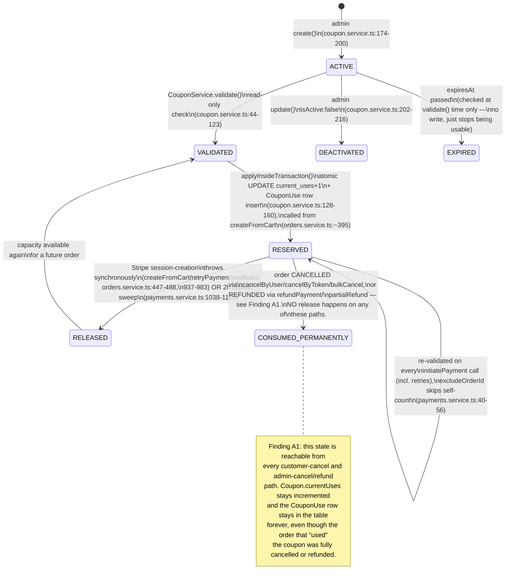
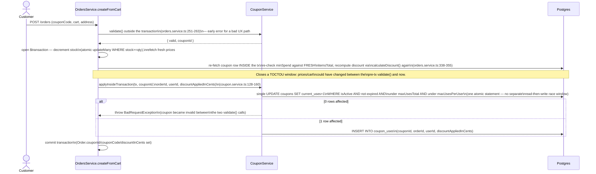
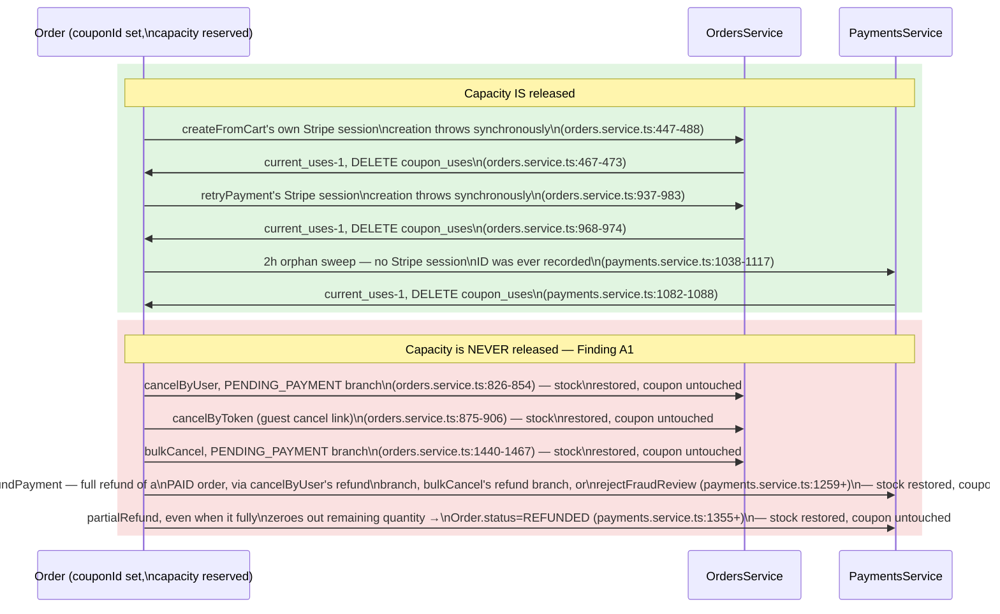
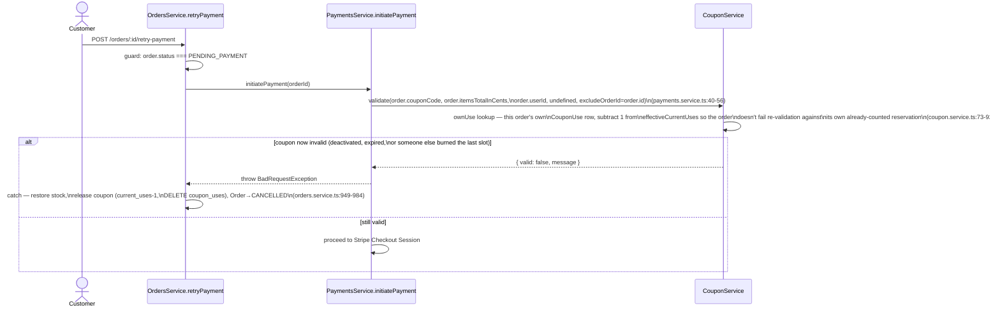

# Coupon Lifecycle Model

Companion to [`business-process-model.md`](./business-process-model.md), same brief and
same method: map how a `Coupon` actually moves through the codebase (not the intended
design), cite every transition `file:line` against the code on this branch, and answer
the brief's real question — *"is there a path in the code that gets from A to C while
bypassing B?"* This is a pure mapping document; no fixes are implemented here.

**Scope.** The full lifecycle of a `Coupon`'s *capacity* — not its discount math (that's
already covered piecemeal in [`audit-exclusion-list.md`](./audit-exclusion-list.md)'s
`## Coupons` section) — from admin creation through validation, atomic consumption at
order creation, re-validation on payment retry, and what happens to consumed capacity
when the order that consumed it never completes.

**See also:** [`audit-exclusion-list.md`](./audit-exclusion-list.md) (existing Coupons
findings — this doc does not restate any of them); [`accepted-tradeoffs.md`](./accepted-tradeoffs.md)
(the `Math.round` customer-favorable rounding entry, deliberately not re-flagged below);
[`business-process-model.md`](./business-process-model.md) and
[`auth-session-lifecycle-model.md`](./auth-session-lifecycle-model.md) (same method
applied to other domains).

---

## 1. Coupon capacity state machine

There's no `CouponStatus` enum — capacity lives in two places that must stay consistent:
`Coupon.currentUses` (a denormalized counter) and the set of `CouponUse` rows
(`schema.prisma:590-604`, `@@unique([couponId, orderId])`, one row per order that
consumed a slot). A coupon is "active" per `Coupon.isActive`/`startsAt`/`expiresAt`
(`coupon.service.ts:55-65`) independent of capacity.



**Reconciliation cron caveat:** `reconcileCurrentUses()` (`coupon.service.ts:236-248`,
hourly) recomputes `Coupon.currentUses = COUNT(*) FROM coupon_uses WHERE coupon_id = ...`.
It fixes *drift* between the counter and the `CouponUse` table — it cannot fix Finding
A1, because the orphaned `CouponUse` rows it counts against really do exist; reconciling
against them just confirms the leaked count as "correct."

**Update:** both the `RESERVED` transition's `applyInsideTransaction()` and this
reconciliation cron's raw SQL referenced column names that don't exist on the real
table — see Finding A0. Both were completely non-functional (every invocation threw)
until fixed in the same pass as A1/A2.

---

## 2. Sequence: apply-coupon-at-checkout

```mermaid
sequenceDiagram
    actor C as Customer
    participant FE as checkout-page.component.ts
    participant CC as CouponController
    participant CS as CouponService

    C->>FE: enters code, clicks "Zastosuj"
    FE->>CC: POST /coupons/validate\n(code, cartTotalInCents, variantIds)
    CC->>CC: CouponValidateThrottlerGuard:\n3 req/min anon, 10 req/min auth\n(throttler.config.ts:25-26)
    CC->>CS: validate(code, total, userId, variantIds)
    CS->>CS: isActive / startsAt / expiresAt /\nmaxUsesTotal / maxUsesPerUser /\nminSpend / excludedProductIds checks
    CS-->>CC: { valid, discountType, discountAmountInCents, appliesToItemsOnly }
    CC->>CC: track consecutive fails per IP,\nSentry alert at 5 fails/5min\n(coupon.controller.ts:56-67)
    CC-->>FE: result
    FE->>FE: FREE_SHIPPING → discountAmountInCents\n= selectedCarrier().price (not 0)\n(checkout-page.component.ts:851-856);\nappliesToItemsOnly → show\n"Rabat nie obejmuje kosztu dostawy"\n(checkout-page.component.ts:408-409)
    FE-->>C: shows discount in order summary
    Note over FE: selectCarrier() later re-syncs\nFREE_SHIPPING discountAmountInCents\nto the new carrier price\n(checkout-page.component.ts:695-702)
```

This validate call is read-only — it never touches `currentUses` or inserts a
`CouponUse` row. Capacity is only actually reserved at order creation (§3).

---

## 3. Sequence: consume-at-order-creation



The atomic `UPDATE ... WHERE` in `applyInsideTransaction` is the one place in this
lifecycle with no TOCTOU gap *by design* — two concurrent checkouts racing the coupon's
last slot correctly let only one through, no lock needed. **However, see Finding A0:**
as originally written, this exact statement referenced column names that don't exist
on the real table and failed on every single call — the design was sound, the SQL
wasn't. Fixed in the same pass as A1/A2.

---

## 4. Sequence: what happens when the order never completes — Finding A1



### A1 — HIGH: a cancelled or refunded order's coupon slot is never returned

**The gap.** Three call sites correctly release a coupon's reserved capacity
(`current_uses` decrement + `CouponUse` row delete): `createFromCart`'s own
Stripe-session-failure rollback, `retryPayment`'s identical rollback, and
`sweepOrphanedPendingOrders`'s 2-hour orphan sweep. Every other path that ends an
order's life — `cancelByUser` (the "Anuluj zamówienie" button, both the
PENDING_PAYMENT in-place-cancel branch and the PAID/PROCESSING refund branch),
`cancelByToken` (the guest cancel-link flow), `bulkCancel` (admin bulk action, both
branches), `refundPayment`, and `partialRefund` when it fully zeroes the order — never
touches `Coupon.currentUses` or the `CouponUse` table at all. Stock is correctly
restored on every one of these paths (mirrored, consistent logic); the coupon slot is
not.

**Net effect.** A `maxUsesPerUser: 1` coupon (the common "10% off your first order" /
single-use referral-code pattern) is permanently burned the moment a customer applies
it and then changes their mind before paying, or pays and later cancels/returns
everything — the single most common reason a customer would cancel in the first place.
The customer gets nothing, and a real `CouponUse` row sits in the table forever
pointing at a `CANCELLED`/`REFUNDED` order, silently counting against both the
per-user and the global `maxUsesTotal` cap. `reconcileCurrentUses()`'s hourly cron
cannot fix this — it reconciles the counter against the row count, and the row really
is there.

**Fix direction:** the three correctly-releasing call sites already share the exact
same three-line pattern (`UPDATE coupons SET current_uses = GREATEST(current_uses - 1,
0) WHERE id = ...` + `couponUse.deleteMany({ where: { orderId } })`) — extract it into
one `CouponService.releaseForOrder(tx, orderId, couponId)` helper and call it from
every status-write site that lands on `CANCELLED` or a fully-`REFUNDED` order
(`cancelByUser`, `cancelByToken`, `bulkCancel`, `refundPayment`, and `partialRefund`'s
`allCancelled` branch), the same way stock restoration is already called consistently
from all of them.

---

## 5. Sequence: re-validation on payment retry



This closes what used to be two related gaps in the same area (see
`audit-exclusion-list.md`'s Coupons section, both items confirmed fixed against
current code while building this doc): the `excludeOrderId` exclusion means a retry
can't fail re-validation purely because it's racing against its own already-counted
reservation, and `retryPayment`'s `catch` block fully rolls back (stock + coupon)
rather than stranding capacity on a genuine rejection.

---

## Audit Findings

### A0 — CRITICAL (found during A1/A2 implementation, not in the original mapping pass): the atomic coupon-consumption UPDATE was silently broken end-to-end — FIXED

**This supersedes the "no TOCTOU gap" claim in §1/§3 above** — the SQL was logically
sound but syntactically broken against the real schema, so it never actually ran
successfully at all.

`CouponService.applyInsideTransaction()` and `reconcileCurrentUses()`'s raw
`$executeRaw`/`$queryRaw` calls referenced snake_case column names
(`current_uses`, `is_active`, `expires_at`, `max_uses_total`, `max_uses_per_user`,
`coupon_id`, `user_id`) and cast string parameters to `::uuid`. Neither matches the
real schema: `Coupon`/`CouponUse` have no `@map` on any field, so Postgres columns are
the literal camelCase names (`"currentUses"`, `"isActive"`, `"expiresAt"`,
`"maxUsesTotal"`, `"maxUsesPerUser"`, `"couponId"`, `"userId"` — confirmed via
`information_schema.columns` against the live database), and `Coupon.id` is a plain
`String` (TEXT column), not `@db.Uuid`.

**Verified against the live database** (read-only/rolled-back checks, no data
changed): the original SQL fails immediately with Postgres error `42703` (`column
"is_active" does not exist`) — and, before even reaching that, `operator does not
exist: text = uuid` from the `::uuid` cast on a TEXT column. This means
**`applyInsideTransaction()` — the single chokepoint every coupon-bearing checkout
calls inside `createFromCart`'s transaction — threw on every single invocation**,
making every coupon-bearing checkout fail, and the hourly `reconcileCurrentUses()`
cron failed identically on every run. Both failures are invisible to this codebase's
unit test suite because it mocks `tx.$executeRaw`/`prisma.$executeRaw` entirely — a
raw-SQL column-name typo has no way to surface there.

**Fixed:** both raw queries now use quoted camelCase column names matching the real
schema, and drop the incorrect `::uuid` casts on TEXT id/couponId/userId parameters
(disambiguating bare `NULL` parameters with `::text` instead, where needed). Re-verified
against the live database in the same way (rolled-back transactions) before applying to
source.

**Process note:** this is the same failure mode as the round-16 documentation-staleness
pattern found earlier in this session, but worse — that was *fixed code, stale docs*.
This was *broken code that every unit test reported as passing*, because the mocking
boundary sits exactly where the bug lived. Any future raw-SQL change in this codebase
should get at least one read-only sanity check against a real Postgres connection
before being trusted, the same way this one finally was.

### A1 — see §4 above (HIGH) — FIXED

**Fixed:** extracted the three correctly-releasing call sites' shared pattern into
`CouponService.releaseForOrder(tx, orderId, couponId)` and called it from every
remaining terminal path: `cancelByUser`'s PENDING_PAYMENT branch, `cancelByToken`,
`bulkCancel`'s PENDING_PAYMENT branch, `refundPayment`, and `partialRefund`'s
`allCancelled` branch. A sixth leak site beyond the five originally identified here was
found and fixed in the same pass: `handlePaymentFailure` (the `checkout.session.expired`
/`async_payment_failed` webhook path) restored stock but never released the coupon
either. All eight call sites now route through the one helper. Regression tests added
for every site in `orders.service.spec.ts`/`payments.service.spec.ts`.

### A2 — LOW (corrected from HIGH; see note below): AdminJS's Coupon edit form bypassed `CouponService.create()`/`update()`'s validation — FIXED

**Correction (verified 2026-06-24 against the live database, not just the schema):**
this finding originally claimed there was no DB-level cap on `PERCENTAGE` coupon
values, which was wrong — a `CHECK` constraint (`coupons_percentage_value_max_100`,
added in `prisma/migrations/20260530110000_add_check_constraints_on_numeric_fields`)
already exists and is enforced on every write path regardless of ORM/AdminJS, verified
by attempting a live `INSERT ... discountType='PERCENTAGE', value=500` in a rolled-back
transaction and observing Postgres reject it (error `23514`,
`violates check constraint "coupons_percentage_value_max_100"`). So the "5× discount /
free order" scenario originally described here was never actually reachable — the
worst case was always a failed write, not a bad coupon.

The real, smaller gap: AdminJS's `Coupon` resource (`admin.setup.ts`) had no
`properties.value`/`properties.discountType` override, so the default Prisma-backed
edit form could attempt to write `value`/`discountType` directly, bypassing
`CouponService.create()`/`update()`'s friendlier validation — an admin would see a raw
Postgres constraint-violation error instead of a clean message, and (for in-bounds but
still-unintended edits) there was no audit trail. `update()` doesn't expose
`value`/`discountType` via `UpdateCouponDto` at all, so this edit-form path was also the
*only* way to change them post-creation, supported by nothing else in the codebase.

**Fixed:** `value`/`discountType` are now locked behind the shared `EDIT_LOCKED`
AdminJS property (`admin.setup.ts`, same constant `business-process-model.md`'s A2 fix
introduced for `Order.status`/`Shipment.status`), closing the unsupported bypass
without removing any capability admins actually had (since editing these fields
post-creation was never a supported operation to begin with).

---

## Appendix: where to look

| Domain | Service | Transition table / core guard | Controller / trigger |
|---|---|---|---|
| Coupon validation | `backend/src/modules/coupons/coupon.service.ts` | `validate()`, lines 44-123 | `coupon.controller.ts` `POST /coupons/validate` |
| Coupon consumption | `backend/src/modules/coupons/coupon.service.ts` | `applyInsideTransaction()`, lines 128-160 | called from `orders.service.ts` `createFromCart` |
| Coupon release (correct) | `backend/src/modules/orders/orders.service.ts`, `backend/src/modules/payments/payments.service.ts` | `createFromCart` rollback (447-488), `retryPayment` rollback (937-983), `sweepOrphanedPendingOrders` (1038-1117) | internal, triggered by Stripe API failure or the reconcile cron |
| Coupon release (missing — A1) | `backend/src/modules/orders/orders.service.ts`, `backend/src/modules/payments/payments.service.ts` | `cancelByUser` (771-873), `cancelByToken` (875+), `bulkCancel` (1402+), `refundPayment`/`partialRefund` (1259+, 1355+) | `orders.controller.ts`, `payments.controller.ts`, AdminJS bulk-cancel/refund actions |
| Coupon admin CRUD | `backend/src/modules/coupons/coupon.service.ts` | `create()`/`update()`, lines 174-216 | `coupon.controller.ts` (admin-only), AdminJS `Coupon` resource (`admin.setup.ts:821-868`) — A2 |
| Reconciliation | `backend/src/modules/coupons/coupon.service.ts` | `reconcileCurrentUses()`, lines 236-248 (hourly cron) | internal |
