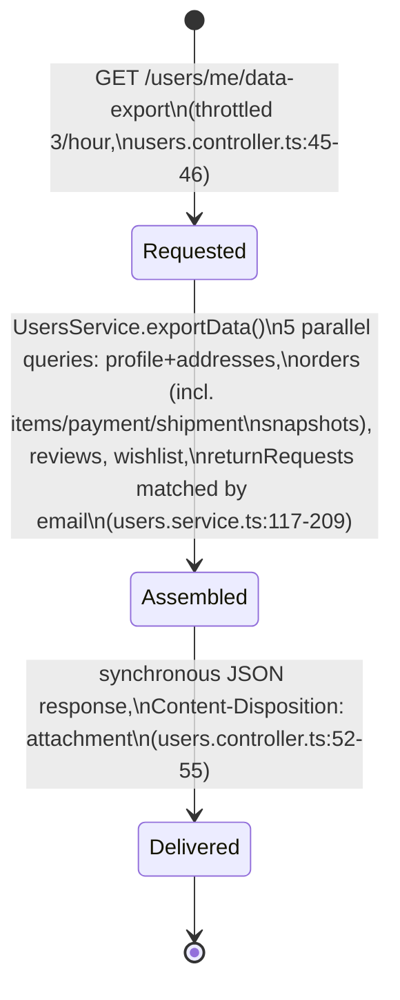

# GDPR Export / Erasure Model

Same method as [`business-process-model.md`](./business-process-model.md),
[`coupon-lifecycle-model.md`](./coupon-lifecycle-model.md), and
[`auth-session-lifecycle-model.md`](./auth-session-lifecycle-model.md): map how data
export and account erasure actually move through the codebase (not the intended
design), cite every step `file:line` against the code on branch `fix/audit_round_22`,
then an Audit Findings section.

**Why this doc exists.** `audit-exclusion-list.md`'s "GDPR / Privacy / Data Retention"
section is the one section in that file with **zero** items tagged `(fixed)` — every
bullet looked exactly as raw as when first written, and the section's own closing note
explicitly flagged full export/erasure handling as never having gotten a systematic
pass (`business-process-model.md` §8.2 scoped it out by name). The working assumption
going in was that this is the most genuinely-broken cluster left on the whole list.

**That assumption was wrong, the same way it was wrong for Auth.** Re-verifying all 7
raw bullets against current code found **all 7 are stale** — erasure scrubbing,
the Art. 17(3)(b) dispute check, consent logging + its purge cron, `marketingConsentAt`,
order-retention purging, the email/outbox retention cron, and even `security.txt` +
an Art. 33 runbook are all already implemented, tested, and working. See
[Resolved](#resolved) for the bullet-by-bullet re-verification.

That said, tracing the actual request→fulfillment flow end-to-end (rather than
spot-checking the existing bullets) surfaced **2 real findings the exclusion list never
mentioned at all** — see [Audit Findings](#audit-findings).

**See also:** [`business-process-model.md`](./business-process-model.md) (§8.2's "Data"
journey is the predecessor of this doc — it explicitly scoped this domain out),
[`coupon-lifecycle-model.md`](./coupon-lifecycle-model.md) and
[`auth-session-lifecycle-model.md`](./auth-session-lifecycle-model.md) (same method,
other domains), [`audit-exclusion-list.md`](./audit-exclusion-list.md) (condensed
history — this doc's findings get folded into its GDPR section once fixes land),
[`accepted-tradeoffs.md`](./accepted-tradeoffs.md) (no entries from this pass yet),
[`docs/gdpr-breach-runbook.md`](./gdpr-breach-runbook.md) (the incident-response side
of data handling — confirmed to exist and to be thorough, see §3 below).

---

## 1. Export request lifecycle (GDPR Art. 20 — data portability)

This is a fully synchronous, on-demand export — no async job, no email-delivered link,
no expiring download token, because none of those are needed: the response is built
and streamed back in the same request. `passwordHash`/`googleId` are explicitly
stripped (`users.service.ts:211`); everything else on `User` (including
`analyticsConsent`/`marketingConsent`/timestamps and `addresses`) is included via the
object spread.

**This flow is fully backend-only — see [A1](#a1).**

---

## 2. Erasure request lifecycle (GDPR Art. 17 — right to erasure)

```mermaid
stateDiagram-v2
    [*] --> Requested: DELETE /users/me\n(users.controller.ts:58-66)
    Requested --> DisputeChecked: for every Payment.stripePaymentIntentId\non this user's orders, list Stripe disputes;\nany 'needs_response' dispute blocks erasure\n(Art. 17(3)(b) exemption,\nusers.service.ts:230-246)
    DisputeChecked --> Blocked: 409 ConflictException,\n\"try again in 30 days\"
    Blocked --> [*]
    DisputeChecked --> Erased: single $transaction (users.service.ts:248-281):\n1) Order snapshots → '[usunięto]' / sentinel email\n2) ReturnRequest rows matched by email → scrubbed\n   (firstName/lastName/email/phone/bankAccount)\n3) User row hard-deleted —\n   cascade removes addresses/tokens/wishlist/reviews;\n   Order.userId set NULL (onDelete: SetNull)
    Erased --> SessionCleared: refresh cookie cleared\n(users.controller.ts:65)
    SessionCleared --> [*]
```

The access token doesn't need an explicit revocation step here: `JwtStrategy.validate()`
re-fetches the user from the DB on *every* request (`jwt.strategy.ts:92-94`) and throws
`UnauthorizedException` if the row is gone — so a hard-deleted account's still-unexpired
15-minute access token stops working immediately, not just after
`JWT_ACCESS_EXPIRES_IN`. (Verified by reading `JwtStrategy`, not assumed — this is the
kind of thing the Auth audit found *wasn't* this careful in a different code path.)

**This flow is also fully backend-only, but unlike export it does have a frontend
entry point** — `profile.component.ts:244-271` (template, confirming dialog) and
`:487-496` (handler, `DELETE /users/me`) implement a full "Usuń konto" danger-zone
flow with confirmation. **The asymmetry with export is itself [A1](#a1).**

---

## 3. Retention / purge crons — the landscape

No single doc previously listed these together; they're three independent
`@Cron` jobs, each owning a different table family, all Redis-`SET NX`-locked:

| Cron | Schedule | Scope | Citation |
|---|---|---|---|
| `purgeExpiredOrderRetention` | Jan 1, 03:00 Europe/Warsaw | `Order` snapshot PII past `retentionExpiresAt` (5-yr accounting window, Ustawa o rachunkowości Art. 74) — skips rows already anonymized by `deleteAccount` via the `@deleted.invalid` sentinel | `orders-cleanup.service.ts:18-45` |
| `purgeStaleOperationalLogs` | Weekly, Europe/Warsaw | `OutboxMessage` (90d, PROCESSED/FAILED only), `email-dlq` BullMQ jobs (90d), `EmailLog` (365d, skips still-bounced addresses to preserve suppression evidence), `ConsentLog` (past its own `expiresAt`, 5yr from creation) | `data-retention-cleanup.service.ts:24-72` |
| (none) | — | **`ReturnRequest` — no retention/expiry path independent of full account deletion** | see [A2](#a2) |

`ConsentLog` (`schema.prisma:736-744`) has no `userId` — it's keyed purely on an
anonymous `consentId` cookie (5-year `maxAge`, `httpOnly`+`sameSite:lax`,
`users.controller.ts:105-116`), which is by design: an authenticated user's consent
lives directly on `User.analyticsConsent`/`marketingConsent` instead
(`users.service.ts:30-37,284-289`). The frontend posts to the same `/api/users/consent`
endpoint regardless of auth state (`consent.service.ts:40`); the backend's
`OptionalJwtGuard` branches into one path or the other (`users.controller.ts:92-117`).
One structural consequence of this split, not severe enough for a numbered finding: if
someone consents while anonymous and *then* registers, nothing migrates that decision
onto the new `User` row — `ConsentService.bannerVisible` won't re-prompt (the decision
is already in `localStorage`), so `User.analyticsConsent` silently stays at its
DB default (`false`) until/unless they explicitly re-toggle consent post-registration.
Worth a one-line follow-up (sync on register/login) if anyone ever audits analytics
accuracy, not a compliance violation — the consent decision itself is still logged,
just not linked to the eventual account.

---

## Audit Findings

### A1 — HIGH (FIXED): the Art. 20 export endpoint has zero frontend entry point — the right exists in the backend only

`GET /users/me/data-export` (`users.controller.ts:45-56`) is fully implemented,
throttled (3/hour), tested (`users.service.spec.ts`'s `exportData` describe block,
`users.controller.spec.ts`'s `exportMyData` describe block), and returns a complete,
well-formed JSON download with a GDPR-appropriate filename. **No frontend code
anywhere in the repo references `data-export` or calls this route.**
`profile.component.ts` — the exact page that already has a full, tested, confirmed
"Usuń konto" (erasure) flow right next to where an export button would naturally
go — has nothing for export.

This is the same bug class `auth-session-lifecycle-model.md` already found *fixed* for
magic-link in round 19 ("fully implemented backend-only... with zero frontend entry
point... fixed by adding routes/components plus a login-page entry point") — except
here it was never closed. A customer's Art. 20 data-portability right is real on the
server and practically inert for an actual customer: exercising it today requires
manually constructing an authenticated HTTP request with a Bearer token, which is not
something a real customer does. Any compliance review or DPO audit asking "show me the
'download my data' feature" finds nothing to click.

**Fixed:** added a "Pobierz moje dane" button to `profile.component.ts`'s account
section (`exportData()`, `profile.component.ts:501-516`), fetching the endpoint as a
blob and triggering a browser download named `gdpr-export-{date}.json`, mirroring the
delete-account button immediately below it. Regression tests cover the happy/error
paths (`profile.component.spec.ts`, `ProfileComponent — exportData`).

### A2 — HIGH (FIXED): `ReturnRequest` PII (including plaintext IBAN) has no retention/expiry path short of full account deletion

`ReturnRequest` (`schema.prisma:645-672`) stores `firstName`/`lastName`/`email`/
`phone`/`bankAccount` with no retention field of its own and no FK-cascade tie to
`Order` deletion (`orderId` is nullable specifically so a return survives even if its
order is hard-deleted, per the comment at `users.service.ts:224-225`). Today exactly
one path scrubs it: `deleteAccount`, matched by the user's email
(`users.service.ts:267-276`) — full voluntary account erasure.

There is no equivalent for the **involuntary, time-based** path: `Order` rows get
their snapshot PII anonymized automatically once `retentionExpiresAt` passes (the
5-year accounting window — `orders-cleanup.service.ts:18-45`, motivated explicitly by
"GDPR Art. 5(1)(e)" per its own comment), but the `ReturnRequest` tied to that same
order — same customer, same identifying information, plus a field the *other* path
doesn't even have to worry about (`bankAccount`, an IBAN, already flagged elsewhere in
`audit-exclusion-list.md`'s Returns section as stored in plaintext) — keeps full,
unredacted PII forever unless that specific customer happens to also delete their
entire account before then. A customer who returned one order six years ago, never
deleted their account, and has long since forgotten they ever had a bank account on
file for a refund, has that IBAN sitting in cleartext in `return_requests` indefinitely
— a clearer storage-limitation violation (Art. 5(1)(e)) than the Order-snapshot case
that was already fixed, because the trigger here is *never* satisfied automatically.

**Fixed:** extended `purgeExpiredOrderRetention` (`orders-cleanup.service.ts:48-67`) to
also scrub `firstName`/`lastName`/`email`/`phone`/`bankAccount` on any `ReturnRequest`
whose parent `order.retentionExpiresAt` has passed, using the same
`retention-expired@deleted.invalid` sentinel and lock as the Order-snapshot scrub,
skipping rows already scrubbed by either `deleteAccount` or a prior retention pass.
Regression tests cover the matching/skip/data shape (`orders-cleanup.service.spec.ts`,
`ReturnRequest retention scrub`).

---

## Resolved — `audit-exclusion-list.md`'s GDPR section, re-verified against current code

| Claim | Verified status |
|---|---|
| "`deleteAccount` doesn't scrub `ReturnRequest` PII; `snapshotStreet`/`City`/`PostalCode` never nulled" | **Stale, both halves.** `ReturnRequest` rows matched by email are scrubbed (`firstName`/`lastName`/`email`/`phone`/`bankAccount`, `users.service.ts:267-276`); `Order.snapshotStreet`/`City`/`PostalCode` are explicitly nulled to `'[usunięto]'` in the same transaction (`users.service.ts:259-261`). |
| "GDPR erasure no open-dispute check (Art. 17(3)(b) conflict)" | **Stale.** `deleteAccount` lists Stripe disputes for every payment intent on the user's orders and throws a 409 if any is `needs_response` (`users.service.ts:230-246`). |
| "Consent stored only in localStorage... no purge job for `expiresAt`" | **Stale.** `ConsentLog` is a real table keyed on a random UUID cookie (not IP/UA hash); `purgeStaleOperationalLogs` deletes rows past their own `expiresAt` weekly (`data-retention-cleanup.service.ts:66-71`). Frontend banner (`cookie-consent.component.ts`, `consent.service.ts`) actually calls the endpoint, not just a local-only stub. |
| "`marketingConsentAt` never set when changed via `PATCH /users/me`" | **Stale.** `UsersService.update()` sets `marketingConsentAt` whenever `marketingConsent` is present in the patch (`users.service.ts:30-37`); `PATCH /users/me` (`updateMe`, `users.controller.ts:82-90`) calls exactly this method. |
| "No data retention schedule / `retentionExpiresAt` for orders past 5-year window" | **Stale.** `purgeExpiredOrderRetention`, a real `@Cron('0 3 1 1 *')` job, does exactly this (`orders-cleanup.service.ts:18-45`); `Order.retentionExpiresAt` is a real, indexed column (`schema.prisma:443,455`). |
| "`email_logs`/`outbox_messages` accumulate PII indefinitely, no TTL cron" | **Stale.** `purgeStaleOperationalLogs` (weekly) deletes both, plus `email-dlq` BullMQ jobs, with a bounce-suppression carve-out so evidence of *why* an address is suppressed outlives the blanket 365-day window (`data-retention-cleanup.service.ts:24-72`). This is the same fix `audit-exclusion-list.md`'s own Email section already documents under round 20 — this GDPR-section bullet was simply never cross-updated when that landed. |
| "No `security.txt`, no documented Art. 33 breach-notification runbook" | **Stale, both halves.** `frontend/src/.well-known/security.txt` exists (Contact/Expires/Policy fields) and is wired into the Angular build's asset list (`angular.json:39-43`) and linked from the privacy page (`privacy.component.ts:92`); `docs/gdpr-breach-runbook.md` is a complete Art. 33/34 runbook (72-hour clock, UODO notification fields, technical response checklist, breach-register pointer). |
| "Open candidate, full export/erasure flow never got a systematic pass" | **Was true until this doc.** The individual gaps it described turned out to already be closed; the systematic pass itself found 2 new findings (A1, A2) that none of the incidental fixes above had occasion to catch, since both are about *absence* (no UI, no cron) rather than a broken implementation of something that existed. |

**7 of 7 raw bullets checked, 7 stale.** Same staleness pattern as Auth (16/17) and the
non-A0 half of Coupons — a hardening pass clearly happened across this domain at some
point (the GDPR Art. references in code comments throughout `users.service.ts`,
`orders-cleanup.service.ts`, and `data-retention-cleanup.service.ts` all read like a
deliberate, well-informed pass, not incidental fixes), and `audit-exclusion-list.md`
was never updated to match. Unlike Auth, this pass also surfaced 2 genuinely new
findings by tracing the actual end-to-end flow instead of only re-checking existing
bullets — both findings are about a flow that's *entirely missing* (no frontend, no
cron), the one category of gap that re-checking old bullets against code can't catch
by construction, since there was never a bullet describing them to re-check.
